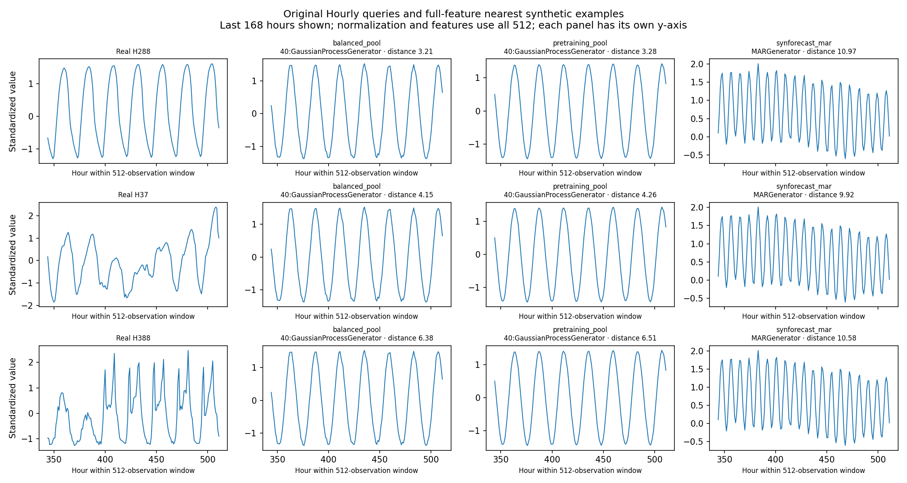

# Hourly coverage investigation

The Hourly gap persists across ten fresh generation seeds and a fourfold
increase in retained candidate count on the fixed query set. However, its
absolute size depends strongly on the distance calculation and on trend
strength. These results support a reproducible **feature-space mismatch**,
not a conclusion that the pools contain no visually similar daily cycles.
Neither `native_v1` nor any generator/preset was changed.

Follow-up: [fresh query splits and paired composition controls](../feature_coverage_hourly_splits/README.md)
now test the proposed next step on 256 additional evaluation IDs.

## What was held fixed

The original small benchmark was reproduced first, including its radii,
coverage fractions, and median distances. Its real split remains fixed:
64 fitting references, 32 calibration queries, and 32 evaluation queries.
Features use period 24, window 24, and the last 512 training observations.
All 414 Hourly training series are long enough to supply that length.

For larger candidate sets, add 192 randomly selected real training series
outside the original 128-series sample to the 64 reference-length slots.
These added rows are candidates only; they do not refit the scaler or PCA.
The 32 calibration/evaluation queries remain excluded from every candidate
set. Per generation seed, request 256 outputs from each of the same public
balanced/pretraining pools and random MAR, with separate corpus seed offsets.

Each seed yields 245–247 slots with complete outputs across all three sources.
Take the first **60 and 240 shared complete slots in generation order**, with
exactly matching real candidates and lengths. These sets are nested. Remaining
successful draws are unused; failures are recorded and no replacement is
generated. This compares retained sample sizes, not equal generation costs:
the smaller set is a subset of the 256-request experiment. All conclusions
are conditional on complete cases and the fixed real split.

For each distance setting and candidate size, calibrate q50/q90/q95 radii
using calibration-to-real-candidate distances. Also retain the radius from
the fixed original 64-reference anchor to isolate increased synthetic density
from the tighter real baseline that larger candidate sets provide. Synthetic
values never fit scaling, PCA, or thresholds. Seed ranges describe generation
variability on these same 32 queries, not confidence intervals or real-sample
uncertainty. The benchmark draws 7,680 new synthetic series in total, plus
192 draws to replay the original result.

## What persists, and what depends on the metric

With full standardized Euclidean distance, q90 coverage is zero for all ten
60-candidate draws. At 240 candidates, balanced and MAR remain zero across
all ten seeds; pretraining covers one query (3.1%) in one seed and none in
the other nine. The median size-matched real baseline is 93.8% at 240.

Increasing candidates does bring neighbours closer. The median across seeds
of median nearest distances changes from 4.04 to 3.84 for balanced, 3.99 to
3.63 for pretraining, and 11.77 to 8.79 for MAR. With the original anchor
radius held fixed, pretraining reaches up to 21.9% q90 coverage in one large
draw, although its median remains zero; balanced and MAR remain zero. Thus
sparse sampling contributes, but the tested increase does not close the gap.

Median q90 coverage across ten seeds, **240 matched candidates per source**:

| Distance setting | Balanced | Pretraining | MAR | Real baseline |
|---|---:|---:|---:|---:|
| Full standardized Euclidean (primary) | 0.0% | 0.0% | 0.0% | 93.8% |
| Standardized Manhattan | 12.5% | 12.5% | 0.0% | 93.8% |
| PCA(2), Euclidean | 4.7% | 6.2% | 0.0% | 87.5% |
| Euclidean with trend strength omitted | 28.1% | 28.1% | 0.0% | 93.8% |

Each row uses its own real-calibrated radius; raw distances across rows are
not comparable. All twelve individual feature omissions were evaluated,
with neighbour search and calibration repeated after each omission. Trend
strength is the most consequential omission in median pool coverage. This
is an exploratory sensitivity check, not justification to remove it from the
frozen schema or to select the most favourable score.

## Which differences contribute

For full-feature nearest neighbours at 240 candidates, trend strength
contributes a median across seeds of about **38% of the mean per-query
squared-distance fraction** for both pools. Crossing counts contribute about
15–17%, followed by level shifts at 9–10%. These are distance decompositions,
not causal importance estimates; medians of fractions need not sum to one.
MAR differs most in seasonal strength (about 42%), crossing counts (19%),
and the ten-lag ACF sum (12%).

The periodic Gaussian-process preset is the nearest balanced candidate in
216/320 query-seed assignments and the nearest pretraining candidate in
181/320; EnergyLoad is next for balanced. KernelSynth variants provide some
additional pretraining neighbours. These counts reuse the same 32 queries
over ten seeds and are not 320 independent real examples.

The original illustrative queries were selected at the 10th, 50th, and 90th
rank percentiles of distance to the balanced pool, without choosing examples
for visual effect. The nearest pool example for all three is a smooth daily
cycle. The real examples include slow level changes and less regular or
multi-peaked daily shapes that this simple neighbour does not reproduce.



There is also a measurement nuance. Real series **H288** and its nearest
balanced neighbour look similar over the displayed final week, but their
trend strengths are 0.975 and 0.041. Over the full 512 observations, the
real trend component's variance is only 3.0% of total series variance; the
neighbour's is about 0.0063%. Trend strength measures trend relative to the
remaining nonseasonal variation, not its share of total signal variance.
That definition can assign a large feature difference to a modest change
beside a dominant seasonal signal. Component variance ratios are recorded
for the examples; correlated components need not have ratios summing to one.

The evidence points toward testing combinations of daily cycle shapes,
drifting levels, and changing amplitudes, rather than assuming the absence
of a basic daily-cycle generator. Such tests should use new real query splits
and held-out settings before changing presets. Larger cross-frequency runs
and the interpretation notebook remain outstanding. This investigation does
not measure forecasting utility or raw-series distance.

## Reproduce and inspect

```bash
MPLCONFIGDIR=/tmp/synforecast-matplotlib .venv/bin/python \
  benchmarks/investigate_hourly_coverage.py
```

The original small benchmark's `summary.json` must be present; its ignored
detailed traces are not needed. The public Hourly training CSV must be cached
locally, or pass `--download`. Defaults pin the original reference seed and
ten redraws. The final summary has `completed=true`.

`summary.json` records source hashes, real splits, generation order, fixed
scaler/PCA parameters, per-seed primary/Manhattan/PCA results and retention,
all feature-omission aggregates, distance contributions, nearest-prototype
counts, and illustrative feature values. The eleven `*_details.json.gz`
files are gitignored local artifacts containing per-query scores and nearest
indices, generator provenance/settings/failures, and raw original example
values. Rerunning reconstructs them. No Parquet or raw synthetic corpus is
added to version control; summary JSON, this report, and one figure are retained.
