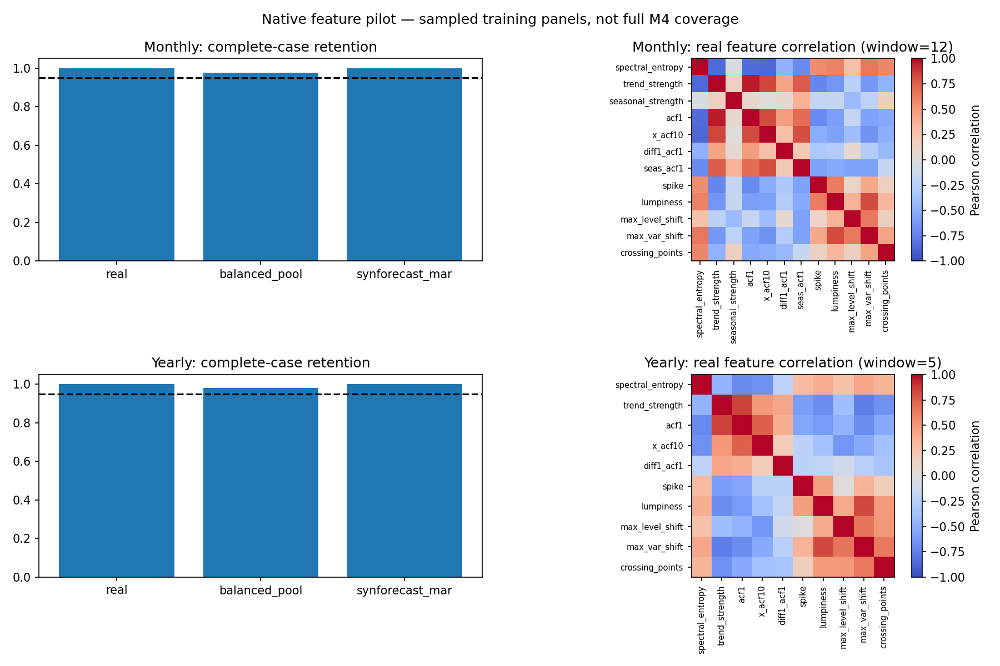
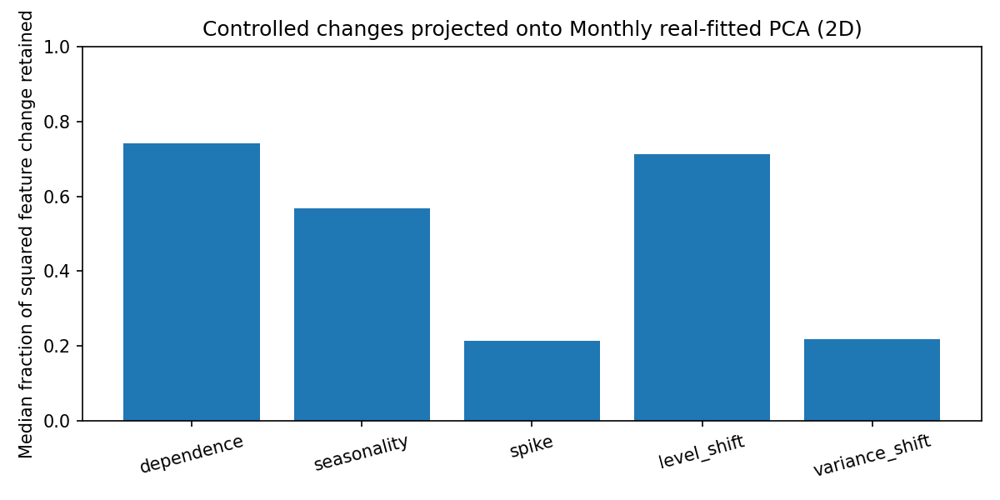

# Native feature pilot

The twelve native candidates respond to the intended controlled mechanisms,
but the two-dimensional coverage protocol is not ready to freeze as a general
feature-space coverage measure. This pilot uses M4 training data only, 256
series per frequency and seed, plus equal-size balanced-pool and SynForecast
MAR corpora with exactly matched effective lengths. It is not a full M4
benchmark or a comparison with the gratis package.

## Results and decision

| Sample seed | Frequency | Real retained | Balanced pool retained | MAR retained | Real variance retained by PCA(2) |
|---|---|---:|---:|---:|---:|
| 20260910 | Monthly | 256/256 | 250/256 | 256/256 | 68.4% |
| 20260910 | Yearly, window 5 | 256/256 | 251/256 | 256/256 | 66.1% |
| 20260911 | Monthly | 256/256 | 250/256 | 256/256 | 63.2% |
| 20260911 | Yearly, window 5 | 256/256 | 250/256 | 256/256 | 67.5% |

The original Yearly experiment used the default ten-observation window and
retained 209/256 real series (81.6%). All 47 exclusions were caused by the
three window features requiring at least 20 observations. An explicit
`window_size=5` restores all real series in both samples without changing
seasonality or other feature definitions. It is a declared panel-level
configuration, not an automatic per-series fallback. The default stays 10
without declared seasonality. `initial_summary.json` preserves the original
results, including the failed retention criterion.

Balanced-pool exclusions are the IoT failure preset's non-finite sensor
observations. They are counted as generation outputs unusable by the current
finite-input feature contract, with IDs and provenance recorded. No values
are imputed, no alternate generator replaces them, and their feature rows
remain in the requested-sample retention denominator. MAR retained all draws.

All five controlled mechanisms pass the predefined response checks on both
sample seeds: dependence, seasonality, an isolated spike, a level shift, and
a variance shift. Changes share a baseline draw to isolate the perturbation.
The intended feature moves in the expected direction for 100% of pairs on
the first seed; on the second, variance shift is 31/32 and the others 32/32.
This checks feature sensitivity, not correspondence with another extractor.

PCA loses meaningful changes. In the first Monthly reference space, the
median fractions of squared standardized feature change retained by the two
components are 74% for dependence, 57% for seasonality, 21% for spikes, 71%
for level shifts, and 22% for variance shifts. The second seed retains 32%
and 28% for spikes and variance shifts. High explained variance from the
original four-feature subset (about 95% on the first Monthly sample) does
not establish broad coverage: it describes a narrower representation.

Grid results are sensitive to resolution and the real reference sample.
For the first Monthly sample, the balanced pool's uncovered-real-cell
fraction is 36.5%, 75.0%, and 86.9% for 15, 30, and 45 bins per axis. Removing
one extreme projected Yearly reference series in the explicitly labelled
sensitivity fit changes that fraction from 38.5% to 69.1% at 30 bins. This
also changes the reference/scaler/PCA, not just the grid; it must not be read
as an isolated grid-boundary effect. Neither trimming nor changing bins is
applied silently to the primary results.

**Decision:** retain the twelve candidates for further validation and record
the explicit Yearly window recipe. Keep the schema labelled
`native_candidate_v1` and `schema_frozen=false`. Do not discard useful features
merely to raise PCA's explained variance. Before paper-scale runs or freezing
the coverage protocol, decide how to corroborate the 2D map in the full
feature space and assess reference/sample-size sensitivity. The declared
80% variance threshold is an operational pilot criterion for a standalone
2D claim, not a universal statistical validity threshold; all four primary
fits fall below it.

## Reproduce and inspect

The follow-up [full-feature corroboration and grid sensitivity experiment](../feature_coverage_validation/README.md)
has now been executed on these caches. It supports reporting calibrated
full-feature distances alongside the exploratory PCA map and isolates grid
effects without refitting PCA. The subsequent [all-frequency availability audit](../feature_coverage_availability/README.md)
also establishes explicit extraction recipes and documents the annual Weekly
limitation. The unchanged definitions have since been finalized as `native_v1`
and used in the [small six-frequency comparison](../feature_coverage_smoke/README.md).
Historical JSON retains its candidate label and original decision metadata.

```bash
# Fetch public training CSVs on the first run; subsequent runs are offline.
MPLCONFIGDIR=/tmp/synforecast-matplotlib .venv/bin/python \
  benchmarks/benchmark_feature_coverage.py --download --yearly-window 5

MPLCONFIGDIR=/tmp/synforecast-matplotlib .venv/bin/python \
  benchmarks/benchmark_feature_coverage.py --yearly-window 5 --seed 20260911 \
  --output benchmarks/data/feature_coverage_pilot/replication

# Reproduce the initial default-window setup in a separate output directory.
MPLCONFIGDIR=/tmp/synforecast-matplotlib .venv/bin/python \
  benchmarks/benchmark_feature_coverage.py --output /tmp/native-pilot-default-window
```

`summary.json` and `replication/summary.json` contain sample IDs, original and
effective lengths, source-file hashes, generator settings/provenance, failures,
retention, acceptance criteria, full feature correlation matrices, reference
reconstruction residuals, control responses, and grid/sample sensitivities.
`initial_summary.json` contains the original default-window results and the
separate invocation metadata for Monthly and Yearly.

The pilot caps each real series to its last 512 training observations and
matches synthetic lengths to those capped series. Five Monthly series are
capped on the first seed and ten on the second; none of the Yearly series are
capped. Seeds select uniform samples independently, not guaranteed disjoint
samples. All results are conditional on these selections and configurations.

Running the commands above creates native feature caches in Parquet and
fitted-space JSON in each frequency directory, including coordinates, IDs,
grid edges, scaler/PCA parameters, and occupancy arrays. Monthly also gets
cached controlled features. These Parquet files and `*_space.json` files are
intentionally gitignored local artifacts; rebuild them on a fresh checkout
before running the follow-up validation. Summary JSON, this report, and its
small figures are retained for review. The caches have a common native
extraction schema recorded in the summary; the precomputed API itself labels
arbitrary input frames generically.
Runtime environment metadata records the dirty development checkout as well
as its base commit, rather than presenting these as results from a released
or clean pinned commit.




