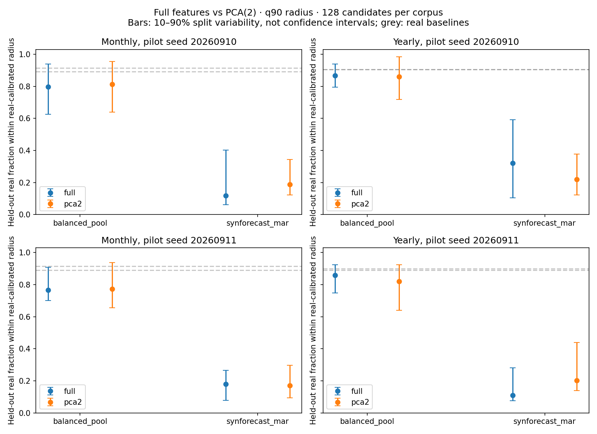
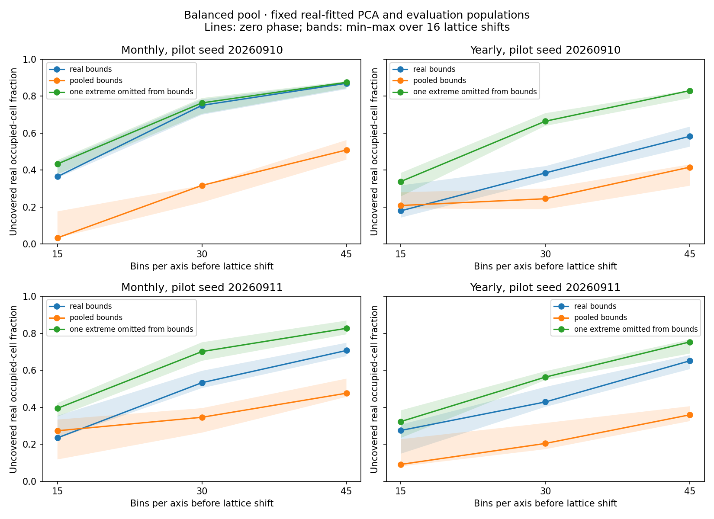

# Full-feature corroboration and grid sensitivity

The balanced pool covers more of the sampled real feature distribution than
SynForecast MAR under both full-feature distances and PCA(2). Their aggregate
ordering is consistent, but individual coverage decisions and grid scores
are sensitive to the representation and measurement settings. Retain the
twelve native features; use full-feature distances alongside the exploratory
PCA map. The experiment originally kept `native_candidate_v1` provisional;
the unchanged definitions have since been finalized as `native_v1`, with
historical artifacts remaining readable under their original label.

This experiment reuses the two Monthly/Yearly pilot caches offline, without
extracting new features or drawing new synthetic series. It evaluates coverage
of feature summaries, not forecasting quality, raw-series similarity, or DTW.

## Distance protocol

Each of 20 seeded repeats splits the 256 complete real rows into 128 reference
rows, 64 calibration queries, and 64 evaluation queries. These sets are
disjoint within a repeat. Fit the mean, population standard deviation, constant
column selection, and PCA on the reference only. Full-feature Euclidean
distances use all remaining standardized features, with no covariance whitening.
Thus correlated summaries still receive separate weight. Synthetic departures
in omitted real-constant features are counted separately; none occurred here.

For each held-out evaluation query, find its nearest synthetic candidate and
its nearest real reference candidate. Use equal candidate counts, 64 or 128,
for both corpora. Separately, calibrate radii at the 50th, 90th, and 95th
percentiles of calibration-to-real-candidate distances. Report the fractions
of evaluation queries within each radius, together with their real-to-real
baseline. Evaluation queries and synthetic points never determine the scaler
or radii. Every radius is recalibrated in its own full/PCA representation.

Vary fitting-reference size independently between 64 and 128, always drawing
from the same reference pool. A 128-row candidate set may therefore include
64 real rows unused by a 64-row scaler fit. Nested candidate selections and
fixed calibration/evaluation queries within each repeat permit paired
comparisons. Candidate-size effects are reported both with size-matched
recalibration and with the 128-candidate radius held fixed.

Repeated splits reuse the same finite pilot corpora. Their 10–90% ranges
describe split variability, **not confidence intervals or generator redraw
uncertainty**. The two source pilot samples can overlap. Original corpora have
matched series lengths; the random subsets are not individually rematched.
Only complete synthetic rows are sampled, with original failures and retention
recorded separately. These scores are conditional on successful outputs.

## Results

At 128 fitting rows and 128 candidates per corpus, median full-feature
coverage at the real-calibrated q90 radius is:

| Pilot seed | Frequency | Balanced pool | MAR | Held-out real baseline |
|---|---|---:|---:|---:|
| 20260910 | Monthly | 79.7% | 11.7% | 91.4% |
| 20260910 | Yearly | 86.7% | 32.0% | 90.6% |
| 20260911 | Monthly | 76.6% | 18.0% | 91.4% |
| 20260911 | Yearly | 85.9% | 10.9% | 89.1% |

The balanced pool strictly exceeds MAR on 79/80 paired q90 evaluations,
with one tie. This is conditional evidence for their ordering, not proof of
general realism. Threshold choice matters: at q50 the balanced pool covers
only 12.5–25.0%, compared with real baselines of 46.9–50.0%. Its q90 results
do not imply that it reproduces dense real neighbourhoods. Split variability
is substantial: the first Monthly balanced-pool q90 result spans 62.5–93.9%
between its 10th and 90th repeat percentiles.

PCA(2) and full-feature distances give different q90 decisions on a median
18.8–24.2% of balanced-pool evaluation queries across the four experiments.
They select the same nearest balanced-pool candidate for only 21.9–30.5% of
queries. Similar aggregate scores therefore do not validate the PCA drill-down
as a full-feature neighbour search. Their distances have different dimensional
scales and should not be compared numerically without their own real baselines.

Changing only the scaler/PCA fitting sample from 64 to 128 rows has a median
paired full-feature q90 coverage effect of zero for the balanced pool in all
four experiments, with individual-repeat variation. Increasing candidates
from 64 to 128 at a **fixed** radius raises its median covered fraction by
5.5–7.8 percentage points. With size-matched real recalibration, the effect can
have either sign because additional real candidates tighten the radius too.
Report corpus sizes and distance distributions instead of treating coverage
as sample-size independent.

All five existing controlled changes lie outside a q90 white-noise
leave-one-out neighbourhood in both representations, for all 32 draws and
both seeds. These changes are large enough to remain detectable despite the
projection energy lost in the original pilot. This saturated check does not
establish sensitivity to subtle changes, and its leave-one-out radius is an
illustrative control diagnostic, not the held-out population protocol above.



## Isolating the grid

Fit PCA once on all 256 real rows. Keep all coordinates and evaluation rows
fixed while varying bins (15/30/45), lattice origin (four phases per axis,
16 combinations), and bounding population (real, pooled, or real with its
single farthest projected point excluded **only when determining bounds**).
Real bounds retain the API's 1% padding; pooled bounds retain its unpadded
contract. Pooled bounds include both synthetic corpora. Phase shifts preserve
cell widths and add edge cells as necessary to enclose the original range;
the occupied-cell fraction is compared, not the all-cell Kang denominator.

At 30 bins, the balanced pool's missed-real-cell fraction varies across lattice
phases from 69.9–78.2% on the first Monthly sample and 34.2–42.1% on the first
Yearly sample, with real bounds. On that Yearly sample, excluding one extreme
point from bound calculation changes the zero-phase fraction from **38.5% to
66.4%**, without refitting PCA or removing any evaluation series. The excluded
point remains visible in the real out-of-range count. The series-level missed
fraction counts out-of-range real queries as uncovered; the occupied-cell
fraction describes only real cells inside the grid.

Pooled bounds reduce the first Monthly zero-phase missed-cell score from
75.0% to 31.7% with exactly the same PCA coordinates and corpora. That is a
change in measurement resolution, not improved generation. Bounds, lattice
phase, occupied-cell counts, and real/synthetic out-of-range counts are saved
for every run. Bounds that exclude real points are sensitivity cases only.



## Protocol decision and remaining work

Require full-feature distance distributions and real-calibrated coverage
curves as corroboration in the planned benchmark. Keep PCA/grid scores as
explicitly two-dimensional diagnostics with reference identity, retained
sample sizes, bounds, bin count, and out-of-range counts. Do not select a
favourable grid or remove features merely to improve a coverage score.

This completes the planned corroboration/sensitivity experiment. It supports
retaining the twelve feature definitions, while leaving the release schema
provisional at the time of this experiment. The subsequent [all-frequency availability audit](../feature_coverage_availability/README.md)
now supplies declared period/window recipes and documents the annual Weekly
limitation; schema finalization and a [small six-frequency comparison](../feature_coverage_smoke/README.md)
have now followed. Feature weighting
and length dependence remain limitations of the chosen distance. No new
public API or dependency is introduced by this benchmark. The separate
raw-series nearest-neighbour/DTW workstream remains outstanding.

## Reproduce and inspect

On a fresh checkout, first rebuild both pilot seeds using the commands in
the [pilot report](../feature_coverage_pilot/README.md#reproduce-and-inspect).
The Parquet inputs, detailed fitted-grid JSON, and compressed validation
traces are intentionally gitignored. Existing local files remain usable;
summary JSON, reports, and small figures are retained for review.

```bash
MPLCONFIGDIR=/tmp/synforecast-matplotlib .venv/bin/python \
  benchmarks/validate_feature_coverage.py
```

`summary.json` stores protocol settings, environment metadata, source hashes,
retention, all summarized configurations, and paired sensitivities. Each run
recreates four local compressed detail files retaining split IDs, fitted parameters, calibration
radii/distances, per-query distances and nearest synthetic indices, and all
grid edges/scores. Indices refer to the saved nested synthetic selection;
all feature values are in the original pilot's hashed Parquet caches.

```python
import gzip
import json
from pathlib import Path

root = Path("benchmarks/data/feature_coverage_validation")
with gzip.open(root / "20260910_Monthly_details.json.gz", "rt") as stream:
    details = json.load(stream)
```

All figures and numbers are reproducible from the cached pilot. The checkout
is a recorded dirty development state, not a released version.
