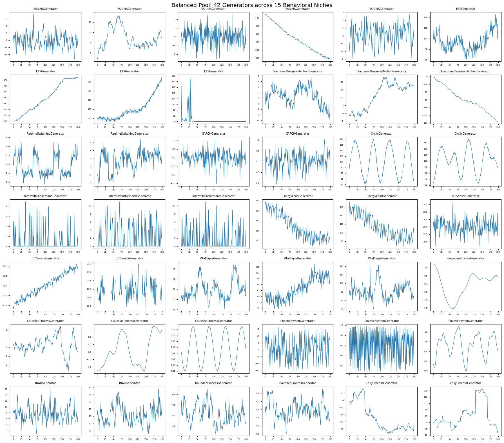
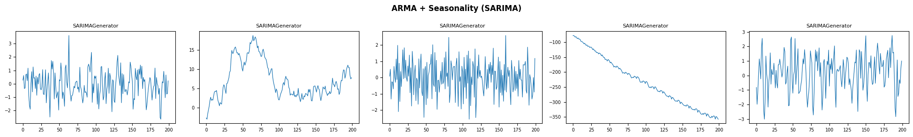
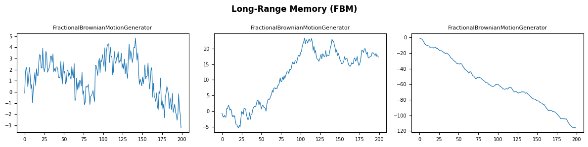
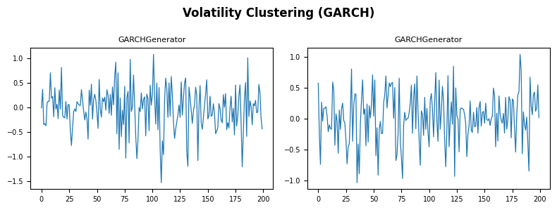
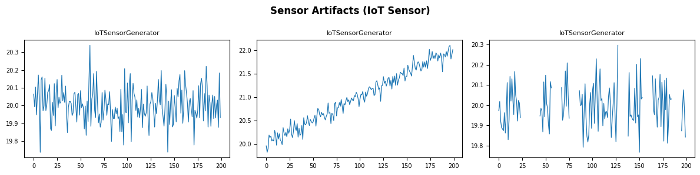
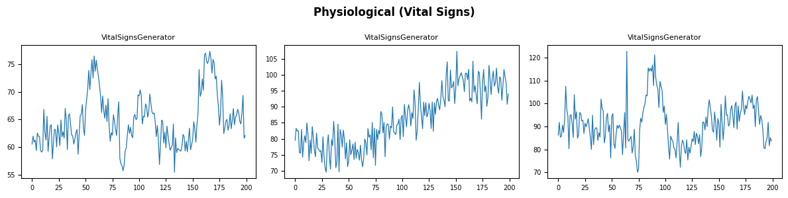
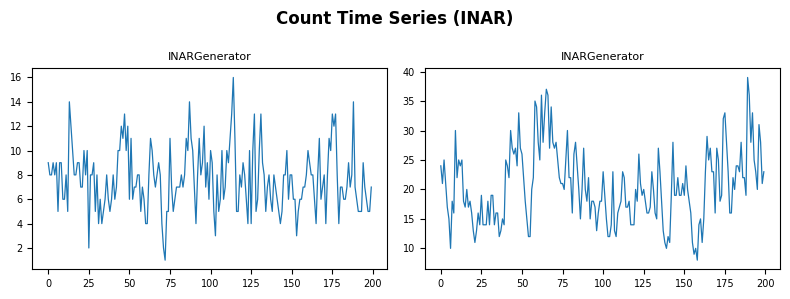
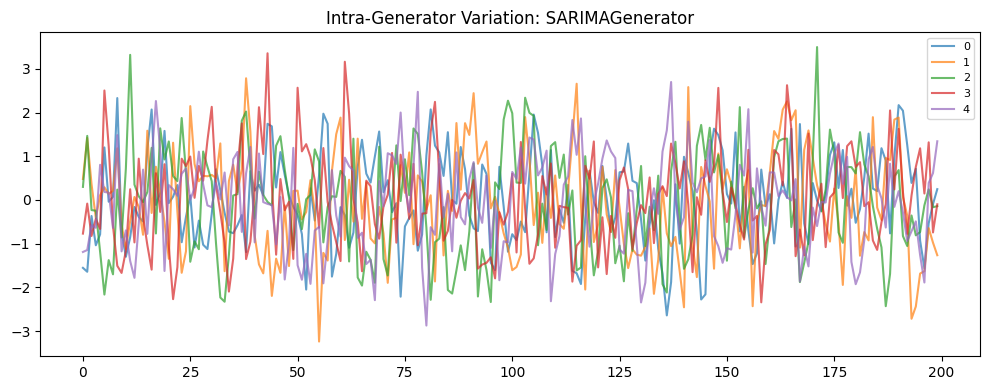

`balanced_pool()` returns 42 pre-configured generators spanning 15
behavioral niches — ARMA and exponential smoothing, long-range memory
and volatility clustering, intermittent demand, deterministic chaos,
counts, bounded and heavy-tailed processes, and more. It is the default
corpus behind [`generate_series`](../getting-started/quickstart), and a
bias-free starting point for benchmarking or pretraining: generators are
allocated proportionally to each niche’s behavioral range, so no single
domain (finance, say) dominates the pool.

> **What’s in, and what’s deliberately out**
>
> The pool draws from *interpretable, single-mechanism* generators —
> each slot is one named data-generating process. The meta-generators
> (`TSIGenerator`, `TCMGenerator`, `KernelSynthGenerator`) are excluded
> on purpose: they already randomize across many behaviors internally,
> so folding them in would blur the one-niche-one-mechanism design.
> Reach for the [`pretraining_pool()`](../generators/pretraining/tsi)
> preset when you want maximal breadth for foundation-model pretraining
> — it bundles those meta-generators (with `balanced_pool` by default).

```python
import matplotlib.pyplot as plt
import polars as pl

from synforecast import SynSet, balanced_pool
```

## Generate a Balanced Dataset

Create 42 generators and generate one series per generator.

```python
generators = balanced_pool(
    min_length=200, max_length=200, freq="D", seed=42, engine="polars"
)
dataset = SynSet(generators)
df = dataset.generate(n_series_per_generator=1)

print(f"Generators: {len(generators)}")
print(f"Series: {df['unique_id'].n_unique()}")
print(f"Total observations: {len(df)}")
```

``` text
Generators: 42
Series: 42
Total observations: 8400
```

## Generator Names

Each generator has a descriptive name indicating its type and
configuration.

```python
for i, gen in enumerate(generators):
    print(f"  {i}: {gen.alias}")
```

``` text
  0: SARIMAGenerator
  1: SARIMAGenerator
  2: SARIMAGenerator
  3: SARIMAGenerator
  4: SARIMAGenerator
  5: ETSGenerator
  6: ETSGenerator
  7: ETSGenerator
  8: ETSGenerator
  9: FractionalBrownianMotionGenerator
  10: FractionalBrownianMotionGenerator
  11: FractionalBrownianMotionGenerator
  12: RegimeSwitchingGenerator
  13: RegimeSwitchingGenerator
  14: GARCHGenerator
  15: GARCHGenerator
  16: CyclicGenerator
  17: CyclicGenerator
  18: IntermittentDemandGenerator
  19: IntermittentDemandGenerator
  20: IntermittentDemandGenerator
  21: EnergyLoadGenerator
  22: EnergyLoadGenerator
  23: IoTSensorGenerator
  24: IoTSensorGenerator
  25: IoTSensorGenerator
  26: VitalSignsGenerator
  27: VitalSignsGenerator
  28: VitalSignsGenerator
  29: GaussianProcessGenerator
  30: GaussianProcessGenerator
  31: GaussianProcessGenerator
  32: GaussianProcessGenerator
  33: ChaoticSystemGenerator
  34: ChaoticSystemGenerator
  35: ChaoticSystemGenerator
  36: INARGenerator
  37: INARGenerator
  38: BoundedProcessGenerator
  39: BoundedProcessGenerator
  40: LevyProcessGenerator
  41: LevyProcessGenerator
```

## Overview: All 42 Series

A compact grid showing every series in the balanced pool.

```python
fig, axes = plt.subplots(7, 6, figsize=(18, 16))
axes = axes.flatten()

for i, gen in enumerate(generators):
    uid = str(i)
    series = df.filter(pl.col("unique_id") == uid)
    values = series["y"].to_list()
    axes[i].plot(values, linewidth=0.8)
    axes[i].set_title(gen.alias, fontsize=7)
    axes[i].tick_params(labelsize=5)

fig.suptitle("Balanced Pool: 42 Generators across 15 Behavioral Niches", fontsize=14)
plt.tight_layout()
plt.show()
```



## Niche Deep-Dives

Each behavioral niche contributes a different number of generators.
Below we group them by niche and plot the variants side by side.

```python
niches = [
    ("ARMA + Seasonality (SARIMA)", list(range(0, 5))),
    ("Exponential Smoothing (ETS)", list(range(5, 9))),
    ("Long-Range Memory (FBM)", list(range(9, 12))),
    ("Structural Breaks (Regime Switching)", list(range(12, 14))),
    ("Volatility Clustering (GARCH)", list(range(14, 16))),
    ("Irregular Cycles (Cyclic)", list(range(16, 18))),
    ("Sparse/Intermittent (Intermittent Demand)", list(range(18, 21))),
    ("Multi-Seasonal (Energy Load)", list(range(21, 23))),
    ("Sensor Artifacts (IoT Sensor)", list(range(23, 26))),
    ("Physiological (Vital Signs)", list(range(26, 29))),
    ("Smooth/Rough Functions (Gaussian Process)", list(range(29, 33))),
    ("Deterministic Chaos (Chaotic System)", list(range(33, 36))),
    ("Count Time Series (INAR)", list(range(36, 38))),
    ("Bounded/Proportion Data (Bounded Process)", list(range(38, 40))),
    ("Heavy-Tailed Processes (Levy Process)", list(range(40, 42))),
]
```


```python
for niche_name, indices in niches:
    n = len(indices)
    fig, axes = plt.subplots(1, n, figsize=(4 * n, 3), squeeze=False)
    fig.suptitle(niche_name, fontsize=12, fontweight="bold")

    for j, idx in enumerate(indices):
        uid = str(idx)
        series = df.filter(pl.col("unique_id") == uid)
        axes[0][j].plot(series["y"].to_list(), linewidth=0.9)
        axes[0][j].set_title(generators[idx].alias, fontsize=8)
        axes[0][j].tick_params(labelsize=7)

    plt.tight_layout()
    plt.show()
```


















## Summary Statistics

Compare key statistics across all 42 series to see how the balanced pool
spans different value ranges and variabilities.

```python
stats = (
    df.group_by("unique_id")
    .agg(
        [
            pl.col("y").count().alias("count"),
            pl.col("y").min().alias("min"),
            pl.col("y").max().alias("max"),
            pl.col("y").mean().alias("mean"),
            pl.col("y").std().alias("std"),
        ]
    )
    .sort("unique_id")
)
stats
```

| unique_id | count | min         | max        | mean       | std       |
|-----------|-------|-------------|------------|------------|-----------|
| cat       | u32   | f64         | f64        | f64        | f64       |
| "0"       | 200   | -2.652759   | 3.609343   | -0.068571  | 0.99059   |
| "1"       | 200   | -2.9431     | 18.770876  | 7.230695   | 4.868281  |
| "10"      | 200   | -5.325623   | 23.33097   | 11.306948  | 8.519994  |
| "11"      | 200   | -116.121731 | -0.744045  | -58.861643 | 31.126446 |
| "12"      | 200   | -4.409192   | 5.592096   | -0.321962  | 2.315978  |
| …         | …     | …           | …          | …          | …         |
| "5"       | 200   | 96.138073   | 104.540914 | 99.457374  | 1.680738  |
| "6"       | 200   | 99.42744    | 175.293536 | 139.361576 | 25.08772  |
| "7"       | 200   | 93.115481   | 190.627616 | 120.187782 | 24.510724 |
| "8"       | 200   | 0.000001    | 195.36977  | 6.241506   | 26.494716 |
| "9"       | 200   | -3.219457   | 4.827293   | 1.352777   | 1.641567  |

## Scaling Up

Generate multiple series per generator for a larger dataset.

```python
df_large = dataset.generate(n_series_per_generator=5)
print(f"Series: {df_large['unique_id'].n_unique()}")
print(f"Total observations: {len(df_large)}")
```

``` text
Series: 210
Total observations: 42000
```

Plot five series from a single generator to see intra-generator
variation.

```python
fig, ax = plt.subplots(figsize=(10, 4))

# Series 0-4 come from the first generator (Stationary AR(1))
for sid in range(5):
    uid = str(sid)
    series = df_large.filter(pl.col("unique_id") == uid)
    ax.plot(series["y"].to_list(), alpha=0.7, label=uid)

ax.set_title(f"Intra-Generator Variation: {generators[0].alias}")
ax.legend(fontsize=8)
plt.tight_layout()
plt.show()
```



