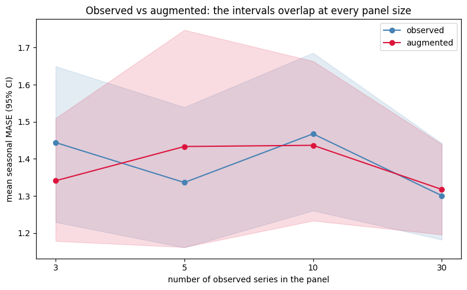
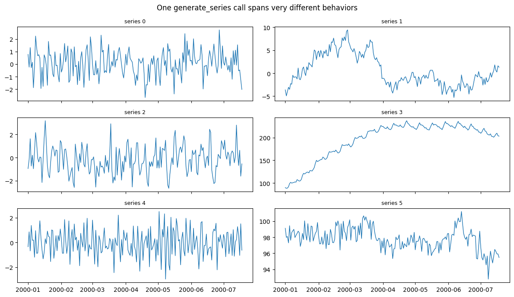

It is tempting to treat synthetic data as a free accuracy boost —
generate more series, get a better model. A rigorous benchmark says
otherwise, and being clear about it is the point of this page: synthetic
data earns its place through **coverage, robustness, privacy, and
pretraining breadth**, not by reliably lowering error on a
well-configured model.

> **The headline**
>
> On M4 Monthly, augmenting a properly-tuned global forecaster with
> `SynAugment` did **not** reliably beat training on the observed data
> alone — across panel sizes from 3 to 30 series and 20 random seeds,
> the win rate hovered around a coin flip and no result was
> statistically significant. Expect augmentation to be *neutral* for
> accuracy in this setting, and reach for synthetic data for the reasons
> in the second half of this page.

## The benchmark

We sample panels of `n` M4 Monthly series and compare a global
gradient-boosted forecaster (`HistGradientBoostingRegressor` via
MLForecast, with per-series standardization — the correct configuration
for M4’s varied scales) trained on:

-   **observed** — the real series only;
-   **augmented** — real series plus `SynAugment` counterparts, fit on
    the training split only (leakage-safe).

We forecast the official 18-month M4 holdout and score seasonal MASE,
paired within each seed. The full sweep (20 seeds) lives in
[`benchmarks/benchmark_augmentation.py`](https://github.com/Nixtla/synforecast/blob/main/benchmarks/benchmark_augmentation.py);
here we load its committed summary.

```python
import json
from pathlib import Path

import matplotlib.pyplot as plt
import pandas as pd

summary_path = Path("benchmarks/data/augmentation_summary.json")
if not summary_path.exists():
    summary_path = Path("../../benchmarks/data/augmentation_summary.json")
summary = json.loads(summary_path.read_text())

table = pd.DataFrame(
    {
        "series in panel": e["n_series"],
        "observed MASE": round(e["observed_mase"], 3),
        "augmented MASE": round(e["augmented_mase"], 3),
        "improvement %": round(e["mean_dmase_pct"], 1),
        "win rate": f"{e['win_rate']:.0%}",
        "Wilcoxon p": round(e["wilcoxon_p"], 3),
    }
    for e in summary["by_size"]
)
print(f"{summary['dataset']} | {summary['model']} | {summary['seeds']} seeds")
table
```

``` text
M4 Monthly (official 18-month holdout) | HistGradientBoostingRegressor via MLForecast, per-series scaling | 20 seeds
```

|     | series in panel | observed MASE | augmented MASE | improvement % | win rate | Wilcoxon p |
|-----|-----------------|---------------|----------------|---------------|----------|------------|
| 0   | 3               | 1.444         | 1.341          | 2.8           | 65%      | 0.231      |
| 1   | 5               | 1.336         | 1.433          | -4.6          | 55%      | 0.985      |
| 2   | 10              | 1.467         | 1.436          | 0.4           | 40%      | 0.729      |
| 3   | 30              | 1.301         | 1.318          | -2.0          | 35%      | 0.452      |

```python
fig, ax = plt.subplots(figsize=(8, 5))
sizes = [e["n_series"] for e in summary["by_size"]]
xs = range(len(sizes))
for cond, color in [("observed", "steelblue"), ("augmented", "crimson")]:
    means = [e[f"{cond}_mase"] for e in summary["by_size"]]
    los = [e[f"{cond}_ci"][0] for e in summary["by_size"]]
    his = [e[f"{cond}_ci"][1] for e in summary["by_size"]]
    ax.plot(list(xs), means, marker="o", color=color, label=cond)
    ax.fill_between(list(xs), los, his, color=color, alpha=0.15)
ax.set_xticks(list(xs))
ax.set_xticklabels([str(n) for n in sizes])
ax.set(xlabel="number of observed series in the panel",
       ylabel="mean seasonal MASE (95% CI)",
       title="Observed vs augmented: the intervals overlap at every panel size")
ax.legend()
plt.tight_layout()
plt.show()
```



The confidence intervals overlap everywhere and the paired win rate
never departs meaningfully from 50%. Two honest caveats about what this
is *not*:

> **Read the result carefully**
>
> -   **This is not evidence that synthetic data is useless** — it is
>     evidence that *augmenting a model that already has enough signal*
>     does not lower error. A gradient-boosted global model with a few
>     full M4 histories is not starved for data.
> -   **A “win” is easy to fake.** An earlier draft of this benchmark
>     showed a large apparent gain — until we noticed it came from an
>     *unscaled* baseline (augmentation was compensating for the model’s
>     poor scale handling) and from too few seeds. With per-series
>     scaling and 20 seeds, the effect vanished. Beware augmentation
>     benchmarks that omit either.

## Where synthetic data does earn its place

The value of synthetic data shows up away from the single-panel accuracy
number:

> **Four honest use cases**
>
> -   **Coverage and diversity.**
>     [`generate_series`](../getting-started/quickstart) and the
>     [balanced pool](balanced_pool) span behaviors — volatility
>     clustering, long memory, intermittency, chaos — that no single
>     real dataset contains. Useful for stress-testing a pipeline and
>     for pretraining breadth.
> -   **Robustness testing.** Inject [anomalies](anomalies),
>     [changepoints](changepoints), and [missingness](missingness) with
>     known ground truth to measure how a model degrades.
> -   **Privacy.** Share a reproducible, statistically-similar panel
>     without exposing proprietary series.
> -   **Pretraining at scale.** The diversity-targeted generators —
>     [TSI](../generators/pretraining/tsi),
>     [TCM](../generators/pretraining/tcm), and
>     [KernelSynth](../generators/pretraining/kernel_synth) — exist to
>     pretrain foundation models, where synthetic pretraining’s payoff
>     is established. That regime is far larger than this CPU benchmark.

The coverage point is easy to see directly — one call yields a panel of
visibly different data-generating processes:

```python
from synforecast import generate_series

pool = generate_series(
    n_series=6, freq="D", min_length=200, max_length=200, engine="polars", seed=7
)
import polars as pl

fig, axes = plt.subplots(3, 2, figsize=(12, 7), sharex=True)
for ax, uid in zip(axes.flat, pool["unique_id"].unique(maintain_order=True).to_list()):
    s = pool.filter(pl.col("unique_id") == uid)
    ax.plot(s["ds"], s["y"], linewidth=1)
    ax.set_title(f"series {uid}", fontsize=9)
fig.suptitle("One generate_series call spans very different behaviors")
plt.tight_layout()
plt.show()
```



## Reproduce

```bash
uv run python benchmarks/benchmark_augmentation.py --seeds 20 \
    --save benchmarks/data/augmentation_results.csv \
    --save-summary benchmarks/data/augmentation_summary.json
```

Use `--quick` for a fast smoke run. The script is model- and
dataset-agnostic enough to re-point at your own panel — and the honest
way to decide whether augmentation helps *your* problem is to run this
paired, multi-seed comparison on *your* data, never on the final
holdout.

