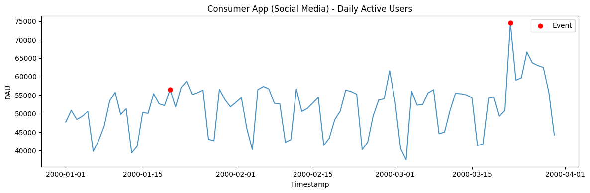
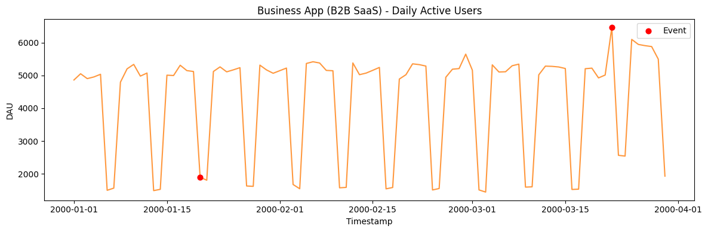
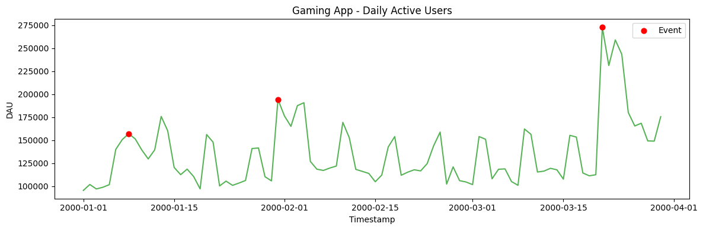
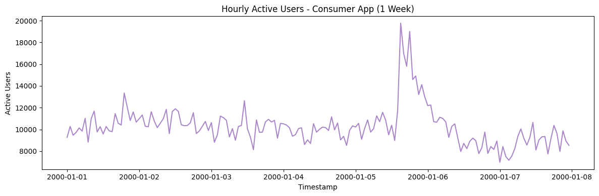
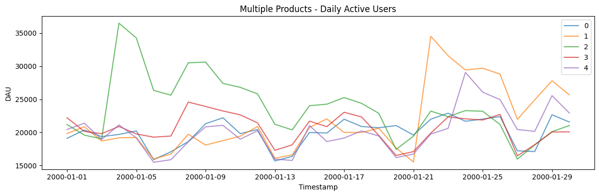

Product-engagement metrics like daily active users have a recognizable
shape: an underlying growth (or decay) trend, a strong weekly rhythm,
and noise. `DailyActiveUsersGenerator` reproduces this for testing
growth-analytics dashboards and anomaly detection on product metrics.

> **The model**
>
> A growth trend is combined with weekly seasonality and noise to
> produce a realistic engagement curve. Tune the growth and seasonal
> strength to span fast-growing, mature, and declining products.

```python
import polars as pl
import matplotlib.pyplot as plt

from synforecast.generators import DailyActiveUsersGenerator
```

## Consumer app (social media)

Generate 3 months of daily DAU data for a consumer app with organic
growth and marketing events.

```python
consumer_params = {
    "min_length": 90,
    "max_length": 90,
    "freq": "D",
    "app_type": "consumer",
    "base_users": 50000.0,
    "growth_rate": 0.001,
    "event_probability": 0.03,
    "event_impact_min": 1.3,
    "event_impact_max": 1.8,
    "event_decay_rate": 0.15,
    "seed": 42,
}
consumer_gen = DailyActiveUsersGenerator(engine="polars", **consumer_params)
consumer_df = consumer_gen.generate(n_series=1)

print(f"Generated {len(consumer_df)} daily observations")
print(f"Columns: {consumer_df.columns}")
consumer_df.head(14)
```

``` text
Generated 90 daily observations
Columns: ['unique_id', 'ds', 'y', 'event']
```

| unique_id | ds                  | y            | event |
|-----------|---------------------|--------------|-------|
| cat       | datetime\[ns\]      | f64          | i32   |
| "0"       | 2000-01-01 00:00:00 | 47735.136215 | 0     |
| "0"       | 2000-01-02 00:00:00 | 50902.490456 | 0     |
| "0"       | 2000-01-03 00:00:00 | 48434.649342 | 0     |
| "0"       | 2000-01-04 00:00:00 | 49295.395926 | 0     |
| "0"       | 2000-01-05 00:00:00 | 50653.792226 | 0     |
| …         | …                   | …            | …     |
| "0"       | 2000-01-10 00:00:00 | 55757.37744  | 0     |
| "0"       | 2000-01-11 00:00:00 | 49779.0814   | 0     |
| "0"       | 2000-01-12 00:00:00 | 51351.236124 | 0     |
| "0"       | 2000-01-13 00:00:00 | 39415.114056 | 0     |
| "0"       | 2000-01-14 00:00:00 | 41195.98853  | 0     |

```python
fig, ax = plt.subplots(figsize=(12, 4))
ax.plot(consumer_df["ds"].to_list(), consumer_df["y"].to_list(), alpha=0.8)
event_days = consumer_df.filter(pl.col("event") == 1)
if len(event_days) > 0:
    ax.scatter(event_days["ds"].to_list(), event_days["y"].to_list(), color="red", zorder=5, label="Event", s=40)
ax.set_xlabel("Timestamp")
ax.set_ylabel("DAU")
ax.set_title("Consumer App (Social Media) - Daily Active Users")
ax.legend()
plt.tight_layout()
plt.show()
```



### Event statistics

Examine how often events occur and their impact on DAU.

```python
n_events = consumer_df["event"].sum()
print(f"Events occurred: {n_events} times ({n_events/len(consumer_df)*100:.1f}%)")
print(
    f"DAU Statistics: Mean={consumer_df['y'].mean():,.0f}, "
    f"Min={consumer_df['y'].min():,.0f}, Max={consumer_df['y'].max():,.0f}"
)
```

``` text
Events occurred: 2 times (2.2%)
DAU Statistics: Mean=51,637, Min=37,539, Max=74,558
```

## Business app (B2B SaaS)

Business apps show very low weekend usage and more stable growth
patterns.

```python
business_params = {
    "min_length": 90,
    "max_length": 90,
    "freq": "D",
    "app_type": "business",
    "base_users": 5000.0,
    "growth_rate": 0.0005,
    "weekend_factor": 0.3,
    "event_probability": 0.02,
    "event_impact_min": 1.2,
    "event_impact_max": 1.5,
    "noise_std": 0.03,
    "seed": 42,
}
business_gen = DailyActiveUsersGenerator(engine="polars", **business_params)
business_df = business_gen.generate(n_series=1)

print(f"Generated {len(business_df)} daily observations")
print(
    f"DAU Statistics: Mean={business_df['y'].mean():,.0f}, "
    f"Min={business_df['y'].min():,.0f}, Max={business_df['y'].max():,.0f}"
)
business_df.head(14)
```

``` text
Generated 90 daily observations
DAU Statistics: Mean=4,248, Min=1,441, Max=6,467
```

| unique_id | ds                  | y           | event |
|-----------|---------------------|-------------|-------|
| cat       | datetime\[ns\]      | f64         | i32   |
| "0"       | 2000-01-01 00:00:00 | 4864.108173 | 0     |
| "0"       | 2000-01-02 00:00:00 | 5053.623878 | 0     |
| "0"       | 2000-01-03 00:00:00 | 4905.17701  | 0     |
| "0"       | 2000-01-04 00:00:00 | 4956.295316 | 0     |
| "0"       | 2000-01-05 00:00:00 | 5037.1627   | 0     |
| …         | …                   | …           | …     |
| "0"       | 2000-01-10 00:00:00 | 5339.451229 | 0     |
| "0"       | 2000-01-11 00:00:00 | 4981.882098 | 0     |
| "0"       | 2000-01-12 00:00:00 | 5075.214947 | 0     |
| "0"       | 2000-01-13 00:00:00 | 1485.148837 | 0     |
| "0"       | 2000-01-14 00:00:00 | 1524.820575 | 0     |

```python
fig, ax = plt.subplots(figsize=(12, 4))
ax.plot(business_df["ds"].to_list(), business_df["y"].to_list(), alpha=0.8, color="C1")
event_days = business_df.filter(pl.col("event") == 1)
if len(event_days) > 0:
    ax.scatter(event_days["ds"].to_list(), event_days["y"].to_list(), color="red", zorder=5, label="Event", s=40)
ax.set_xlabel("Timestamp")
ax.set_ylabel("DAU")
ax.set_title("Business App (B2B SaaS) - Daily Active Users")
ax.legend()
plt.tight_layout()
plt.show()
```



## Gaming app

Gaming apps typically show higher weekend usage and more frequent events
(game updates, tournaments).

```python
gaming_params = {
    "min_length": 90,
    "max_length": 90,
    "freq": "D",
    "app_type": "gaming",
    "base_users": 100000.0,
    "growth_rate": 0.002,
    "weekend_factor": 1.4,
    "event_probability": 0.05,
    "event_impact_min": 1.5,
    "event_impact_max": 2.5,
    "event_decay_rate": 0.2,
    "seed": 42,
}
gaming_gen = DailyActiveUsersGenerator(engine="polars", **gaming_params)
gaming_df = gaming_gen.generate(n_series=1)

n_events = gaming_df["event"].sum()
print(f"Generated {len(gaming_df)} daily observations")
print(f"Events occurred: {n_events} times (game updates, tournaments, etc.)")
print(
    f"DAU Statistics: Mean={gaming_df['y'].mean():,.0f}, "
    f"Min={gaming_df['y'].min():,.0f}, Max={gaming_df['y'].max():,.0f}"
)
gaming_df.head(14)
```

``` text
Generated 90 daily observations
Events occurred: 3 times (game updates, tournaments, etc.)
DAU Statistics: Mean=135,983, Min=95,470, Max=272,723
```

| unique_id | ds                  | y             | event |
|-----------|---------------------|---------------|-------|
| cat       | datetime\[ns\]      | f64           | i32   |
| "0"       | 2000-01-01 00:00:00 | 95470.27243   | 0     |
| "0"       | 2000-01-02 00:00:00 | 101906.684189 | 0     |
| "0"       | 2000-01-03 00:00:00 | 97062.940412  | 0     |
| "0"       | 2000-01-04 00:00:00 | 98886.564031  | 0     |
| "0"       | 2000-01-05 00:00:00 | 101713.017001 | 0     |
| …         | …                   | …             | …     |
| "0"       | 2000-01-10 00:00:00 | 139500.258599 | 0     |
| "0"       | 2000-01-11 00:00:00 | 129672.160207 | 0     |
| "0"       | 2000-01-12 00:00:00 | 139542.59736  | 0     |
| "0"       | 2000-01-13 00:00:00 | 175824.955432 | 0     |
| "0"       | 2000-01-14 00:00:00 | 160332.88223  | 0     |

```python
fig, ax = plt.subplots(figsize=(12, 4))
ax.plot(gaming_df["ds"].to_list(), gaming_df["y"].to_list(), alpha=0.8, color="C2")
event_days = gaming_df.filter(pl.col("event") == 1)
if len(event_days) > 0:
    ax.scatter(event_days["ds"].to_list(), event_days["y"].to_list(), color="red", zorder=5, label="Event", s=40)
ax.set_xlabel("Timestamp")
ax.set_ylabel("DAU")
ax.set_title("Gaming App - Daily Active Users")
ax.legend()
plt.tight_layout()
plt.show()
```



## Analyzing event impact

Compare DAU on event days versus normal days to measure the lift from
marketing events.

```python
event_days = consumer_df.filter(pl.col("event") == 1)
if len(event_days) > 0:
    print("Days when events occurred:")
    print(event_days)

    avg_event_day = consumer_df.filter(pl.col("event") == 1)["y"].mean()
    avg_normal_day = consumer_df.filter(pl.col("event") == 0)["y"].mean()
    print(f"\nAverage DAU on event days: {avg_event_day:,.0f}")
    print(f"Average DAU on normal days: {avg_normal_day:,.0f}")
    print(f"Event day lift: {(avg_event_day/avg_normal_day - 1)*100:.1f}%")
```

``` text
Days when events occurred:
shape: (2, 4)
┌───────────┬─────────────────────┬──────────────┬───────┐
│ unique_id ┆ ds                  ┆ y            ┆ event │
│ ---       ┆ ---                 ┆ ---          ┆ ---   │
│ cat       ┆ datetime[ns]        ┆ f64          ┆ i32   │
╞═══════════╪═════════════════════╪══════════════╪═══════╡
│ 0         ┆ 2000-01-20 00:00:00 ┆ 56577.396413 ┆ 1     │
│ 0         ┆ 2000-03-22 00:00:00 ┆ 74557.509084 ┆ 1     │
└───────────┴─────────────────────┴──────────────┴───────┘

Average DAU on event days: 65,567
Average DAU on normal days: 51,320
Event day lift: 27.8%
```

## Hourly active users

The generator also supports sub-daily frequencies like hourly data.

```python
hourly_params = {
    "min_length": 168,
    "max_length": 168,
    "freq": "h",
    "app_type": "consumer",
    "base_users": 10000.0,
    "event_probability": 0.01,
    "noise_std": 0.08,
    "seed": 42,
}
hourly_gen = DailyActiveUsersGenerator(engine="polars", **hourly_params)
hourly_df = hourly_gen.generate(n_series=1)

print(f"Generated {len(hourly_df)} hourly observations")
hourly_df.head(24)
```

``` text
Generated 168 hourly observations
```

| unique_id | ds                  | y            | event |
|-----------|---------------------|--------------|-------|
| cat       | datetime\[ns\]      | f64          | i32   |
| "0"       | 2000-01-01 00:00:00 | 9275.243589  | 0     |
| "0"       | 2000-01-01 01:00:00 | 10272.524421 | 0     |
| "0"       | 2000-01-01 02:00:00 | 9468.136049  | 0     |
| "0"       | 2000-01-01 03:00:00 | 9727.297606  | 0     |
| "0"       | 2000-01-01 04:00:00 | 10144.538427 | 0     |
| …         | …                   | …            | …     |
| "0"       | 2000-01-01 19:00:00 | 13346.974807 | 1     |
| "0"       | 2000-01-01 20:00:00 | 12068.154452 | 0     |
| "0"       | 2000-01-01 21:00:00 | 10815.974473 | 0     |
| "0"       | 2000-01-01 22:00:00 | 11608.360831 | 0     |
| "0"       | 2000-01-01 23:00:00 | 10668.204221 | 0     |

```python
fig, ax = plt.subplots(figsize=(12, 4))
ax.plot(hourly_df["ds"].to_list(), hourly_df["y"].to_list(), alpha=0.8, color="C4")
ax.set_xlabel("Timestamp")
ax.set_ylabel("Active Users")
ax.set_title("Hourly Active Users - Consumer App (1 Week)")
plt.tight_layout()
plt.show()
```



## Multiple products/apps

Generate DAU data for multiple products simultaneously and compare event
distributions.

```python
multi_params = {
    "min_length": 30,
    "max_length": 30,
    "freq": "D",
    "app_type": "consumer",
    "base_users": 20000.0,
    "event_probability": 0.03,
    "seed": 42,
}
multi_gen = DailyActiveUsersGenerator(engine="polars", **multi_params)
multi_df = multi_gen.generate(n_series=5)

print(f"Generated 5 products with {len(multi_df)} total observations")
print("\nProduct 0 preview:")
print(multi_df.filter(pl.col("unique_id") == "0").head(10))

total_events = multi_df.group_by("unique_id").agg(pl.col("event").sum())
print("\nEvents per product:")
print(total_events)
```

``` text
Generated 5 products with 150 total observations

Product 0 preview:
shape: (10, 4)
┌───────────┬─────────────────────┬──────────────┬───────┐
│ unique_id ┆ ds                  ┆ y            ┆ event │
│ ---       ┆ ---                 ┆ ---          ┆ ---   │
│ cat       ┆ datetime[ns]        ┆ f64          ┆ i32   │
╞═══════════╪═════════════════════╪══════════════╪═══════╡
│ 0         ┆ 2000-01-01 00:00:00 ┆ 19094.054486 ┆ 0     │
│ 0         ┆ 2000-01-02 00:00:00 ┆ 20350.825855 ┆ 0     │
│ 0         ┆ 2000-01-03 00:00:00 ┆ 19354.510065 ┆ 0     │
│ 0         ┆ 2000-01-04 00:00:00 ┆ 19688.625437 ┆ 0     │
│ 0         ┆ 2000-01-05 00:00:00 ┆ 20221.064661 ┆ 0     │
│ 0         ┆ 2000-01-06 00:00:00 ┆ 15882.965767 ┆ 0     │
│ 0         ┆ 2000-01-07 00:00:00 ┆ 17069.908021 ┆ 0     │
│ 0         ┆ 2000-01-08 00:00:00 ┆ 18599.75721  ┆ 0     │
│ 0         ┆ 2000-01-09 00:00:00 ┆ 21305.138222 ┆ 0     │
│ 0         ┆ 2000-01-10 00:00:00 ┆ 22202.888052 ┆ 0     │
└───────────┴─────────────────────┴──────────────┴───────┘

Events per product:
shape: (5, 2)
┌───────────┬───────┐
│ unique_id ┆ event │
│ ---       ┆ ---   │
│ cat       ┆ i32   │
╞═══════════╪═══════╡
│ 4         ┆ 1     │
│ 0         ┆ 1     │
│ 3         ┆ 1     │
│ 1         ┆ 1     │
│ 2         ┆ 1     │
└───────────┴───────┘
```

```python
fig, ax = plt.subplots(figsize=(12, 4))
for uid in multi_df["unique_id"].unique().to_list():
    series = multi_df.filter(pl.col("unique_id") == uid)
    ax.plot(series["ds"].to_list(), series["y"].to_list(), label=uid, alpha=0.7)
ax.set_xlabel("Timestamp")
ax.set_ylabel("DAU")
ax.set_title("Multiple Products - Daily Active Users")
ax.legend()
plt.tight_layout()
plt.show()
```



## Custom column names

Customize the output column names to match your application’s naming
conventions.

```python
custom_params = {
    "min_length": 30,
    "max_length": 30,
    "freq": "D",
    "base_users": 15000.0,
    "event_probability": 0.05,
    "event_col": "marketing_campaign",
    "id_col": "product_id",
    "time_col": "date",
    "target_col": "dau",
    "seed": 42,
}
custom_gen = DailyActiveUsersGenerator(engine="polars", **custom_params)
custom_df = custom_gen.generate(n_series=1)

print(f"Columns: {custom_df.columns}")
custom_df.head(10)
```

``` text
Columns: ['product_id', 'date', 'dau', 'marketing_campaign']
```

| product_id | date                | dau          | marketing_campaign |
|------------|---------------------|--------------|--------------------|
| cat        | datetime\[ns\]      | f64          | i32                |
| "0"        | 2000-01-01 00:00:00 | 14320.540864 | 0                  |
| "0"        | 2000-01-02 00:00:00 | 15263.119391 | 0                  |
| "0"        | 2000-01-03 00:00:00 | 14515.882549 | 0                  |
| "0"        | 2000-01-04 00:00:00 | 14766.469078 | 0                  |
| "0"        | 2000-01-05 00:00:00 | 15165.798496 | 0                  |
| "0"        | 2000-01-06 00:00:00 | 11912.224325 | 0                  |
| "0"        | 2000-01-07 00:00:00 | 12802.431016 | 0                  |
| "0"        | 2000-01-08 00:00:00 | 18654.126716 | 1                  |
| "0"        | 2000-01-09 00:00:00 | 18991.33087  | 0                  |
| "0"        | 2000-01-10 00:00:00 | 18312.235462 | 0                  |

> **Related generators**
>
> -   [Clickstream](clickstream) — the sessionized activity beneath
>     engagement metrics.
> -   [Seasonal](../statistical/seasonal) — the weekly rhythm in
>     isolation.
>
> Full parameters are in the [generator
> reference](https://github.com/Nixtla/synforecast/blob/main/GENERATORS.md).

