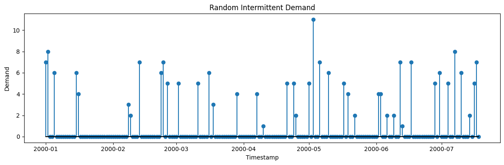
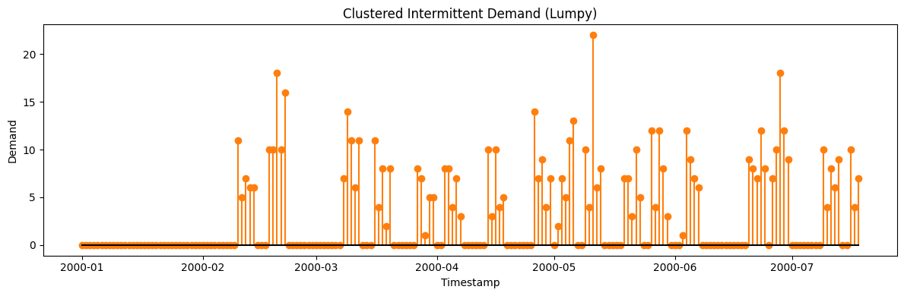
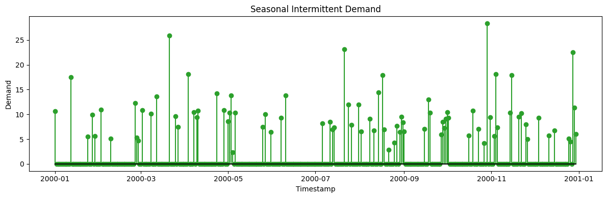
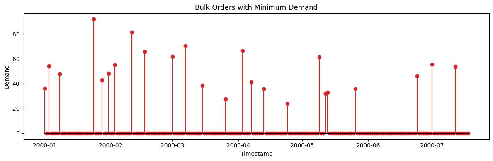
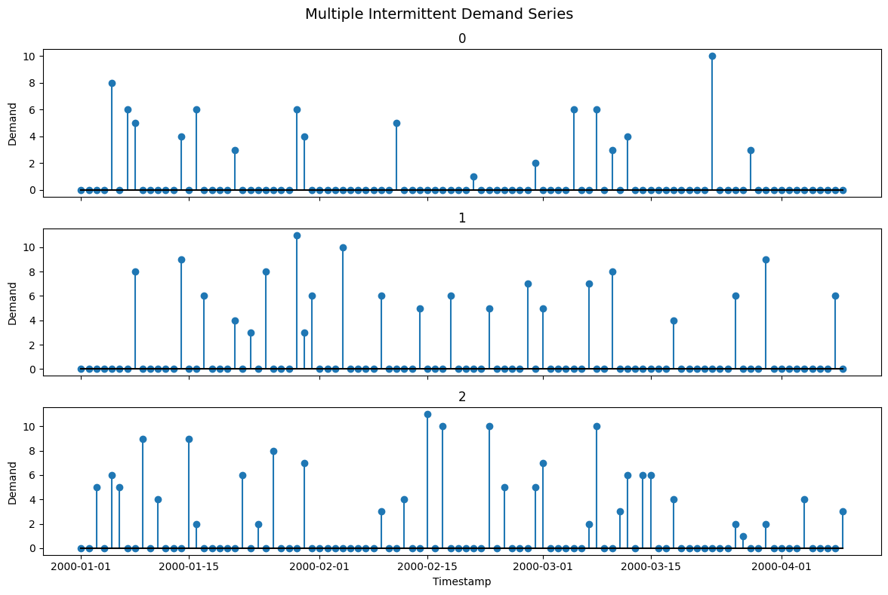

Intermittent demand is *sparse*: long runs of zeros punctuated by
occasional nonzero orders — the reality for spare parts and slow-moving
SKUs. Standard forecasters trained on smooth series fail here, which
makes this generator the test bed for Croston-type methods and
zero-inflated models.

> **The model**
>
> Nonzero demands are separated by random gaps, with order sizes drawn
> independently. `intermittent_pattern` shapes *when* orders occur —
> `random`, `clustered` (bursts of demand), or `seasonal` (periodic
> demand windows).

```python
import numpy as np
import polars as pl
import matplotlib.pyplot as plt

from synforecast.generators import IntermittentDemandGenerator
```

## 1. Random Intermittent Pattern (Retail Demand)

Generate demand with a 20% probability of occurrence each day, using a
Poisson distribution for demand sizes.

```python
params_random = {
    "min_length": 200,
    "max_length": 200,
    "freq": "D",
    "intermittent_pattern": "random",
    "demand_probability": 0.2,
    "demand_distribution": "poisson",
    "demand_mean": 5.0,
    "seed": 42,
}

gen_random = IntermittentDemandGenerator(engine="polars", **params_random)
df_random = gen_random.generate(n_series=1)

print(f"Generated {len(df_random)} daily observations")
df_random.head(20)
```

``` text
Generated 200 daily observations
```

| unique_id | ds                  | y   |
|-----------|---------------------|-----|
| cat       | datetime\[ns\]      | f64 |
| "0"       | 2000-01-01 00:00:00 | 7.0 |
| "0"       | 2000-01-02 00:00:00 | 8.0 |
| "0"       | 2000-01-03 00:00:00 | 0.0 |
| "0"       | 2000-01-04 00:00:00 | 0.0 |
| "0"       | 2000-01-05 00:00:00 | 6.0 |
| …         | …                   | …   |
| "0"       | 2000-01-16 00:00:00 | 4.0 |
| "0"       | 2000-01-17 00:00:00 | 0.0 |
| "0"       | 2000-01-18 00:00:00 | 0.0 |
| "0"       | 2000-01-19 00:00:00 | 0.0 |
| "0"       | 2000-01-20 00:00:00 | 0.0 |

```python
fig, ax = plt.subplots(figsize=(12, 4))
series = df_random.filter(pl.col("unique_id") == "0")
ax.stem(series["ds"].to_list(), series["y"].to_list(), linefmt="C0-", markerfmt="C0o", basefmt="k-")
ax.set_xlabel("Timestamp")
ax.set_ylabel("Demand")
ax.set_title("Random Intermittent Demand")
plt.tight_layout()
plt.show()
```



```python
non_zero_count = (df_random["y"] > 0).sum()
zero_count = (df_random["y"] == 0).sum()
zero_ratio = zero_count / len(df_random)

print(f"Demand statistics:")
print(f"  Zero demand days:     {zero_count} ({zero_ratio:.1%})")
print(f"  Non-zero demand days: {non_zero_count} ({1-zero_ratio:.1%})")

if non_zero_count > 0:
    non_zero_demands = df_random.filter(pl.col("y") > 0)["y"].to_numpy()
    print(f"  When demand occurs:")
    print(f"    Mean:   {non_zero_demands.mean():.2f}")
    print(f"    Std:    {non_zero_demands.std():.2f}")
    print(f"    Min:    {non_zero_demands.min():.0f}")
    print(f"    Max:    {non_zero_demands.max():.0f}")
```

``` text
Demand statistics:
  Zero demand days:     157 (78.5%)
  Non-zero demand days: 43 (21.5%)
  When demand occurs:
    Mean:   4.93
    Std:    2.10
    Min:    1
    Max:    11
```

## 2. Clustered Intermittent Pattern (Lumpy Demand)

Demand occurs in clusters of consecutive days, simulating bulk ordering
behavior.

```python
params_clustered = {
    "min_length": 200,
    "max_length": 200,
    "freq": "D",
    "intermittent_pattern": "clustered",
    "demand_probability": 0.15,
    "cluster_size": 5,
    "demand_distribution": "negative_binomial",
    "demand_mean": 8.0,
    "demand_std": 4.0,
    "seed": 123,
}

gen_clustered = IntermittentDemandGenerator(engine="polars", **params_clustered)
df_clustered = gen_clustered.generate(n_series=1)

print(f"Generated {len(df_clustered)} daily observations")
print(f"Demand occurs in clusters of {params_clustered['cluster_size']} days")

non_zero_count = (df_clustered["y"] > 0).sum()
zero_ratio = (df_clustered["y"] == 0).sum() / len(df_clustered)
print(f"\nCluster statistics:")
print(f"  Zero demand days:     {(df_clustered['y'] == 0).sum()} ({zero_ratio:.1%})")
print(f"  Non-zero demand days: {non_zero_count} ({1-zero_ratio:.1%})")

df_clustered.head(30)
```

``` text
Generated 200 daily observations
Demand occurs in clusters of 5 days

Cluster statistics:
  Zero demand days:     117 (58.5%)
  Non-zero demand days: 83 (41.5%)
```

| unique_id | ds                  | y   |
|-----------|---------------------|-----|
| cat       | datetime\[ns\]      | f64 |
| "0"       | 2000-01-01 00:00:00 | 0.0 |
| "0"       | 2000-01-02 00:00:00 | 0.0 |
| "0"       | 2000-01-03 00:00:00 | 0.0 |
| "0"       | 2000-01-04 00:00:00 | 0.0 |
| "0"       | 2000-01-05 00:00:00 | 0.0 |
| …         | …                   | …   |
| "0"       | 2000-01-26 00:00:00 | 0.0 |
| "0"       | 2000-01-27 00:00:00 | 0.0 |
| "0"       | 2000-01-28 00:00:00 | 0.0 |
| "0"       | 2000-01-29 00:00:00 | 0.0 |
| "0"       | 2000-01-30 00:00:00 | 0.0 |

```python
fig, ax = plt.subplots(figsize=(12, 4))
series = df_clustered.filter(pl.col("unique_id") == "0")
ax.stem(series["ds"].to_list(), series["y"].to_list(), linefmt="C1-", markerfmt="C1o", basefmt="k-")
ax.set_xlabel("Timestamp")
ax.set_ylabel("Demand")
ax.set_title("Clustered Intermittent Demand (Lumpy)")
plt.tight_layout()
plt.show()
```



## 3. Seasonal Intermittent Pattern (Seasonal Spare Parts)

Demand probability varies seasonally, with peaks at regular intervals.

```python
params_seasonal = {
    "min_length": 365,
    "max_length": 365,
    "freq": "D",
    "intermittent_pattern": "seasonal",
    "demand_probability": 0.1,
    "seasonal_period": 30,
    "seasonal_peak_prob": 0.4,
    "demand_distribution": "lognormal",
    "demand_mean": 10.0,
    "demand_std": 5.0,
    "seed": 456,
}

gen_seasonal = IntermittentDemandGenerator(engine="polars", **params_seasonal)
df_seasonal = gen_seasonal.generate(n_series=1)

print(f"Generated {len(df_seasonal)} daily observations (1 year)")
print(f"Seasonal period: {params_seasonal['seasonal_period']} days")
```

``` text
Generated 365 daily observations (1 year)
Seasonal period: 30 days
```

```python
fig, ax = plt.subplots(figsize=(12, 4))
series = df_seasonal.filter(pl.col("unique_id") == "0")
ax.stem(series["ds"].to_list(), series["y"].to_list(), linefmt="C2-", markerfmt="C2o", basefmt="k-")
ax.set_xlabel("Timestamp")
ax.set_ylabel("Demand")
ax.set_title("Seasonal Intermittent Demand")
plt.tight_layout()
plt.show()
```



```python
df_seasonal_with_month = df_seasonal.with_columns(
    (
        (pl.col("ds").dt.ordinal_day() - 1) // params_seasonal["seasonal_period"]
    ).alias("period")
)

period_stats = (
    df_seasonal_with_month.group_by("period")
    .agg(
        [
            (pl.col("y") > 0).sum().alias("demand_days"),
            pl.col("y").sum().alias("total_demand"),
        ]
    )
    .sort("period")
)
period_stats.head(12)
```

| period | demand_days | total_demand |
|--------|-------------|--------------|
| i16    | u32         | f64          |
| 0      | 5           | 49.140826    |
| 1      | 5           | 38.369604    |
| 2      | 6           | 77.554187    |
| 3      | 6           | 73.764635    |
| 4      | 7           | 62.9634      |
| …      | …           | …            |
| 7      | 10          | 88.474966    |
| 8      | 7           | 61.269519    |
| 9      | 9           | 74.013587    |
| 10     | 11          | 129.047768   |
| 11     | 5           | 31.955985    |

## 4. Comparing Different Demand Distributions

Compare Poisson, negative binomial, lognormal, and gamma distributions
for demand sizes.

```python
distributions = ["poisson", "negative_binomial", "lognormal", "gamma"]
results = {}

for dist in distributions:
    params = {
        "min_length": 300,
        "max_length": 300,
        "freq": "D",
        "demand_probability": 0.3,
        "demand_distribution": dist,
        "demand_mean": 7.0,
        "demand_std": 3.0,
        "seed": 789,
    }

    gen = IntermittentDemandGenerator(engine="polars", **params)
    df = gen.generate(n_series=1)

    non_zero = df.filter(pl.col("y") > 0)["y"].to_numpy()
    if len(non_zero) > 0:
        results[dist] = {
            "count": len(non_zero),
            "mean": non_zero.mean(),
            "std": non_zero.std(),
            "min": non_zero.min(),
            "max": non_zero.max(),
        }

print(f"Distribution comparison (when demand > 0):")
print(f"{'Distribution':<20} {'Count':<8} {'Mean':<8} {'Std':<8} {'Min':<8} {'Max':<8}")
print("-" * 60)
for dist, stats in results.items():
    print(
        f"{dist:<20} {stats['count']:<8} {stats['mean']:<8.2f} {stats['std']:<8.2f} {stats['min']:<8.0f} {stats['max']:<8.0f}"
    )
```

``` text
Distribution comparison (when demand > 0):
Distribution         Count    Mean     Std      Min      Max     
------------------------------------------------------------
poisson              86       6.80     2.48     3        15      
negative_binomial    86       6.43     2.82     1        15      
lognormal            86       6.55     2.62     2        18      
gamma                86       6.47     2.73     1        17      
```

## 5. Bulk Orders with Minimum Demand

Simulate rare but large orders with a minimum order quantity constraint.

```python
params_bulk = {
    "min_length": 200,
    "max_length": 200,
    "freq": "D",
    "demand_probability": 0.1,
    "demand_distribution": "gamma",
    "demand_mean": 50.0,
    "demand_std": 20.0,
    "min_demand": 20,
    "seed": 999,
}

gen_bulk = IntermittentDemandGenerator(engine="polars", **params_bulk)
df_bulk = gen_bulk.generate(n_series=1)

print(f"Generated {len(df_bulk)} daily observations")
print(f"Minimum order quantity: {params_bulk['min_demand']}")

non_zero_bulk = df_bulk.filter(pl.col("y") > 0)["y"].to_numpy()
if len(non_zero_bulk) > 0:
    print(f"\nBulk order statistics:")
    print(f"  Number of orders: {len(non_zero_bulk)}")
    print(f"  Mean order size:  {non_zero_bulk.mean():.2f}")
    print(f"  Min order size:   {non_zero_bulk.min():.0f}")
    print(f"  Max order size:   {non_zero_bulk.max():.0f}")
    print(f"  All orders >= minimum: {np.all(non_zero_bulk >= params_bulk['min_demand'])}")

df_bulk.head(20)
```

``` text
Generated 200 daily observations
Minimum order quantity: 20

Bulk order statistics:
  Number of orders: 24
  Mean order size:  50.34
  Min order size:   24
  Max order size:   92
  All orders >= minimum: True
```

| unique_id | ds                  | y         |
|-----------|---------------------|-----------|
| cat       | datetime\[ns\]      | f64       |
| "0"       | 2000-01-01 00:00:00 | 36.316717 |
| "0"       | 2000-01-02 00:00:00 | 0.0       |
| "0"       | 2000-01-03 00:00:00 | 54.317364 |
| "0"       | 2000-01-04 00:00:00 | 0.0       |
| "0"       | 2000-01-05 00:00:00 | 0.0       |
| …         | …                   | …         |
| "0"       | 2000-01-16 00:00:00 | 0.0       |
| "0"       | 2000-01-17 00:00:00 | 0.0       |
| "0"       | 2000-01-18 00:00:00 | 0.0       |
| "0"       | 2000-01-19 00:00:00 | 0.0       |
| "0"       | 2000-01-20 00:00:00 | 0.0       |

```python
fig, ax = plt.subplots(figsize=(12, 4))
series = df_bulk.filter(pl.col("unique_id") == "0")
ax.stem(series["ds"].to_list(), series["y"].to_list(), linefmt="C3-", markerfmt="C3o", basefmt="k-")
ax.set_xlabel("Timestamp")
ax.set_ylabel("Demand")
ax.set_title("Bulk Orders with Minimum Demand")
plt.tight_layout()
plt.show()
```



## 6. Multiple Intermittent Demand Series

Generate multiple independent intermittent demand series and compare
their statistics.

```python
params_multi = {
    "min_length": 100,
    "max_length": 100,
    "freq": "D",
    "demand_probability": 0.25,
    "demand_distribution": "poisson",
    "demand_mean": 6.0,
    "seed": 1234,
}

gen_multi = IntermittentDemandGenerator(engine="polars", **params_multi)
df_multi = gen_multi.generate(n_series=3)

print(f"Generated 3 intermittent demand series")
print(f"Total rows: {len(df_multi)}")
print(f"Unique series IDs: {df_multi['unique_id'].unique().to_list()}")

series_stats = (
    df_multi.group_by("unique_id")
    .agg(
        [
            (pl.col("y") == 0).sum().alias("zero_days"),
            (pl.col("y") > 0).sum().alias("demand_days"),
            pl.col("y").sum().alias("total_demand"),
            pl.col("y")
            .filter(pl.col("y") > 0)
            .mean()
            .alias("avg_demand_when_nonzero"),
        ]
    )
    .sort("unique_id")
)
series_stats
```

``` text
Generated 3 intermittent demand series
Total rows: 300
Unique series IDs: ['0', '1', '2']
```

| unique_id | zero_days | demand_days | total_demand | avg_demand_when_nonzero |
|-----------|-----------|-------------|--------------|-------------------------|
| cat       | u32       | u32         | f64          | f64                     |
| "0"       | 83        | 17          | 82.0         | 4.823529                |
| "1"       | 78        | 22          | 142.0        | 6.454545                |
| "2"       | 69        | 31          | 167.0        | 5.387097                |

```python
fig, axes = plt.subplots(3, 1, figsize=(12, 8), sharex=True)
for ax, uid in zip(axes, df_multi["unique_id"].unique().to_list()):
    series = df_multi.filter(pl.col("unique_id") == uid)
    ax.stem(series["ds"].to_list(), series["y"].to_list(), linefmt="C0-", markerfmt="C0o", basefmt="k-")
    ax.set_ylabel("Demand")
    ax.set_title(uid)
axes[-1].set_xlabel("Timestamp")
plt.suptitle("Multiple Intermittent Demand Series", fontsize=14)
plt.tight_layout()
plt.show()
```



> **Related generators**
>
> -   [INAR](../statistical/inar) — autocorrelated integer counts.
> -   [Poisson process](../stochastic/poisson_process) — event arrivals
>     over time.
>
> Full parameters are in the [generator
> reference](https://github.com/Nixtla/synforecast/blob/main/GENERATORS.md).

