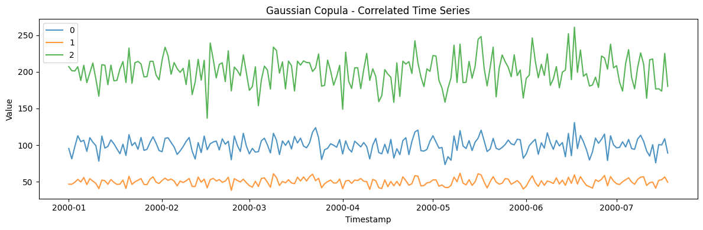
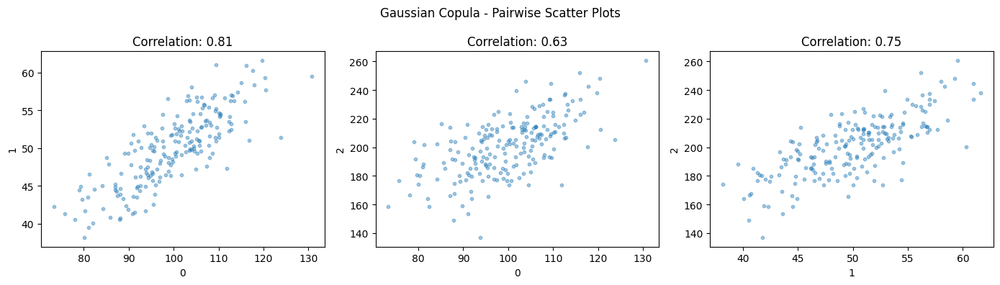
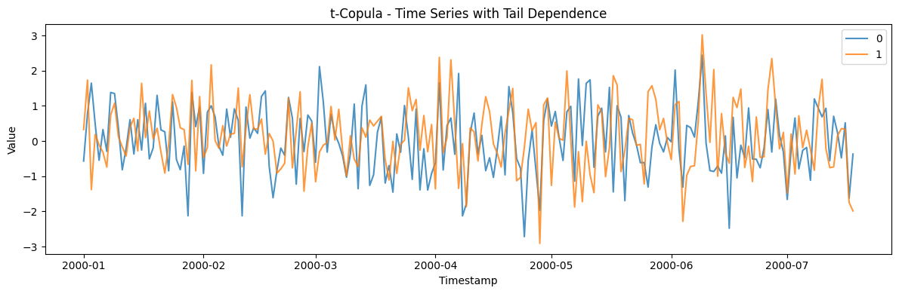
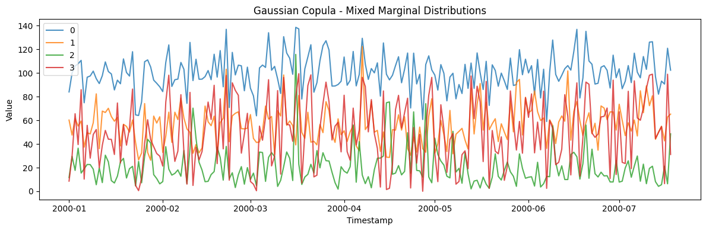
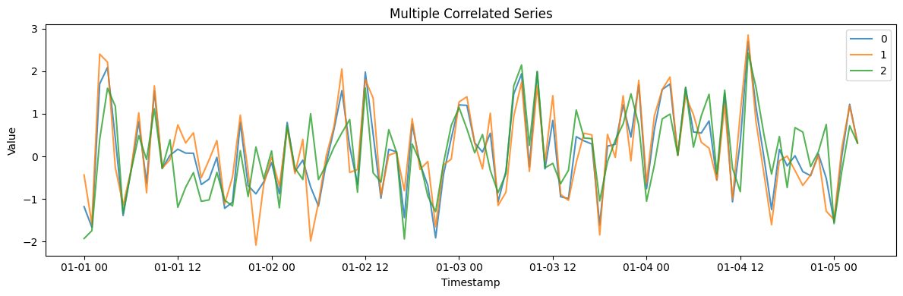

A copula separates *what each series looks like* (its marginal
distribution) from *how the series move together* (their dependence).
`CopulaGenerator` imposes a target correlation structure across channels
while leaving each channel’s marginal free — the right tool when the
joint dependence matters more than any single series’ dynamics.

> **The model**
>
> A copula (`copula_type="gaussian"` or `"t"`) couples the channels
> through a `correlation_matrix`, then maps each channel back to its
> marginal. A t-copula adds tail dependence — extremes that co-occur —
> which a Gaussian copula misses.

```python
import numpy as np
import polars as pl
import matplotlib.pyplot as plt

from synforecast.generators import CopulaGenerator
```

## 1. Gaussian Copula with Correlated Normal Variables

Generate three correlated variables with specified pairwise correlations
using a Gaussian copula.

```python
corr_matrix = np.array([[1.0, 0.8, 0.6], [0.8, 1.0, 0.7], [0.6, 0.7, 1.0]])

params_gaussian = {
    "min_length": 200,
    "max_length": 200,
    "freq": "D",
    "copula_type": "gaussian",
    "correlation_matrix": corr_matrix,
    "marginal_distributions": [
        {"type": "normal", "loc": 100.0, "scale": 10.0},
        {"type": "normal", "loc": 50.0, "scale": 5.0},
        {"type": "normal", "loc": 200.0, "scale": 20.0},
    ],
    "seed": 42,
}

gen_gaussian = CopulaGenerator(engine="polars", **params_gaussian)
df_gaussian = gen_gaussian.generate(n_series=3)

print(f"Generated {len(df_gaussian)} observations with 3 correlated variables")
df_gaussian.head(10)
```

``` text
Generated 600 observations with 3 correlated variables
```

| unique_id | ds                  | y          |
|-----------|---------------------|------------|
| cat       | datetime\[ns\]      | f64        |
| "0"       | 2000-01-01 00:00:00 | 95.378555  |
| "0"       | 2000-01-02 00:00:00 | 81.197776  |
| "0"       | 2000-01-03 00:00:00 | 97.662273  |
| "0"       | 2000-01-04 00:00:00 | 112.804514 |
| "0"       | 2000-01-05 00:00:00 | 104.679034 |
| "0"       | 2000-01-06 00:00:00 | 106.63344  |
| "0"       | 2000-01-07 00:00:00 | 91.473154  |
| "0"       | 2000-01-08 00:00:00 | 110.159648 |
| "0"       | 2000-01-09 00:00:00 | 103.90346  |
| "0"       | 2000-01-10 00:00:00 | 99.305584  |

```python
fig, ax = plt.subplots(figsize=(12, 4))
for uid in df_gaussian["unique_id"].unique().to_list():
    series = df_gaussian.filter(pl.col("unique_id") == uid)
    ax.plot(series["ds"].to_list(), series["y"].to_list(), label=uid, alpha=0.8)
ax.set_xlabel("Timestamp")
ax.set_ylabel("Value")
ax.set_title("Gaussian Copula - Correlated Time Series")
ax.legend()
plt.tight_layout()
plt.show()
```



### Verify Correlations

Check that the empirical correlations match the specified correlation
matrix.

```python
df_wide = df_gaussian.pivot(on="unique_id", index="ds", values="y")
series_cols = sorted([col for col in df_wide.columns if col != "ds"])

if len(series_cols) >= 3:
    corr_0_1 = np.corrcoef(
        df_wide[series_cols[0]].to_numpy(), df_wide[series_cols[1]].to_numpy()
    )[0, 1]
    corr_0_2 = np.corrcoef(
        df_wide[series_cols[0]].to_numpy(), df_wide[series_cols[2]].to_numpy()
    )[0, 1]
    corr_1_2 = np.corrcoef(
        df_wide[series_cols[1]].to_numpy(), df_wide[series_cols[2]].to_numpy()
    )[0, 1]

    print(f"Correlations (compared to specified):")
    print(f"  0 vs 1: {corr_0_1:.3f} (specified: 0.800)")
    print(f"  0 vs 2: {corr_0_2:.3f} (specified: 0.600)")
    print(f"  1 vs 2: {corr_1_2:.3f} (specified: 0.700)")
```

``` text
Correlations (compared to specified):
  0 vs 1: 0.809 (specified: 0.800)
  0 vs 2: 0.627 (specified: 0.600)
  1 vs 2: 0.745 (specified: 0.700)
```

```python
fig, axes = plt.subplots(1, 3, figsize=(14, 4))
cols = sorted([c for c in df_wide.columns if c != "ds"])
pairs = [(0, 1), (0, 2), (1, 2)]
for ax, (i, j) in zip(axes, pairs):
    ax.scatter(df_wide[cols[i]].to_list(), df_wide[cols[j]].to_list(), alpha=0.4, s=10)
    ax.set_xlabel(cols[i])
    ax.set_ylabel(cols[j])
    corr_val = np.corrcoef(df_wide[cols[i]].to_numpy(), df_wide[cols[j]].to_numpy())[0, 1]
    ax.set_title(f"Correlation: {corr_val:.2f}")
plt.suptitle("Gaussian Copula - Pairwise Scatter Plots")
plt.tight_layout()
plt.show()
```



## 2. t-Copula with Heavy Tail Dependence

The t-copula captures tail dependence, meaning extreme events are more
likely to occur together than with a Gaussian copula.

```python
params_t = {
    "min_length": 200,
    "max_length": 200,
    "freq": "D",
    "copula_type": "t",
    "df": 5.0,
    "marginal_distributions": [
        {"type": "normal", "loc": 0.0, "scale": 1.0},
        {"type": "normal", "loc": 0.0, "scale": 1.0},
    ],
    "seed": 123,
}

gen_t = CopulaGenerator(engine="polars", **params_t)
df_t = gen_t.generate(n_series=2)

print(f"Generated {len(df_t)} observations with t-copula")

df_t_wide = df_t.pivot(on="unique_id", index="ds", values="y")
t_cols = sorted([col for col in df_t_wide.columns if col != "ds"])
if len(t_cols) >= 2:
    corr_t = np.corrcoef(
        df_t_wide[t_cols[0]].to_numpy(), df_t_wide[t_cols[1]].to_numpy()
    )[0, 1]
    print(f"Correlation: {corr_t:.3f}")
```

``` text
Generated 400 observations with t-copula
Correlation: 0.318
```

```python
fig, ax = plt.subplots(figsize=(12, 4))
for uid in df_t["unique_id"].unique().to_list():
    series = df_t.filter(pl.col("unique_id") == uid)
    ax.plot(series["ds"].to_list(), series["y"].to_list(), label=uid, alpha=0.8)
ax.set_xlabel("Timestamp")
ax.set_ylabel("Value")
ax.set_title("t-Copula - Time Series with Tail Dependence")
ax.legend()
plt.tight_layout()
plt.show()
```



## 3. Gaussian Copula with Mixed Marginal Distributions

Copulas decouple the dependency structure from the marginals, allowing
different distribution types for each variable.

```python
params_mixed = {
    "min_length": 200,
    "max_length": 200,
    "freq": "D",
    "copula_type": "gaussian",
    "marginal_distributions": [
        {"type": "normal", "loc": 100.0, "scale": 15.0},
        {"type": "lognormal", "mean": 4.0, "sigma": 0.3},
        {"type": "gamma", "shape": 2.0, "scale": 10.0},
        {"type": "uniform", "low": 0.0, "high": 100.0},
    ],
    "seed": 456,
}

gen_mixed = CopulaGenerator(engine="polars", **params_mixed)
df_mixed = gen_mixed.generate(n_series=4)

print(f"Generated {len(df_mixed)} observations with mixed marginals")

stats = df_mixed.group_by("unique_id").agg(
    pl.col("y").mean().alias("mean"), pl.col("y").std().alias("std")
)
stats.sort("unique_id")
```

``` text
Generated 800 observations with mixed marginals
```

| unique_id | mean       | std       |
|-----------|------------|-----------|
| cat       | f64        | f64       |
| "0"       | 100.361521 | 15.150987 |
| "1"       | 56.092974  | 16.038571 |
| "2"       | 20.491118  | 15.704863 |
| "3"       | 49.569035  | 28.428938 |

```python
fig, ax = plt.subplots(figsize=(12, 4))
for uid in df_mixed["unique_id"].unique().to_list():
    series = df_mixed.filter(pl.col("unique_id") == uid)
    ax.plot(series["ds"].to_list(), series["y"].to_list(), label=uid, alpha=0.8)
ax.set_xlabel("Timestamp")
ax.set_ylabel("Value")
ax.set_title("Gaussian Copula - Mixed Marginal Distributions")
ax.legend()
plt.tight_layout()
plt.show()
```



## 4. Generating Multiple Correlated Series

Generate multiple independent draws of correlated multivariate series.

```python
params_multi = {
    "min_length": 100,
    "max_length": 100,
    "freq": "h",
    "copula_type": "gaussian",
    "seed": 789,
}

gen_multi = CopulaGenerator(engine="polars", **params_multi)
df_multi = gen_multi.generate(n_series=3)

print(f"Generated 3 multivariate series")
print(f"Total rows: {len(df_multi)}")
print(f"Unique series IDs: {df_multi['unique_id'].unique().to_list()}")

df_multi.filter(pl.col("unique_id") == "0").head(5)
```

``` text
Generated 3 multivariate series
Total rows: 300
Unique series IDs: ['0', '1', '2']
```

| unique_id | ds                  | y         |
|-----------|---------------------|-----------|
| cat       | datetime\[ns\]      | f64       |
| "0"       | 2000-01-01 00:00:00 | -1.177967 |
| "0"       | 2000-01-01 01:00:00 | -1.662594 |
| "0"       | 2000-01-01 02:00:00 | 1.704117  |
| "0"       | 2000-01-01 03:00:00 | 2.0864    |
| "0"       | 2000-01-01 04:00:00 | 0.423711  |

```python
fig, ax = plt.subplots(figsize=(12, 4))
for uid in df_multi["unique_id"].unique().to_list():
    series = df_multi.filter(pl.col("unique_id") == uid)
    ax.plot(series["ds"].to_list(), series["y"].to_list(), label=uid, alpha=0.8)
ax.set_xlabel("Timestamp")
ax.set_ylabel("Value")
ax.set_title("Multiple Correlated Series")
ax.legend()
plt.tight_layout()
plt.show()
```



> **Related generators**
>
> -   [VAR](var) — dependence that plays out *over time* (lead-lag), not
>     just contemporaneously.
> -   [Multivariatize](../../capabilities/multivariatize) — turn any
>     univariate generator into coupled channels.
>
> Full parameters are in the [generator
> reference](https://github.com/Nixtla/synforecast/blob/main/GENERATORS.md).

