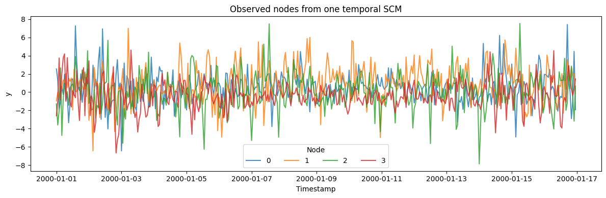

`TCMGenerator` samples a temporal structural causal model (SCM):
variables are connected through randomly sampled lagged edges, then the
system is rolled forward with nonlinear edge functions and stochastic
innovations.

The temporal-SCM framing follows the overview in Runge et al. (2023),
[Causal inference for time
series](https://doi.org/10.1038/s43017-023-00431-y). SynForecast’s graph
sampler, edge-function mixture, stability rescaling, and rollout guards
are original design choices; this is not a reproduction of a generator
from that paper.

```python
import matplotlib.pyplot as plt
import numpy as np
import polars as pl

from synforecast.generators import TCMGenerator
```

## Independent SCM draws

In the default univariate mode, each output series comes from a
separately sampled SCM. The observed series is one node; other nodes in
that SCM act as latent drivers.

```python
independent_generator = TCMGenerator(
    engine="polars",
    min_length=256,
    max_length=256,
    freq="h",
    n_vars_range=(2, 5),
    max_lag_range=(1, 12),
    seed=42,
)
independent_df = independent_generator.generate(n_series=3)
independent_df.head()
```

| unique_id | ds                  | y         |
|-----------|---------------------|-----------|
| cat       | datetime\[ns\]      | f64       |
| "0"       | 2000-01-01 00:00:00 | 1.345195  |
| "0"       | 2000-01-01 01:00:00 | -0.067311 |
| "0"       | 2000-01-01 02:00:00 | -0.248761 |
| "0"       | 2000-01-01 03:00:00 | -0.196262 |
| "0"       | 2000-01-01 04:00:00 | 0.030754  |

```python
fig, ax = plt.subplots(figsize=(12, 4))
for uid in independent_df["unique_id"].unique(maintain_order=True):
    series = independent_df.filter(pl.col("unique_id") == uid)
    ax.plot(series["ds"], series["y"], label=str(uid), alpha=0.8)
ax.set(title="Independent temporal SCM draws", xlabel="Timestamp", ylabel="y")
ax.legend(title="Series")
plt.tight_layout()
plt.show()
```


## Nodes from one shared SCM

Set `multivariate=True` to return several observed nodes from one
jointly rolled-out SCM. The resulting series share the same causal graph
and may exhibit contemporaneous and lagged dependence.

```python
joint_generator = TCMGenerator(
    engine="polars",
    min_length=384,
    max_length=384,
    freq="h",
    multivariate=True,
    n_vars_range=(4, 6),
    max_lag_range=(1, 12),
    edge_probability_range=(0.15, 0.3),
    seed=7,
)
joint_df = joint_generator.generate(n_series=4)
wide = joint_df.pivot(on="unique_id", index="ds", values="y").sort("ds")
value_columns = [column for column in wide.columns if column != "ds"]
correlations = np.corrcoef(wide.select(value_columns).to_numpy(), rowvar=False)
print("Contemporaneous correlation matrix:")
print(np.round(correlations, 2))
joint_df.head()
```

``` text
Contemporaneous correlation matrix:
[[ 1.    0.03 -0.01 -0.05]
 [ 0.03  1.    0.04  0.12]
 [-0.01  0.04  1.   -0.02]
 [-0.05  0.12 -0.02  1.  ]]
```

| unique_id | ds                  | y         |
|-----------|---------------------|-----------|
| cat       | datetime\[ns\]      | f64       |
| "0"       | 2000-01-01 00:00:00 | 2.540188  |
| "0"       | 2000-01-01 01:00:00 | 1.305371  |
| "0"       | 2000-01-01 02:00:00 | -1.855451 |
| "0"       | 2000-01-01 03:00:00 | -1.029545 |
| "0"       | 2000-01-01 04:00:00 | 0.628659  |

```python
fig, ax = plt.subplots(figsize=(12, 4))
for uid in joint_df["unique_id"].unique(maintain_order=True):
    series = joint_df.filter(pl.col("unique_id") == uid)
    ax.plot(series["ds"], series["y"], label=str(uid), alpha=0.8)
ax.set(title="Observed nodes from one temporal SCM", xlabel="Timestamp", ylabel="y")
ax.legend(title="Node", ncol=4)
plt.tight_layout()
plt.show()
```



> **Related generators**
>
> -   [TSI](tsi) — trend/seasonal/irregular composition;
>     [KernelSynth](kernel_synth) — GP kernel compositions.
> -   [VAR](../multivariate/var) — linear multivariate dynamics without
>     a random causal graph.
>
> Full parameters are in the [generator
> reference](https://github.com/Nixtla/synforecast/blob/main/GENERATORS.md).

