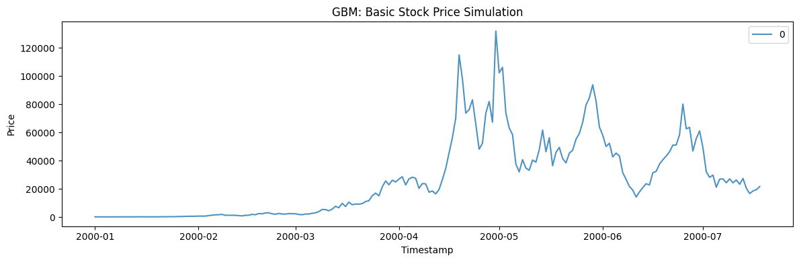
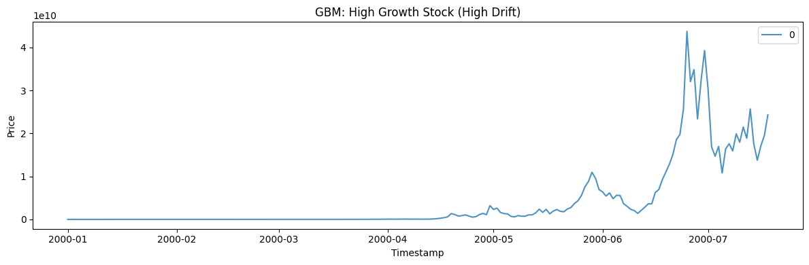
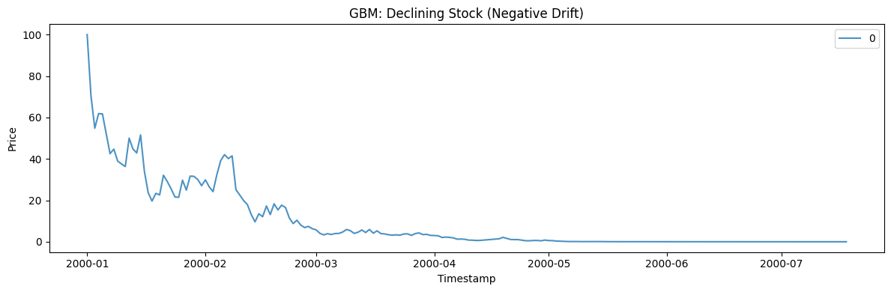
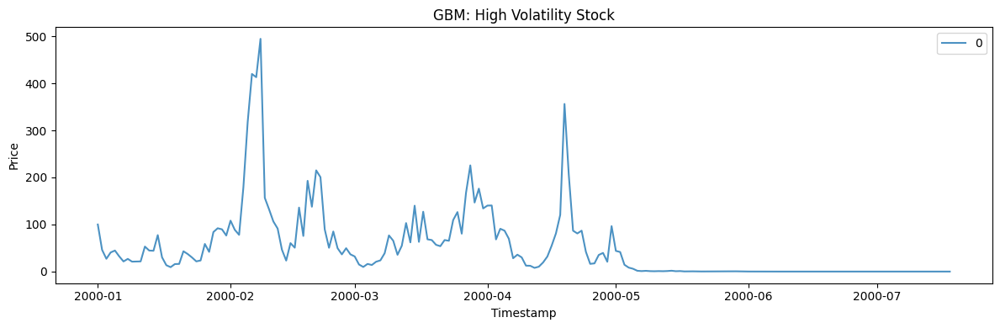
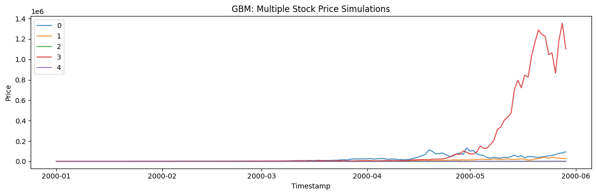

Geometric Brownian motion (GBM) is the standard model for strictly
positive, compounding quantities — asset prices, populations, anything
that grows *multiplicatively*. Its log grows as a drifting random walk,
so the level is log-normal and never goes negative.

> **The model**
>
> $$dS_t = \mu\,S_t\,dt + \sigma\,S_t\,dW_t$$
>
> Returns are proportional to the current level: `drift` (`mu`) sets the
> exponential growth rate and `volatility` (`sigma`) the multiplicative
> noise. This is the process behind Black-Scholes option pricing.

```python
import polars as pl
import matplotlib.pyplot as plt

from synforecast.generators import GeometricBrownianMotionGenerator
```

## 1. Basic stock price simulation

A standard GBM with 5% annual drift and 20% volatility, starting at 100.

```python
basic_params = {
    "min_length": 200,
    "max_length": 200,
    "freq": "D",
    "mu": 0.05,
    "sigma": 0.2,
    "initial_value": 100.0,
    "seed": 42,
}

basic_gen = GeometricBrownianMotionGenerator(engine="polars", **basic_params)
basic_df = basic_gen.generate(n_series=1)

print(f"Generated {len(basic_df)} observations (starting at {basic_params['initial_value']})")
print(f"Statistics: Mean={basic_df['y'].mean():.4f}, Min={basic_df['y'].min():.4f}, Max={basic_df['y'].max():.4f}")
basic_df.head(10)
```

``` text
Generated 200 observations (starting at 100.0)
Statistics: Mean=26728.5201, Min=66.9310, Max=132041.2507
```

| unique_id | ds                  | y         |
|-----------|---------------------|-----------|
| cat       | datetime\[ns\]      | f64       |
| "0"       | 2000-01-01 00:00:00 | 100.0     |
| "0"       | 2000-01-02 00:00:00 | 77.855257 |
| "0"       | 2000-01-03 00:00:00 | 66.931005 |
| "0"       | 2000-01-04 00:00:00 | 83.485543 |
| "0"       | 2000-01-05 00:00:00 | 92.09352  |
| "0"       | 2000-01-06 00:00:00 | 85.875252 |
| "0"       | 2000-01-07 00:00:00 | 77.473016 |
| "0"       | 2000-01-08 00:00:00 | 90.038957 |
| "0"       | 2000-01-09 00:00:00 | 86.666449 |
| "0"       | 2000-01-10 00:00:00 | 92.367284 |

```python
fig, ax = plt.subplots(figsize=(12, 4))
for uid in basic_df["unique_id"].unique().to_list():
    series = basic_df.filter(pl.col("unique_id") == uid)
    ax.plot(series["ds"].to_list(), series["y"].to_list(), label=uid, alpha=0.8)
ax.set_xlabel("Timestamp")
ax.set_ylabel("Price")
ax.set_title("GBM: Basic Stock Price Simulation")
ax.legend()
plt.tight_layout()
plt.show()
```



## 2. High growth stock (high drift)

A 15% drift rate with 30% volatility simulates a high-growth asset.

```python
high_growth_params = {
    "min_length": 200,
    "max_length": 200,
    "freq": "D",
    "mu": 0.15,
    "sigma": 0.3,
    "initial_value": 50.0,
    "seed": 42,
}

high_growth_gen = GeometricBrownianMotionGenerator(engine="polars", **high_growth_params)
high_growth_df = high_growth_gen.generate(n_series=1)

print(f"Generated {len(high_growth_df)} observations with high growth rate")
print(f"Statistics: Mean={high_growth_df['y'].mean():.4f}, Min={high_growth_df['y'].min():.4f}, Max={high_growth_df['y'].max():.4f}")
high_growth_df.head(10)
```

``` text
Generated 200 observations with high growth rate
Statistics: Mean=4185320814.3454, Min=30.8693, Max=43769024468.9006
```

| unique_id | ds                  | y         |
|-----------|---------------------|-----------|
| cat       | datetime\[ns\]      | f64       |
| "0"       | 2000-01-01 00:00:00 | 50.0      |
| "0"       | 2000-01-02 00:00:00 | 36.472001 |
| "0"       | 2000-01-03 00:00:00 | 30.86927  |
| "0"       | 2000-01-04 00:00:00 | 45.662525 |
| "0"       | 2000-01-05 00:00:00 | 56.175157 |
| "0"       | 2000-01-06 00:00:00 | 53.710647 |
| "0"       | 2000-01-07 00:00:00 | 48.86993  |
| "0"       | 2000-01-08 00:00:00 | 65.015869 |
| "0"       | 2000-01-09 00:00:00 | 65.194035 |
| "0"       | 2000-01-10 00:00:00 | 76.166901 |

```python
fig, ax = plt.subplots(figsize=(12, 4))
for uid in high_growth_df["unique_id"].unique().to_list():
    series = high_growth_df.filter(pl.col("unique_id") == uid)
    ax.plot(series["ds"].to_list(), series["y"].to_list(), label=uid, alpha=0.8)
ax.set_xlabel("Timestamp")
ax.set_ylabel("Price")
ax.set_title("GBM: High Growth Stock (High Drift)")
ax.legend()
plt.tight_layout()
plt.show()
```



## 3. Declining stock (negative drift)

A negative drift (-5%) simulates a declining asset.

```python
declining_params = {
    "min_length": 200,
    "max_length": 200,
    "freq": "D",
    "mu": -0.05,
    "sigma": 0.2,
    "initial_value": 100.0,
    "seed": 42,
}

declining_gen = GeometricBrownianMotionGenerator(engine="polars", **declining_params)
declining_df = declining_gen.generate(n_series=1)

print(f"Generated {len(declining_df)} observations with negative drift")
print(f"Statistics: Mean={declining_df['y'].mean():.4f}, Min={declining_df['y'].min():.4f}, Max={declining_df['y'].max():.4f}")
declining_df.head(10)
```

``` text
Generated 200 observations with negative drift
Statistics: Mean=9.7741, Min=0.0000, Max=100.0000
```

| unique_id | ds                  | y         |
|-----------|---------------------|-----------|
| cat       | datetime\[ns\]      | f64       |
| "0"       | 2000-01-01 00:00:00 | 100.0     |
| "0"       | 2000-01-02 00:00:00 | 70.44635  |
| "0"       | 2000-01-03 00:00:00 | 54.798472 |
| "0"       | 2000-01-04 00:00:00 | 61.847612 |
| "0"       | 2000-01-05 00:00:00 | 61.732133 |
| "0"       | 2000-01-06 00:00:00 | 52.085973 |
| "0"       | 2000-01-07 00:00:00 | 42.518093 |
| "0"       | 2000-01-08 00:00:00 | 44.712023 |
| "0"       | 2000-01-09 00:00:00 | 38.941746 |
| "0"       | 2000-01-10 00:00:00 | 37.553735 |

```python
fig, ax = plt.subplots(figsize=(12, 4))
for uid in declining_df["unique_id"].unique().to_list():
    series = declining_df.filter(pl.col("unique_id") == uid)
    ax.plot(series["ds"].to_list(), series["y"].to_list(), label=uid, alpha=0.8)
ax.set_xlabel("Timestamp")
ax.set_ylabel("Price")
ax.set_title("GBM: Declining Stock (Negative Drift)")
ax.legend()
plt.tight_layout()
plt.show()
```



## 4. High volatility stock

A 50% volatility produces extreme price swings.

```python
high_vol_params = {
    "min_length": 200,
    "max_length": 200,
    "freq": "D",
    "mu": 0.05,
    "sigma": 0.5,
    "initial_value": 100.0,
    "seed": 42,
}

high_vol_gen = GeometricBrownianMotionGenerator(engine="polars", **high_vol_params)
high_vol_df = high_vol_gen.generate(n_series=1)

print(f"Generated {len(high_vol_df)} observations with high volatility")
print(f"Statistics: Mean={high_vol_df['y'].mean():.4f}, Min={high_vol_df['y'].min():.4f}, Max={high_vol_df['y'].max():.4f}")
high_vol_df.head(10)
```

``` text
Generated 200 observations with high volatility
Statistics: Mean=50.6428, Min=0.0000, Max=494.4897
```

| unique_id | ds                  | y         |
|-----------|---------------------|-----------|
| cat       | datetime\[ns\]      | f64       |
| "0"       | 2000-01-01 00:00:00 | 100.0     |
| "0"       | 2000-01-02 00:00:00 | 46.033679 |
| "0"       | 2000-01-03 00:00:00 | 27.150637 |
| "0"       | 2000-01-04 00:00:00 | 40.606511 |
| "0"       | 2000-01-05 00:00:00 | 44.667948 |
| "0"       | 2000-01-06 00:00:00 | 32.281165 |
| "0"       | 2000-01-07 00:00:00 | 21.478855 |
| "0"       | 2000-01-08 00:00:00 | 26.919497 |
| "0"       | 2000-01-09 00:00:00 | 21.060765 |
| "0"       | 2000-01-10 00:00:00 | 21.2568   |

```python
fig, ax = plt.subplots(figsize=(12, 4))
for uid in high_vol_df["unique_id"].unique().to_list():
    series = high_vol_df.filter(pl.col("unique_id") == uid)
    ax.plot(series["ds"].to_list(), series["y"].to_list(), label=uid, alpha=0.8)
ax.set_xlabel("Timestamp")
ax.set_ylabel("Price")
ax.set_title("GBM: High Volatility Stock")
ax.legend()
plt.tight_layout()
plt.show()
```



## 5. Multiple stock price simulations

Generate 5 independent GBM paths in one call.

```python
multi_params = {
    "min_length": 150,
    "max_length": 150,
    "freq": "D",
    "mu": 0.05,
    "sigma": 0.2,
    "initial_value": 100.0,
    "seed": 42,
}

multi_gen = GeometricBrownianMotionGenerator(engine="polars", **multi_params)
multi_df = multi_gen.generate(n_series=5)

print(f"Generated 5 stock price simulations with {len(multi_df)} total observations")
print(f"Overall Statistics: Mean={multi_df['y'].mean():.4f}, Min={multi_df['y'].min():.4f}, Max={multi_df['y'].max():.4f}")
multi_df.filter(pl.col("unique_id") == "0").head(10)
```

``` text
Generated 5 stock price simulations with 750 total observations
Overall Statistics: Mean=33529.5984, Min=39.7278, Max=1355600.3980
```

| unique_id | ds                  | y         |
|-----------|---------------------|-----------|
| cat       | datetime\[ns\]      | f64       |
| "0"       | 2000-01-01 00:00:00 | 100.0     |
| "0"       | 2000-01-02 00:00:00 | 77.855257 |
| "0"       | 2000-01-03 00:00:00 | 66.931005 |
| "0"       | 2000-01-04 00:00:00 | 83.485543 |
| "0"       | 2000-01-05 00:00:00 | 92.09352  |
| "0"       | 2000-01-06 00:00:00 | 85.875252 |
| "0"       | 2000-01-07 00:00:00 | 77.473016 |
| "0"       | 2000-01-08 00:00:00 | 90.038957 |
| "0"       | 2000-01-09 00:00:00 | 86.666449 |
| "0"       | 2000-01-10 00:00:00 | 92.367284 |

```python
fig, ax = plt.subplots(figsize=(12, 4))
for uid in multi_df["unique_id"].unique().to_list():
    series = multi_df.filter(pl.col("unique_id") == uid)
    ax.plot(series["ds"].to_list(), series["y"].to_list(), label=uid, alpha=0.8)
ax.set_xlabel("Timestamp")
ax.set_ylabel("Price")
ax.set_title("GBM: Multiple Stock Price Simulations")
ax.legend()
plt.tight_layout()
plt.show()
```



> **Related generators**
>
> -   [Random walk](../statistical/random_walk) — the *additive*
>     counterpart.
> -   [Jump diffusion](jump_diffusion) — GBM plus sudden jumps.
>
> Drift and volatility parameters are in the [generator
> reference](https://github.com/Nixtla/synforecast/blob/main/GENERATORS.md).

