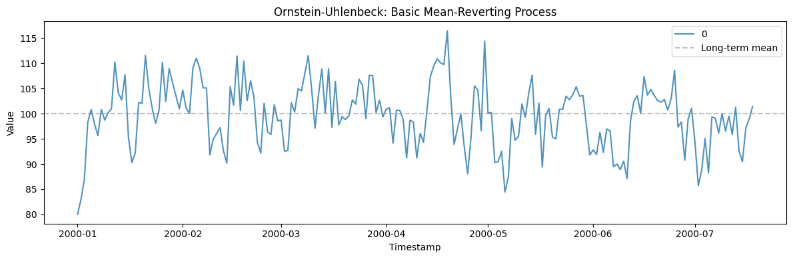
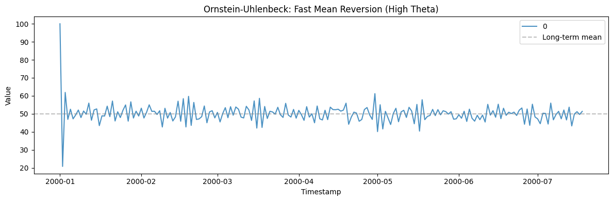
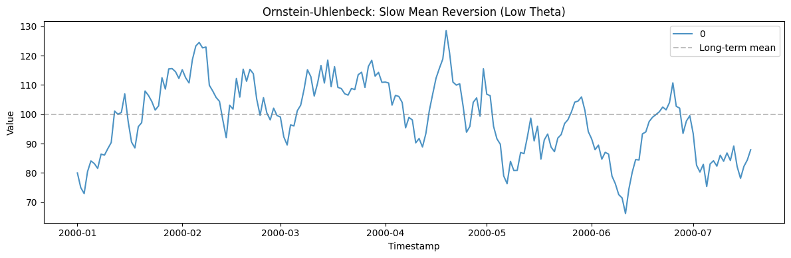
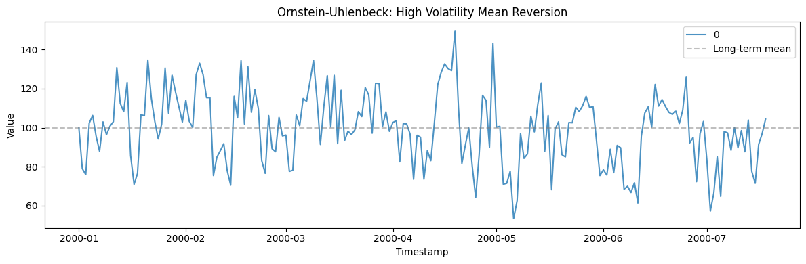
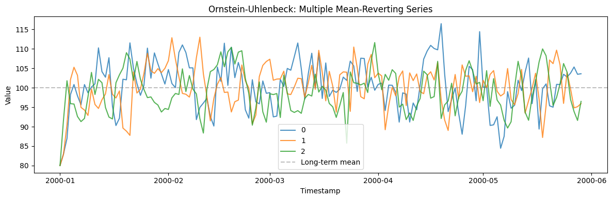

The Ornstein-Uhlenbeck process is the canonical *mean-reverting* series:
it wanders like a random walk but is continually pulled back toward a
long-run level. It models interest-rate spreads, temperatures, and any
quantity with an equilibrium it drifts around rather than away from.

> **The model**
>
> $$dx_t = \theta\,(\mu - x_t)\,dt + \sigma\,dW_t$$
>
> `theta` is the reversion speed (how hard it is pulled back), `mu` the
> long-run mean, and `sigma` the volatility. Large `theta` gives a tight
> band around `mu`; small `theta` approaches a random walk.

```python
import polars as pl
import matplotlib.pyplot as plt

from synforecast.generators import OrnsteinUhlenbeckGenerator
```

## 1. Basic mean-reverting process

Start at 80 and revert towards a long-term mean of 100.

```python
basic_params = {
    "min_length": 200,
    "max_length": 200,
    "freq": "D",
    "theta": 0.5,
    "mu": 100.0,
    "sigma": 5.0,
    "initial_value": 80.0,
    "seed": 42,
}

basic_gen = OrnsteinUhlenbeckGenerator(engine="polars", **basic_params)
basic_df = basic_gen.generate(n_series=1)

print(f"Generated {len(basic_df)} observations (mean-reverting to {basic_params['mu']})")
print(f"Statistics: Mean={basic_df['y'].mean():.4f}, Std={basic_df['y'].std():.4f}")
basic_df.head(10)
```

``` text
Generated 200 observations (mean-reverting to 100.0)
Statistics: Mean=99.6442, Std=6.3555
```

| unique_id | ds                  | y          |
|-----------|---------------------|------------|
| cat       | datetime\[ns\]      | f64        |
| "0"       | 2000-01-01 00:00:00 | 80.0       |
| "0"       | 2000-01-02 00:00:00 | 82.992031  |
| "0"       | 2000-01-03 00:00:00 | 86.966288  |
| "0"       | 2000-01-04 00:00:00 | 98.258423  |
| "0"       | 2000-01-05 00:00:00 | 100.832489 |
| "0"       | 2000-01-06 00:00:00 | 97.918522  |
| "0"       | 2000-01-07 00:00:00 | 95.635111  |
| "0"       | 2000-01-08 00:00:00 | 100.825374 |
| "0"       | 2000-01-09 00:00:00 | 98.708297  |
| "0"       | 2000-01-10 00:00:00 | 100.196799 |

```python
fig, ax = plt.subplots(figsize=(12, 4))
for uid in basic_df["unique_id"].unique().to_list():
    series = basic_df.filter(pl.col("unique_id") == uid)
    ax.plot(series["ds"].to_list(), series["y"].to_list(), label=uid, alpha=0.8)
ax.axhline(y=100.0, color="gray", linestyle="--", alpha=0.5, label="Long-term mean")
ax.set_xlabel("Timestamp")
ax.set_ylabel("Value")
ax.set_title("Ornstein-Uhlenbeck: Basic Mean-Reverting Process")
ax.legend()
plt.tight_layout()
plt.show()
```



## 2. Fast mean reversion (high theta)

A high theta value causes the process to revert to the mean quickly,
even when starting far away.

```python
fast_params = {
    "min_length": 200,
    "max_length": 200,
    "freq": "D",
    "theta": 1.5,
    "mu": 50.0,
    "sigma": 3.0,
    "initial_value": 100.0,
    "seed": 42,
}

fast_gen = OrnsteinUhlenbeckGenerator(engine="polars", **fast_params)
fast_df = fast_gen.generate(n_series=1)

print(f"Generated {len(fast_df)} observations with fast mean reversion")
print(f"Statistics: Mean={fast_df['y'].mean():.4f}, Std={fast_df['y'].std():.4f}")
fast_df.head(10)
```

``` text
Generated 200 observations with fast mean reversion
Statistics: Mean=50.1392, Std=5.6323
```

| unique_id | ds                  | y         |
|-----------|---------------------|-----------|
| cat       | datetime\[ns\]      | f64       |
| "0"       | 2000-01-01 00:00:00 | 100.0     |
| "0"       | 2000-01-02 00:00:00 | 20.795219 |
| "0"       | 2000-01-03 00:00:00 | 61.884554 |
| "0"       | 2000-01-04 00:00:00 | 46.92289  |
| "0"       | 2000-01-05 00:00:00 | 52.560521 |
| "0"       | 2000-01-06 00:00:00 | 47.221106 |
| "0"       | 2000-01-07 00:00:00 | 49.394957 |
| "0"       | 2000-01-08 00:00:00 | 52.107212 |
| "0"       | 2000-01-09 00:00:00 | 47.92376  |
| "0"       | 2000-01-10 00:00:00 | 51.54371  |

```python
fig, ax = plt.subplots(figsize=(12, 4))
for uid in fast_df["unique_id"].unique().to_list():
    series = fast_df.filter(pl.col("unique_id") == uid)
    ax.plot(series["ds"].to_list(), series["y"].to_list(), label=uid, alpha=0.8)
ax.axhline(y=50.0, color="gray", linestyle="--", alpha=0.5, label="Long-term mean")
ax.set_xlabel("Timestamp")
ax.set_ylabel("Value")
ax.set_title("Ornstein-Uhlenbeck: Fast Mean Reversion (High Theta)")
ax.legend()
plt.tight_layout()
plt.show()
```



## 3. Slow mean reversion (low theta)

A low theta means the process reverts slowly, behaving more like a
random walk in the short term.

```python
slow_params = {
    "min_length": 200,
    "max_length": 200,
    "freq": "D",
    "theta": 0.1,
    "mu": 100.0,
    "sigma": 5.0,
    "initial_value": 80.0,
    "seed": 42,
}

slow_gen = OrnsteinUhlenbeckGenerator(engine="polars", **slow_params)
slow_df = slow_gen.generate(n_series=1)

print(f"Generated {len(slow_df)} observations with slow mean reversion")
print(f"Statistics: Mean={slow_df['y'].mean():.4f}, Std={slow_df['y'].std():.4f}")
slow_df.head(10)
```

``` text
Generated 200 observations with slow mean reversion
Statistics: Mean=98.8006, Std=12.5962
```

| unique_id | ds                  | y         |
|-----------|---------------------|-----------|
| cat       | datetime\[ns\]      | f64       |
| "0"       | 2000-01-01 00:00:00 | 80.0      |
| "0"       | 2000-01-02 00:00:00 | 74.992031 |
| "0"       | 2000-01-03 00:00:00 | 72.9631   |
| "0"       | 2000-01-04 00:00:00 | 80.442069 |
| "0"       | 2000-01-05 00:00:00 | 84.10114  |
| "0"       | 2000-01-06 00:00:00 | 83.193303 |
| "0"       | 2000-01-07 00:00:00 | 81.549823 |
| "0"       | 2000-01-08 00:00:00 | 86.402659 |
| "0"       | 2000-01-09 00:00:00 | 86.058004 |
| "0"       | 2000-01-10 00:00:00 | 88.294854 |

```python
fig, ax = plt.subplots(figsize=(12, 4))
for uid in slow_df["unique_id"].unique().to_list():
    series = slow_df.filter(pl.col("unique_id") == uid)
    ax.plot(series["ds"].to_list(), series["y"].to_list(), label=uid, alpha=0.8)
ax.axhline(y=100.0, color="gray", linestyle="--", alpha=0.5, label="Long-term mean")
ax.set_xlabel("Timestamp")
ax.set_ylabel("Value")
ax.set_title("Ornstein-Uhlenbeck: Slow Mean Reversion (Low Theta)")
ax.legend()
plt.tight_layout()
plt.show()
```



## 4. High volatility mean reversion

Higher sigma produces larger fluctuations around the long-term mean.

```python
high_vol_params = {
    "min_length": 200,
    "max_length": 200,
    "freq": "D",
    "theta": 0.5,
    "mu": 100.0,
    "sigma": 15.0,
    "initial_value": 100.0,
    "seed": 42,
}

high_vol_gen = OrnsteinUhlenbeckGenerator(engine="polars", **high_vol_params)
high_vol_df = high_vol_gen.generate(n_series=1)

print(f"Generated {len(high_vol_df)} observations with high volatility")
print(f"Statistics: Mean={high_vol_df['y'].mean():.4f}, Std={high_vol_df['y'].std():.4f}")
high_vol_df.head(10)
```

``` text
Generated 200 observations with high volatility
Statistics: Mean=99.5327, Std=18.1821
```

| unique_id | ds                  | y          |
|-----------|---------------------|------------|
| cat       | datetime\[ns\]      | f64        |
| "0"       | 2000-01-01 00:00:00 | 100.0      |
| "0"       | 2000-01-02 00:00:00 | 78.976093  |
| "0"       | 2000-01-03 00:00:00 | 75.898864  |
| "0"       | 2000-01-04 00:00:00 | 102.275269 |
| "0"       | 2000-01-05 00:00:00 | 106.247467 |
| "0"       | 2000-01-06 00:00:00 | 95.630566  |
| "0"       | 2000-01-07 00:00:00 | 87.842834  |
| "0"       | 2000-01-08 00:00:00 | 102.944872 |
| "0"       | 2000-01-09 00:00:00 | 96.359266  |
| "0"       | 2000-01-10 00:00:00 | 100.707584 |

```python
fig, ax = plt.subplots(figsize=(12, 4))
for uid in high_vol_df["unique_id"].unique().to_list():
    series = high_vol_df.filter(pl.col("unique_id") == uid)
    ax.plot(series["ds"].to_list(), series["y"].to_list(), label=uid, alpha=0.8)
ax.axhline(y=100.0, color="gray", linestyle="--", alpha=0.5, label="Long-term mean")
ax.set_xlabel("Timestamp")
ax.set_ylabel("Value")
ax.set_title("Ornstein-Uhlenbeck: High Volatility Mean Reversion")
ax.legend()
plt.tight_layout()
plt.show()
```



## 5. Multiple mean-reverting series

Generate multiple independent OU processes in one call.

```python
multi_params = {
    "min_length": 150,
    "max_length": 150,
    "freq": "D",
    "theta": 0.5,
    "mu": 100.0,
    "sigma": 5.0,
    "initial_value": 80.0,
    "seed": 42,
}

multi_gen = OrnsteinUhlenbeckGenerator(engine="polars", **multi_params)
multi_df = multi_gen.generate(n_series=3)

print(f"Generated 3 series with {len(multi_df)} total observations")
print(f"Overall Statistics: Mean={multi_df['y'].mean():.4f}, Std={multi_df['y'].std():.4f}")
multi_df.filter(pl.col("unique_id") == "0").head(10)
```

``` text
Generated 3 series with 450 total observations
Overall Statistics: Mean=99.8925, Std=5.8501
```

| unique_id | ds                  | y          |
|-----------|---------------------|------------|
| cat       | datetime\[ns\]      | f64        |
| "0"       | 2000-01-01 00:00:00 | 80.0       |
| "0"       | 2000-01-02 00:00:00 | 82.992031  |
| "0"       | 2000-01-03 00:00:00 | 86.966288  |
| "0"       | 2000-01-04 00:00:00 | 98.258423  |
| "0"       | 2000-01-05 00:00:00 | 100.832489 |
| "0"       | 2000-01-06 00:00:00 | 97.918522  |
| "0"       | 2000-01-07 00:00:00 | 95.635111  |
| "0"       | 2000-01-08 00:00:00 | 100.825374 |
| "0"       | 2000-01-09 00:00:00 | 98.708297  |
| "0"       | 2000-01-10 00:00:00 | 100.196799 |

```python
fig, ax = plt.subplots(figsize=(12, 4))
for uid in multi_df["unique_id"].unique().to_list():
    series = multi_df.filter(pl.col("unique_id") == uid)
    ax.plot(series["ds"].to_list(), series["y"].to_list(), label=uid, alpha=0.8)
ax.axhline(y=100.0, color="gray", linestyle="--", alpha=0.5, label="Long-term mean")
ax.set_xlabel("Timestamp")
ax.set_ylabel("Value")
ax.set_title("Ornstein-Uhlenbeck: Multiple Mean-Reverting Series")
ax.legend()
plt.tight_layout()
plt.show()
```



> **Related generators**
>
> -   [Random walk](../statistical/random_walk) — the no-reversion limit
>     (`theta` → 0).
> -   [Bounded process](bounded_process) — mean reversion constrained to
>     an interval.
>
> Reversion, mean, and volatility parameters are in the [generator
> reference](https://github.com/Nixtla/synforecast/blob/main/GENERATORS.md).

