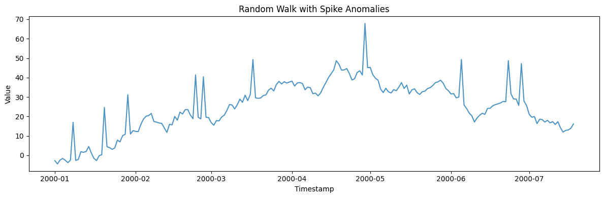
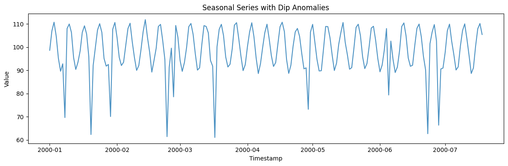
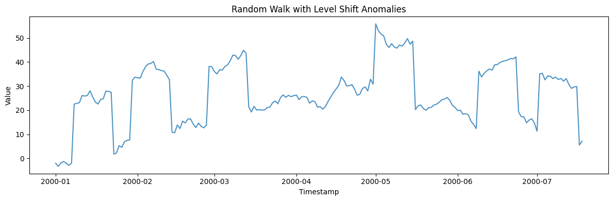
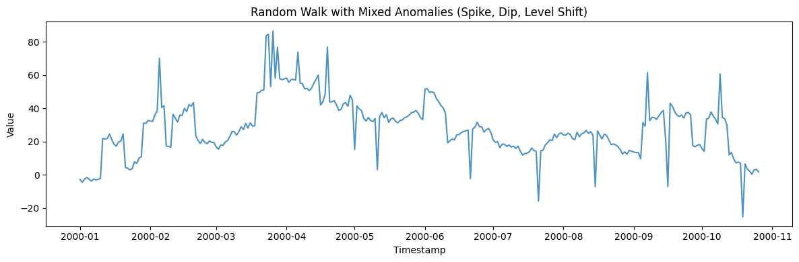
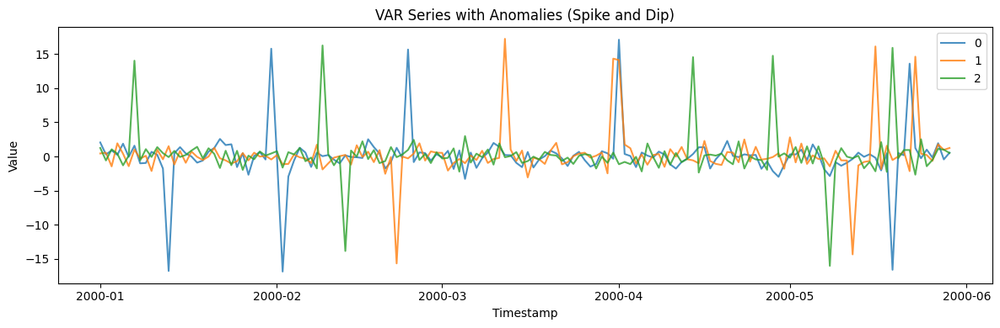
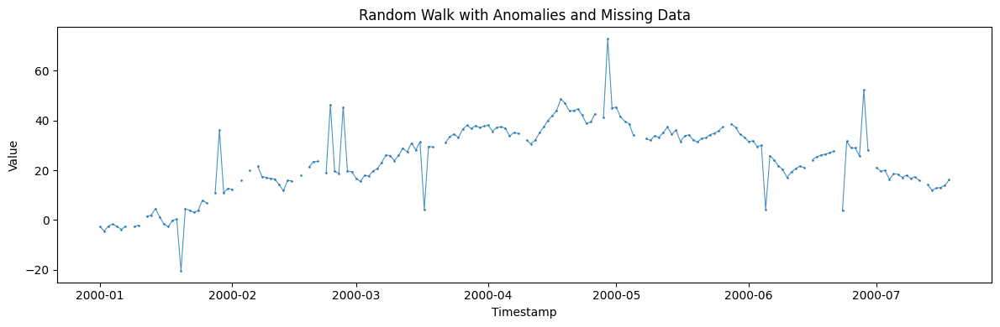

This example demonstrates how to inject anomalies (spikes, dips, level
shifts) into time series using the anomaly parameters available in any
generator.

```python
import matplotlib.pyplot as plt
import polars as pl

from synforecast.generators import (
    RandomWalkGenerator,
    SeasonalGenerator,
    VARGenerator,
)
```

## Spike Anomalies

Inject upward spike anomalies into a random walk series. About 5% of
points will be affected.

```python
spike_params = {
    "min_length": 200,
    "max_length": 200,
    "freq": "D",
    "drift": 0.1,
    "volatility": 2.0,
    "anomalies": True,
    "anomaly_fraction": 0.05,
    "anomaly_types": ["spike"],
    "spike_magnitude": 20.0,
    "seed": 42,
}
spike_gen = RandomWalkGenerator(engine="polars", **spike_params)
spike_df = spike_gen.generate(n_series=1)

print(f"Generated {len(spike_df)} observations with ~5% spike anomalies")
print(
    f"\nStatistics: Mean={spike_df['y'].mean():.4f}, "
    f"Min={spike_df['y'].min():.4f}, Max={spike_df['y'].max():.4f}"
)
spike_df.head(10)
```

``` text
Generated 200 observations with ~5% spike anomalies

Statistics: Mean=25.2045, Min=-4.4151, Max=67.8570
```

| unique_id | ds                  | y         |
|-----------|---------------------|-----------|
| cat       | datetime\[ns\]      | f64       |
| "0"       | 2000-01-01 00:00:00 | -2.703188 |
| "0"       | 2000-01-02 00:00:00 | -4.415079 |
| "0"       | 2000-01-03 00:00:00 | -2.404967 |
| "0"       | 2000-01-04 00:00:00 | -1.623656 |
| "0"       | 2000-01-05 00:00:00 | -2.522745 |
| "0"       | 2000-01-06 00:00:00 | -3.752405 |
| "0"       | 2000-01-07 00:00:00 | -2.449278 |
| "0"       | 2000-01-08 00:00:00 | 16.968966 |
| "0"       | 2000-01-09 00:00:00 | -2.593973 |
| "0"       | 2000-01-10 00:00:00 | -2.132627 |

```python
fig, ax = plt.subplots(figsize=(12, 4))
ax.plot(spike_df["ds"].to_list(), spike_df["y"].to_list(), alpha=0.8)
ax.set_title("Random Walk with Spike Anomalies")
ax.set_xlabel("Timestamp")
ax.set_ylabel("Value")
plt.tight_layout()
plt.show()
```



## Dip Anomalies

Inject downward dip anomalies into a seasonal series.

```python
dip_params = {
    "min_length": 200,
    "max_length": 200,
    "freq": "D",
    "seasonality_period": 7,
    "seasonality_amplitude": 10.0,
    "base_level": 100.0,
    "anomalies": True,
    "anomaly_fraction": 0.05,
    "anomaly_types": ["dip"],
    "dip_magnitude": -30.0,
    "seed": 42,
}
dip_gen = SeasonalGenerator(engine="polars", **dip_params)
dip_df = dip_gen.generate(n_series=1)

print(f"Generated {len(dip_df)} observations with ~5% dip anomalies")
print(
    f"\nStatistics: Mean={dip_df['y'].mean():.4f}, "
    f"Min={dip_df['y'].min():.4f}, Max={dip_df['y'].max():.4f}"
)
dip_df.head(10)
```

``` text
Generated 200 observations with ~5% dip anomalies

Statistics: Mean=98.6000, Min=61.0952, Max=111.8020
```

| unique_id | ds                  | y          |
|-----------|---------------------|------------|
| cat       | datetime\[ns\]      | f64        |
| "0"       | 2000-01-01 00:00:00 | 98.598406  |
| "0"       | 2000-01-02 00:00:00 | 106.912369 |
| "0"       | 2000-01-03 00:00:00 | 110.704335 |
| "0"       | 2000-01-04 00:00:00 | 104.679493 |
| "0"       | 2000-01-05 00:00:00 | 95.161618  |
| "0"       | 2000-01-06 00:00:00 | 89.585891  |
| "0"       | 2000-01-07 00:00:00 | 92.783249  |
| "0"       | 2000-01-08 00:00:00 | 69.659122  |
| "0"       | 2000-01-09 00:00:00 | 107.986845 |
| "0"       | 2000-01-10 00:00:00 | 109.929952 |

```python
fig, ax = plt.subplots(figsize=(12, 4))
ax.plot(dip_df["ds"].to_list(), dip_df["y"].to_list(), alpha=0.8)
ax.set_title("Seasonal Series with Dip Anomalies")
ax.set_xlabel("Timestamp")
ax.set_ylabel("Value")
plt.tight_layout()
plt.show()
```



## Level Shift Anomalies

Level shift anomalies persist for a configurable duration, simulating
sustained deviations.

```python
level_shift_params = {
    "min_length": 200,
    "max_length": 200,
    "freq": "D",
    "drift": 0.05,
    "volatility": 1.5,
    "anomalies": True,
    "anomaly_fraction": 0.03,
    "anomaly_types": ["level_shift"],
    "level_shift_magnitude": 25.0,
    "level_shift_duration": 15,
    "seed": 42,
}
level_shift_gen = RandomWalkGenerator(engine="polars", **level_shift_params)
level_shift_df = level_shift_gen.generate(n_series=1)

print(f"Generated {len(level_shift_df)} observations with level shift anomalies")
print(
    f"\nStatistics: Mean={level_shift_df['y'].mean():.4f}, "
    f"Std={level_shift_df['y'].std():.4f}"
)
level_shift_df.head(10)
```

``` text
Generated 200 observations with level shift anomalies

Statistics: Mean=26.8909, Std=12.2233
```

| unique_id | ds                  | y         |
|-----------|---------------------|-----------|
| cat       | datetime\[ns\]      | f64       |
| "0"       | 2000-01-01 00:00:00 | -2.052391 |
| "0"       | 2000-01-02 00:00:00 | -3.361309 |
| "0"       | 2000-01-03 00:00:00 | -1.878725 |
| "0"       | 2000-01-04 00:00:00 | -1.317742 |
| "0"       | 2000-01-05 00:00:00 | -2.017059 |
| "0"       | 2000-01-06 00:00:00 | -2.964304 |
| "0"       | 2000-01-07 00:00:00 | -2.011958 |
| "0"       | 2000-01-08 00:00:00 | 22.526725 |
| "0"       | 2000-01-09 00:00:00 | 22.82952  |
| "0"       | 2000-01-10 00:00:00 | 23.15053  |

```python
fig, ax = plt.subplots(figsize=(12, 4))
ax.plot(level_shift_df["ds"].to_list(), level_shift_df["y"].to_list(), alpha=0.8)
ax.set_title("Random Walk with Level Shift Anomalies")
ax.set_xlabel("Timestamp")
ax.set_ylabel("Value")
plt.tight_layout()
plt.show()
```



## Mixed Anomaly Types

Combine spikes, dips, and level shifts in a single series with 8%
anomaly rate.

```python
mixed_params = {
    "min_length": 300,
    "max_length": 300,
    "freq": "D",
    "drift": 0.1,
    "volatility": 2.0,
    "anomalies": True,
    "anomaly_fraction": 0.08,
    "anomaly_types": ["spike", "dip", "level_shift"],
    "spike_magnitude": 30.0,
    "dip_magnitude": -30.0,
    "level_shift_magnitude": 20.0,
    "level_shift_duration": 10,
    "seed": 42,
}
mixed_gen = RandomWalkGenerator(engine="polars", **mixed_params)
mixed_df = mixed_gen.generate(n_series=1)

print(f"Generated {len(mixed_df)} observations with mixed anomaly types")
print(
    f"\nStatistics: Mean={mixed_df['y'].mean():.4f}, "
    f"Min={mixed_df['y'].min():.4f}, Max={mixed_df['y'].max():.4f}"
)
mixed_df.head(10)
```

``` text
Generated 300 observations with mixed anomaly types

Statistics: Mean=28.2474, Min=-25.2225, Max=86.4608
```

| unique_id | ds                  | y         |
|-----------|---------------------|-----------|
| cat       | datetime\[ns\]      | f64       |
| "0"       | 2000-01-01 00:00:00 | -2.703188 |
| "0"       | 2000-01-02 00:00:00 | -4.415079 |
| "0"       | 2000-01-03 00:00:00 | -2.404967 |
| "0"       | 2000-01-04 00:00:00 | -1.623656 |
| "0"       | 2000-01-05 00:00:00 | -2.522745 |
| "0"       | 2000-01-06 00:00:00 | -3.752405 |
| "0"       | 2000-01-07 00:00:00 | -2.449278 |
| "0"       | 2000-01-08 00:00:00 | -3.031034 |
| "0"       | 2000-01-09 00:00:00 | -2.593973 |
| "0"       | 2000-01-10 00:00:00 | -2.132627 |

```python
fig, ax = plt.subplots(figsize=(12, 4))
ax.plot(mixed_df["ds"].to_list(), mixed_df["y"].to_list(), alpha=0.8)
ax.set_title("Random Walk with Mixed Anomalies (Spike, Dip, Level Shift)")
ax.set_xlabel("Timestamp")
ax.set_ylabel("Value")
plt.tight_layout()
plt.show()
```



## VAR Generator with Anomalies (Multivariate)

Anomalies can be injected into multivariate generators like VAR,
affecting each series independently.

```python
var_params = {
    "min_length": 150,
    "max_length": 150,
    "freq": "D",
    "lag_order": 1,
    "anomalies": True,
    "anomaly_fraction": 0.05,
    "anomaly_types": ["spike", "dip"],
    "spike_magnitude": 15.0,
    "dip_magnitude": -15.0,
    "seed": 42,
}
var_gen = VARGenerator(engine="polars", **var_params)
var_df = var_gen.generate(n_series=3)

print(
    f"Generated 3 correlated series with anomalies ({len(var_df)} total observations)"
)
print(
    f"\nOverall Statistics: Mean={var_df['y'].mean():.4f}, "
    f"Min={var_df['y'].min():.4f}, Max={var_df['y'].max():.4f}"
)
var_df.filter(pl.col("unique_id") == "0").head(10)
```

``` text
Generated 3 correlated series with anomalies (450 total observations)

Overall Statistics: Mean=0.1813, Min=-16.8378, Max=17.2190
```

| unique_id | ds                  | y         |
|-----------|---------------------|-----------|
| cat       | datetime\[ns\]      | f64       |
| "0"       | 2000-01-01 00:00:00 | 2.057667  |
| "0"       | 2000-01-02 00:00:00 | 0.295293  |
| "0"       | 2000-01-03 00:00:00 | 0.893053  |
| "0"       | 2000-01-04 00:00:00 | 0.235888  |
| "0"       | 2000-01-05 00:00:00 | 1.876363  |
| "0"       | 2000-01-06 00:00:00 | -0.051986 |
| "0"       | 2000-01-07 00:00:00 | 1.583556  |
| "0"       | 2000-01-08 00:00:00 | -1.001584 |
| "0"       | 2000-01-09 00:00:00 | -0.94835  |
| "0"       | 2000-01-10 00:00:00 | 0.680186  |

```python
fig, ax = plt.subplots(figsize=(12, 4))
for uid in var_df["unique_id"].unique().to_list():
    series = var_df.filter(pl.col("unique_id") == uid)
    ax.plot(series["ds"].to_list(), series["y"].to_list(), label=uid, alpha=0.8)
ax.set_title("VAR Series with Anomalies (Spike and Dip)")
ax.set_xlabel("Timestamp")
ax.set_ylabel("Value")
ax.legend()
plt.tight_layout()
plt.show()
```



## Anomalies with Missing Data

Combine anomaly injection with missing data patterns to create realistic
test scenarios.

```python
combined_params = {
    "min_length": 200,
    "max_length": 200,
    "freq": "D",
    "drift": 0.1,
    "volatility": 2.0,
    "anomalies": True,
    "anomaly_fraction": 0.05,
    "anomaly_types": ["spike", "dip"],
    "spike_magnitude": 25.0,
    "dip_magnitude": -25.0,
    "missing_data": True,
    "missing_pattern": "random",
    "missing_rate": 0.1,
    "seed": 42,
}
combined_gen = RandomWalkGenerator(engine="polars", **combined_params)
combined_df = combined_gen.generate(n_series=1)
null_count = combined_df["y"].null_count()

print(
    f"Generated {len(combined_df)} observations with both anomalies "
    f"and missing data ({null_count} missing values)"
)
print(
    f"\nStatistics (excluding nulls): Mean={combined_df['y'].mean():.4f}, "
    f"Min={combined_df['y'].min():.4f}, Max={combined_df['y'].max():.4f}"
)
combined_df.head(15)
```

``` text
Generated 200 observations with both anomalies and missing data (0 missing values)

Statistics (excluding nulls): Mean=nan, Min=-20.3636, Max=72.8570
```

| unique_id | ds                  | y         |
|-----------|---------------------|-----------|
| cat       | datetime\[ns\]      | f64       |
| "0"       | 2000-01-01 00:00:00 | -2.703188 |
| "0"       | 2000-01-02 00:00:00 | -4.415079 |
| "0"       | 2000-01-03 00:00:00 | -2.404967 |
| "0"       | 2000-01-04 00:00:00 | -1.623656 |
| "0"       | 2000-01-05 00:00:00 | -2.522745 |
| …         | …                   | …         |
| "0"       | 2000-01-11 00:00:00 | NaN       |
| "0"       | 2000-01-12 00:00:00 | 1.575591  |
| "0"       | 2000-01-13 00:00:00 | 1.930384  |
| "0"       | 2000-01-14 00:00:00 | 4.577353  |
| "0"       | 2000-01-15 00:00:00 | 1.224502  |

```python
fig, ax = plt.subplots(figsize=(12, 4))
ax.plot(combined_df["ds"].to_list(), combined_df["y"].to_list(), alpha=0.8, marker=".", markersize=2, linewidth=0.8)
ax.set_title("Random Walk with Anomalies and Missing Data")
ax.set_xlabel("Timestamp")
ax.set_ylabel("Value")
plt.tight_layout()
plt.show()
```



