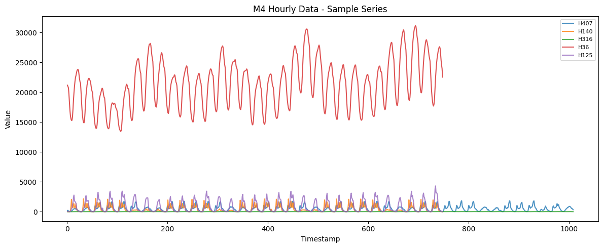
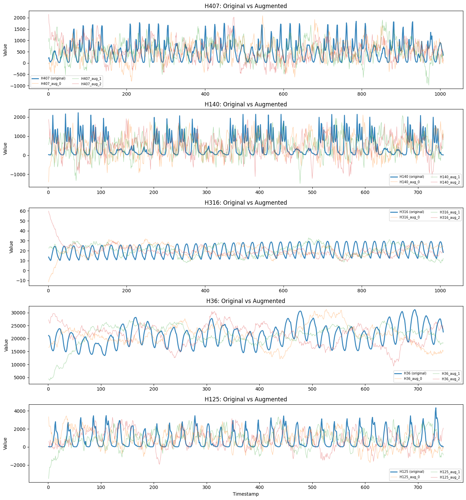
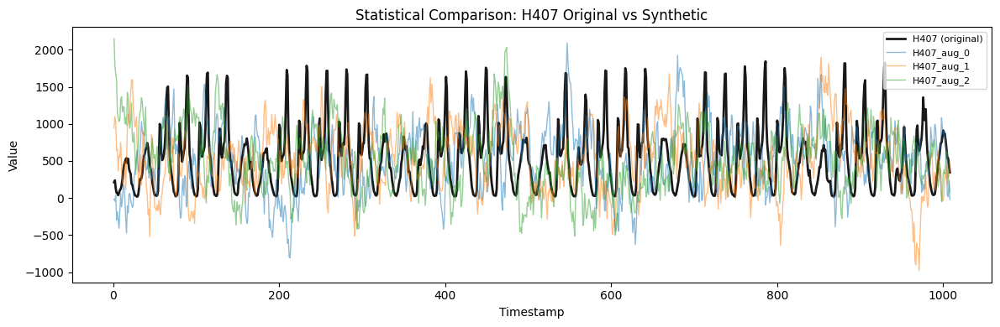
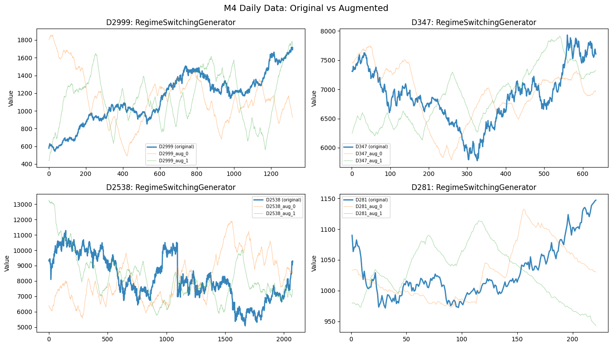
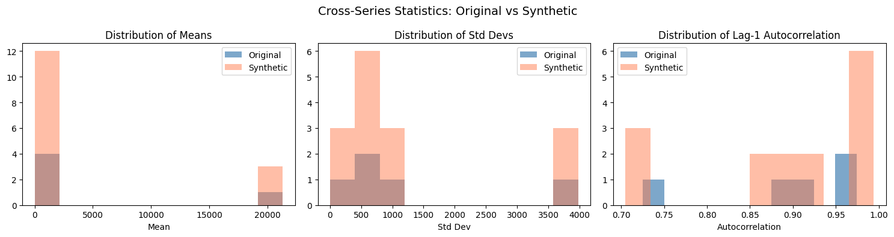

This example demonstrates how to use SynAugment to augment real time
series datasets from the M4 competition. We compare the statistical
properties of synthetic series against the original data to show how
well the augmentation preserves the characteristics of the real data.

**Requires**: `datasetsforecast` (`pip install datasetsforecast`)

```python
import tempfile

import matplotlib.pyplot as plt
import numpy as np
import polars as pl
from datasetsforecast.m4 import M4

from synforecast import SynAugment
```


```python
def compute_series_stats(values: np.ndarray) -> dict:
    """Compute statistical properties of a time series."""
    return {
        "mean": float(np.mean(values)),
        "std": float(np.std(values)),
        "min": float(np.min(values)),
        "max": float(np.max(values)),
        "range": float(np.max(values) - np.min(values)),
        "cv": float(np.std(values) / np.mean(values)) if np.mean(values) != 0 else 0,
        "skewness": float(np.mean(((values - np.mean(values)) / np.std(values)) ** 3))
        if np.std(values) > 0
        else 0,
        "autocorr_lag1": float(np.corrcoef(values[:-1], values[1:])[0, 1])
        if len(values) > 1
        else 0,
    }


def print_comparison_table(original_stats: dict, synthetic_stats_list: list) -> None:
    """Print a comparison table of original vs synthetic statistics."""
    avg_synthetic = {}
    for key in original_stats:
        avg_synthetic[key] = np.mean([s[key] for s in synthetic_stats_list])

    print(f"{'Statistic':<15} {'Original':>12} {'Synthetic (avg)':>15} {'Diff %':>10}")
    print("-" * 55)
    for key in original_stats:
        orig = original_stats[key]
        synth = avg_synthetic[key]
        if abs(orig) > 1e-6:
            diff_pct = abs(synth - orig) / abs(orig) * 100
        else:
            diff_pct = 0 if abs(synth) < 1e-6 else 100
        print(f"{key:<15} {orig:>12.4f} {synth:>15.4f} {diff_pct:>9.1f}%")
```

## M4 Hourly Data

Load hourly time series from the M4 competition and analyze their
patterns before augmenting.

```python
tmpdir = tempfile.mkdtemp()

df_hourly, *_ = M4.load(directory=tmpdir, group="Hourly")
df_hourly = pl.from_pandas(df_hourly)
sample_ids = df_hourly["unique_id"].unique().head(5).to_list()
df_sample = df_hourly.filter(pl.col("unique_id").is_in(sample_ids))

print(f"Loaded {df_hourly['unique_id'].n_unique()} hourly series from M4")
print(f"Using {len(sample_ids)} series for demonstration: {sample_ids}")
print(f"Total rows in sample: {len(df_sample)}")

print("\nSample data (first series, first 5 rows):")
df_sample.filter(pl.col("unique_id") == sample_ids[0]).head(5)
```

``` text
  0%|          | 0.00/555k [00:00<?, ?iB/s]2.35MiB [00:00, 70.1MiB/s]                 
INFO:datasetsforecast.utils:Successfully downloaded Hourly-train.csv, 2347115, bytes.
  0%|          | 0.00/36.8k [00:00<?, ?iB/s]133kiB [00:00, 32.7MiB/s]                   
INFO:datasetsforecast.utils:Successfully downloaded Hourly-test.csv, 132820, bytes.
  0%|          | 0.00/346k [00:00<?, ?iB/s]4.34MiB [00:00, 110MiB/s]                  
INFO:datasetsforecast.utils:Successfully downloaded M4-info.csv, 4335598, bytes.
  0%|          | 0.00/3.56M [00:00<?, ?iB/s] 59%|█████▉    | 2.10M/3.56M [00:00<00:00, 20.6MiB/s]100%|██████████| 3.56M/3.56M [00:00<00:00, 25.8MiB/s]
INFO:datasetsforecast.utils:Successfully downloaded submission-Naive2.zip, 3564691, bytes.
INFO:datasetsforecast.utils:Decompressing zip file...
```

``` text
Loaded 414 hourly series from M4
Using 5 series for demonstration: ['H407', 'H140', 'H316', 'H36', 'H125']
Total rows in sample: 4260

Sample data (first series, first 5 rows):
```

| unique_id | ds  | y     |
|-----------|-----|-------|
| str       | i64 | f64   |
| "H407"    | 1   | 214.0 |
| "H407"    | 2   | 238.0 |
| "H407"    | 3   | 130.0 |
| "H407"    | 4   | 69.0  |
| "H407"    | 5   | 68.0  |

```python
fig, ax = plt.subplots(figsize=(12, 5))
for uid in sample_ids:
    series = df_sample.filter(pl.col("unique_id") == uid)
    ax.plot(series["ds"].to_list(), series["y"].to_list(), label=uid, alpha=0.8)
ax.set_title("M4 Hourly Data - Sample Series")
ax.set_xlabel("Timestamp")
ax.set_ylabel("Value")
ax.legend(fontsize=8)
plt.tight_layout()
plt.show()
```



### Analyzing Series Patterns

SynAugment detects seasonality, trend, and stationarity to choose the
best generator for each series.

```python
augmenter = SynAugment(seed=42)

analysis = augmenter.analyze(df_sample)

for series_id in sample_ids:
    info = analysis[series_id]
    print(f"\n  {series_id}:")
    print(f"    Recommended generator: {info['recommended_generator']}")
    props = info["properties"]
    print(f"    Has seasonality: {props['seasonality']['has_seasonality']}")
    if props["seasonality"]["has_seasonality"]:
        print(f"    Seasonality period: {props['seasonality']['period']}")
    print(f"    Has trend: {props['trend']['has_trend']}")
    print(f"    Is stationary: {props['stationarity']['is_stationary']}")
```

``` text

  H407:
    Recommended generator: RegimeSwitchingGenerator
    Has seasonality: True
    Seasonality period: 24
    Has trend: False
    Is stationary: True

  H140:
    Recommended generator: RegimeSwitchingGenerator
    Has seasonality: True
    Seasonality period: 24
    Has trend: False
    Is stationary: True

  H316:
    Recommended generator: RegimeSwitchingGenerator
    Has seasonality: True
    Seasonality period: 24
    Has trend: False
    Is stationary: True

  H36:
    Recommended generator: RegimeSwitchingGenerator
    Has seasonality: True
    Seasonality period: 2
    Has trend: True
    Is stationary: True

  H125:
    Recommended generator: RegimeSwitchingGenerator
    Has seasonality: True
    Seasonality period: 24
    Has trend: False
    Is stationary: True
```

### Augmenting the Data

Generate 3 synthetic series per original series.

```python
augmented_df = augmenter.augment(df_sample, n_augment=3)

print(f"Original series: {df_sample['unique_id'].n_unique()}")
print(f"Total series after augmentation: {augmented_df['unique_id'].n_unique()}")
```

``` text
Original series: 5
Total series after augmentation: 20
```

```python
fig, axes = plt.subplots(len(sample_ids), 1, figsize=(14, 3 * len(sample_ids)))
for i, uid in enumerate(sample_ids):
    ax = axes[i] if len(sample_ids) > 1 else axes
    # Plot original
    orig = augmented_df.filter(pl.col("unique_id") == uid)
    ax.plot(orig["ds"].to_list(), orig["y"].to_list(), label=f"{uid} (original)", alpha=0.9, linewidth=2)
    # Plot augmented
    for j in range(3):
        aug_id = f"{uid}_aug_{j}"
        aug = augmented_df.filter(pl.col("unique_id") == aug_id)
        if len(aug) > 0:
            ax.plot(aug["ds"].to_list(), aug["y"].to_list(), label=aug_id, alpha=0.4, linewidth=0.8)
    ax.set_title(f"{uid}: Original vs Augmented")
    ax.set_ylabel("Value")
    ax.legend(fontsize=7, ncol=2)
axes[-1].set_xlabel("Timestamp") if len(sample_ids) > 1 else axes.set_xlabel("Timestamp")
plt.tight_layout()
plt.show()
```



## Statistical Comparison - Original vs Synthetic

Compare key statistics between the original and synthetic versions of a
series.

```python
test_id = sample_ids[0]
print(f"Detailed comparison for series: {test_id}")

original_values = (
    augmented_df.filter(pl.col("unique_id") == test_id).sort("ds")["y"].to_numpy()
)
original_stats = compute_series_stats(original_values)

synthetic_stats_list = []
for i in range(3):
    aug_id = f"{test_id}_aug_{i}"
    aug_values = (
        augmented_df.filter(pl.col("unique_id") == aug_id)
        .sort("ds")["y"]
        .to_numpy()
    )
    synthetic_stats_list.append(compute_series_stats(aug_values))

print_comparison_table(original_stats, synthetic_stats_list)
```

``` text
Detailed comparison for series: H407
Statistic           Original Synthetic (avg)     Diff %
-------------------------------------------------------
mean                527.1240        527.1159       0.0%
std                 431.2579        431.2505       0.0%
min                  19.0000       -767.4451    4139.2%
max                1844.0000       2047.9487      11.1%
range              1825.0000       2815.3938      54.3%
cv                    0.8181          0.8181       0.0%
skewness              0.9814          0.1279      87.0%
autocorr_lag1         0.8818          0.8782       0.4%
```

```python
fig, ax = plt.subplots(figsize=(12, 4))
# Plot original series
orig = augmented_df.filter(pl.col("unique_id") == test_id)
ax.plot(orig["ds"].to_list(), orig["y"].to_list(), label=f"{test_id} (original)", alpha=0.9, linewidth=2, color="black")
# Plot synthetic copies
for i in range(3):
    aug_id = f"{test_id}_aug_{i}"
    aug = augmented_df.filter(pl.col("unique_id") == aug_id)
    if len(aug) > 0:
        ax.plot(aug["ds"].to_list(), aug["y"].to_list(), label=aug_id, alpha=0.5, linewidth=1)
ax.set_title(f"Statistical Comparison: {test_id} Original vs Synthetic")
ax.set_xlabel("Timestamp")
ax.set_ylabel("Value")
ax.legend(fontsize=8)
plt.tight_layout()
plt.show()
```



## M4 Daily Data

Augment daily frequency data from the M4 competition.

```python
df_daily, *_ = M4.load(directory=tmpdir, group="Daily")
df_daily = pl.from_pandas(df_daily)

daily_ids = df_daily["unique_id"].unique().head(4).to_list()
df_daily_sample = df_daily.filter(pl.col("unique_id").is_in(daily_ids))

print(f"Loaded {df_daily['unique_id'].n_unique()} daily series from M4")
print(f"Using {len(daily_ids)} series: {daily_ids}")

augmenter_daily = SynAugment(seed=123)
analysis_daily = augmenter_daily.analyze(df_daily_sample)

print("\nAnalysis results:")
for series_id in daily_ids:
    info = analysis_daily[series_id]
    print(f"  {series_id}: {info['recommended_generator']}")

augmented_daily = augmenter_daily.augment(df_daily_sample, n_augment=2)
print(
    f"\nAugmented from {len(daily_ids)} to {augmented_daily['unique_id'].n_unique()} series"
)
```

``` text
  0%|          | 0.00/32.5M [00:00<?, ?iB/s] 20%|██        | 6.60M/32.5M [00:00<00:00, 66.0MiB/s] 41%|████      | 13.3M/32.5M [00:00<00:00, 66.7MiB/s] 62%|██████▏   | 20.0M/32.5M [00:00<00:00, 66.6MiB/s] 82%|████████▏ | 26.7M/32.5M [00:00<00:00, 66.8MiB/s]33.4MiB [00:00, 66.7MiB/s]                           40.0MiB [00:00, 66.1MiB/s]46.7MiB [00:00, 65.8MiB/s]53.2MiB [00:00, 64.6MiB/s]59.8MiB [00:00, 64.8MiB/s]66.5MiB [00:01, 65.7MiB/s]73.1MiB [00:01, 65.5MiB/s]79.7MiB [00:01, 65.4MiB/s]86.2MiB [00:01, 64.5MiB/s]92.7MiB [00:01, 64.6MiB/s]95.8MiB [00:01, 65.6MiB/s]
INFO:datasetsforecast.utils:Successfully downloaded Daily-train.csv, 95765153, bytes.
  0%|          | 0.00/198k [00:00<?, ?iB/s]576kiB [00:00, 43.8MiB/s]                  
INFO:datasetsforecast.utils:Successfully downloaded Daily-test.csv, 576459, bytes.
```

``` text
Loaded 4227 daily series from M4
Using 4 series: ['D2999', 'D347', 'D2538', 'D281']

Analysis results:
  D2999: RegimeSwitchingGenerator
  D347: RegimeSwitchingGenerator
  D2538: RegimeSwitchingGenerator
  D281: RegimeSwitchingGenerator

Augmented from 4 to 12 series
```

```python
fig, axes = plt.subplots(2, 2, figsize=(14, 8))
for i, uid in enumerate(daily_ids):
    ax = axes[i // 2][i % 2]
    # Original
    orig = augmented_daily.filter(pl.col("unique_id") == uid)
    ax.plot(orig["ds"].to_list(), orig["y"].to_list(), label=f"{uid} (original)", alpha=0.9, linewidth=2)
    # Augmented
    for j in range(2):
        aug_id = f"{uid}_aug_{j}"
        aug = augmented_daily.filter(pl.col("unique_id") == aug_id)
        if len(aug) > 0:
            ax.plot(aug["ds"].to_list(), aug["y"].to_list(), label=aug_id, alpha=0.4, linewidth=0.8)
    ax.set_title(f"{uid}: {analysis_daily[uid]['recommended_generator']}")
    ax.set_ylabel("Value")
    ax.legend(fontsize=7)
plt.suptitle("M4 Daily Data: Original vs Augmented", fontsize=14)
plt.tight_layout()
plt.show()
```



## Cross-Series Statistics

Compare distributions of mean, std, and autocorrelation across all
original vs all synthetic series.

```python
original_means = []
original_stds = []
original_autocorrs = []

for series_id in sample_ids:
    values = (
        df_sample.filter(pl.col("unique_id") == series_id)
        .sort("ds")["y"]
        .to_numpy()
    )
    original_means.append(np.mean(values))
    original_stds.append(np.std(values))
    if len(values) > 1:
        original_autocorrs.append(np.corrcoef(values[:-1], values[1:])[0, 1])

synthetic_means = []
synthetic_stds = []
synthetic_autocorrs = []

synthetic_ids = [
    uid
    for uid in augmented_df["unique_id"].unique().to_list()
    if "_aug_" in str(uid)
]

for series_id in synthetic_ids:
    values = (
        augmented_df.filter(pl.col("unique_id") == series_id)
        .sort("ds")["y"]
        .to_numpy()
    )
    synthetic_means.append(np.mean(values))
    synthetic_stds.append(np.std(values))
    if len(values) > 1:
        synthetic_autocorrs.append(np.corrcoef(values[:-1], values[1:])[0, 1])

print(f"Original series ({len(sample_ids)} series):")
print(
    f"  Mean of means: {np.mean(original_means):.4f} (std: {np.std(original_means):.4f})"
)
print(
    f"  Mean of stds:  {np.mean(original_stds):.4f} (std: {np.std(original_stds):.4f})"
)
print(
    f"  Mean autocorr: {np.mean(original_autocorrs):.4f} (std: {np.std(original_autocorrs):.4f})"
)

print(f"\nSynthetic series ({len(synthetic_ids)} series):")
print(
    f"  Mean of means: {np.mean(synthetic_means):.4f} (std: {np.std(synthetic_means):.4f})"
)
print(
    f"  Mean of stds:  {np.mean(synthetic_stds):.4f} (std: {np.std(synthetic_stds):.4f})"
)
print(
    f"  Mean autocorr: {np.mean(synthetic_autocorrs):.4f} (std: {np.std(synthetic_autocorrs):.4f})"
)
```

``` text
Original series (5 series):
  Mean of means: 4632.0193 (std: 8341.1509)
  Mean of stds:  1180.5708 (std: 1429.8718)
  Mean autocorr: 0.8923 (std: 0.0900)

Synthetic series (15 series):
  Mean of means: 4632.0290 (std: 8341.1588)
  Mean of stds:  1180.5364 (std: 1429.7893)
  Mean autocorr: 0.8962 (std: 0.1000)
```

```python
fig, axes = plt.subplots(1, 3, figsize=(15, 4))

axes[0].hist(original_means, bins=10, alpha=0.7, label="Original", color="steelblue")
axes[0].hist(synthetic_means, bins=10, alpha=0.5, label="Synthetic", color="coral")
axes[0].set_title("Distribution of Means")
axes[0].set_xlabel("Mean")
axes[0].legend()

axes[1].hist(original_stds, bins=10, alpha=0.7, label="Original", color="steelblue")
axes[1].hist(synthetic_stds, bins=10, alpha=0.5, label="Synthetic", color="coral")
axes[1].set_title("Distribution of Std Devs")
axes[1].set_xlabel("Std Dev")
axes[1].legend()

axes[2].hist(original_autocorrs, bins=10, alpha=0.7, label="Original", color="steelblue")
axes[2].hist(synthetic_autocorrs, bins=10, alpha=0.5, label="Synthetic", color="coral")
axes[2].set_title("Distribution of Lag-1 Autocorrelation")
axes[2].set_xlabel("Autocorrelation")
axes[2].legend()

plt.suptitle("Cross-Series Statistics: Original vs Synthetic", fontsize=14)
plt.tight_layout()
plt.show()
```



## Augmenting for ML Training

A common use case: expand a small dataset to create a larger training
set for ML models.

```python
small_dataset = df_hourly.filter(
    pl.col("unique_id").is_in(df_hourly["unique_id"].unique().head(10).to_list())
)

print(f"Original training set: {small_dataset['unique_id'].n_unique()} series")
print(f"Total observations: {len(small_dataset)}")

ml_augmenter = SynAugment(seed=42)
expanded_dataset = ml_augmenter.augment(small_dataset, n_augment=5)

print(f"\nExpanded training set: {expanded_dataset['unique_id'].n_unique()} series")
print(f"Total observations: {len(expanded_dataset)}")
print(f"Expansion factor: {len(expanded_dataset) / len(small_dataset):.1f}x")

lengths = expanded_dataset.group_by("unique_id").agg(pl.len().alias("length"))
print(f"\nSeries length distribution:")
print(f"  Min: {lengths['length'].min()}, Max: {lengths['length'].max()}")
print(f"  Mean: {lengths['length'].mean():.1f}")
```

``` text
Original training set: 10 series
Total observations: 8780

Expanded training set: 60 series
Total observations: 52680
Expansion factor: 6.0x

Series length distribution:
  Min: 748, Max: 1008
  Mean: 878.0
```

