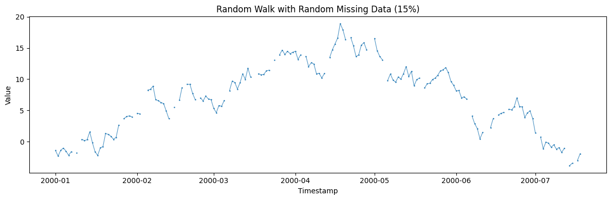
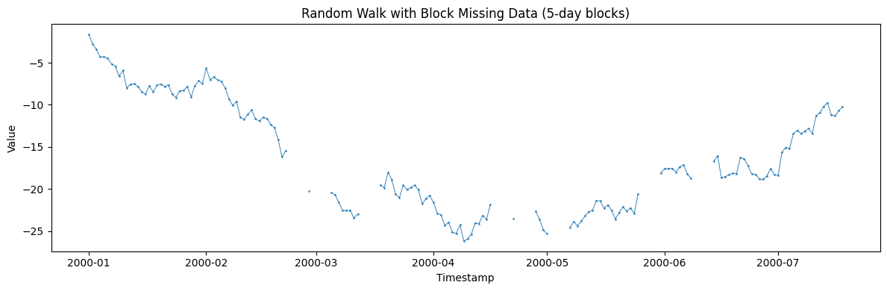
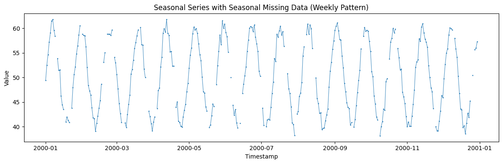
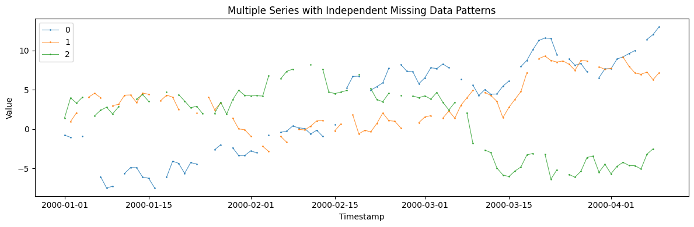

This example demonstrates how to generate realistic time series with
various missing data patterns: random, block, and seasonal. These are
useful for testing imputation methods and evaluating forecasting models
under missing data.

```python
import matplotlib.pyplot as plt
import numpy as np
import polars as pl

from synforecast.generators import RandomWalkGenerator, SeasonalGenerator
```

## Random Missing Data Pattern

Each observation has an independent 15% probability of being missing.

```python
params_random = {
    "min_length": 200,
    "max_length": 200,
    "freq": "D",
    "missing_data": True,
    "missing_pattern": "random",
    "missing_rate": 0.15,
    "seed": 42,
}

gen_random = RandomWalkGenerator(engine="polars", **params_random)
df_random = gen_random.generate(n_series=1)

print(f"Generated {len(df_random)} daily observations")
df_random.head(20)
```

``` text
Generated 200 daily observations
```

| unique_id | ds                  | y         |
|-----------|---------------------|-----------|
| cat       | datetime\[ns\]      | f64       |
| "0"       | 2000-01-01 00:00:00 | -1.401594 |
| "0"       | 2000-01-02 00:00:00 | -2.307539 |
| "0"       | 2000-01-03 00:00:00 | -1.352484 |
| "0"       | 2000-01-04 00:00:00 | -1.011828 |
| "0"       | 2000-01-05 00:00:00 | -1.511372 |
| …         | …                   | …         |
| "0"       | 2000-01-16 00:00:00 | -1.602961 |
| "0"       | 2000-01-17 00:00:00 | -2.194502 |
| "0"       | 2000-01-18 00:00:00 | -0.974393 |
| "0"       | 2000-01-19 00:00:00 | -0.785018 |
| "0"       | 2000-01-20 00:00:00 | 1.318207  |

```python
values = df_random["y"].to_numpy()
nan_count = np.sum(np.isnan(values))
nan_rate = nan_count / len(values)

print(f"Missing data statistics:")
print(f"  Missing values:     {nan_count} ({nan_rate:.1%})")
print(f"  Complete values:    {len(values) - nan_count} ({1-nan_rate:.1%})")

non_nan_values = values[~np.isnan(values)]
if len(non_nan_values) > 0:
    print(f"  Non-missing mean:   {non_nan_values.mean():.2f}")
    print(f"  Non-missing std:    {non_nan_values.std():.2f}")
```

``` text
Missing data statistics:
  Missing values:     30 (15.0%)
  Complete values:    170 (85.0%)
  Non-missing mean:   7.08
  Non-missing std:    5.47
```

```python
fig, ax = plt.subplots(figsize=(12, 4))
series = df_random.filter(pl.col("unique_id") == "0")
ax.plot(series["ds"].to_list(), series["y"].to_list(), alpha=0.8, marker=".", markersize=2, linewidth=0.8)
ax.set_title("Random Walk with Random Missing Data (15%)")
ax.set_xlabel("Timestamp")
ax.set_ylabel("Value")
plt.tight_layout()
plt.show()
```



## Block Missing Data Pattern (Sensor Outages)

Missing data occurs in contiguous blocks of 5 consecutive days,
simulating sensor outages or system downtime.

```python
params_block = {
    "min_length": 200,
    "max_length": 200,
    "freq": "D",
    "missing_data": True,
    "missing_pattern": "block",
    "missing_rate": 0.2,
    "missing_block_size": 5,
    "seed": 123,
}

gen_block = RandomWalkGenerator(engine="polars", **params_block)
df_block = gen_block.generate(n_series=1)

print(f"Generated {len(df_block)} daily observations")
print(f"Missing blocks of size: {params_block['missing_block_size']} days")
df_block.head(30)
```

``` text
Generated 200 daily observations
Missing blocks of size: 5 days
```

| unique_id | ds                  | y         |
|-----------|---------------------|-----------|
| cat       | datetime\[ns\]      | f64       |
| "0"       | 2000-01-01 00:00:00 | -1.648263 |
| "0"       | 2000-01-02 00:00:00 | -2.785263 |
| "0"       | 2000-01-03 00:00:00 | -3.426808 |
| "0"       | 2000-01-04 00:00:00 | -4.329042 |
| "0"       | 2000-01-05 00:00:00 | -4.296375 |
| …         | …                   | …         |
| "0"       | 2000-01-26 00:00:00 | -8.303371 |
| "0"       | 2000-01-27 00:00:00 | -7.850564 |
| "0"       | 2000-01-28 00:00:00 | -9.064892 |
| "0"       | 2000-01-29 00:00:00 | -7.744237 |
| "0"       | 2000-01-30 00:00:00 | -7.141098 |

```python
values_block = df_block["y"].to_numpy()
nan_count_block = np.sum(np.isnan(values_block))
nan_rate_block = nan_count_block / len(values_block)

# Find longest missing block
max_consecutive = 0
current_consecutive = 0
for val in values_block:
    if np.isnan(val):
        current_consecutive += 1
        max_consecutive = max(max_consecutive, current_consecutive)
    else:
        current_consecutive = 0

print(f"Block missing statistics:")
print(f"  Missing values:     {nan_count_block} ({nan_rate_block:.1%})")
print(
    f"  Complete values:    {len(values_block) - nan_count_block} ({1-nan_rate_block:.1%})"
)
print(f"  Longest missing block: {max_consecutive} consecutive days")
```

``` text
Block missing statistics:
  Missing values:     40 (20.0%)
  Complete values:    160 (80.0%)
  Longest missing block: 5 consecutive days
```

```python
fig, ax = plt.subplots(figsize=(12, 4))
series = df_block.filter(pl.col("unique_id") == "0")
ax.plot(series["ds"].to_list(), series["y"].to_list(), alpha=0.8, marker=".", markersize=2, linewidth=0.8)
ax.set_title("Random Walk with Block Missing Data (5-day blocks)")
ax.set_xlabel("Timestamp")
ax.set_ylabel("Value")
plt.tight_layout()
plt.show()
```



## Seasonal Missing Data Pattern (Weekend Reporting Gaps)

Missing data follows a weekly seasonal pattern, simulating weekend
reporting gaps in business data.

```python
params_seasonal = {
    "min_length": 365,
    "max_length": 365,
    "freq": "D",
    "missing_data": True,
    "missing_pattern": "seasonal",
    "missing_rate": 0.12,
    "missing_seasonal_period": 7,
    "seed": 456,
}

gen_seasonal = SeasonalGenerator(engine="polars", **params_seasonal)
df_seasonal = gen_seasonal.generate(n_series=1)

values_seasonal = df_seasonal["y"].to_numpy()
nan_count_seasonal = np.sum(np.isnan(values_seasonal))

print(f"Generated {len(df_seasonal)} daily observations (1 year)")
print(f"Seasonal period: {params_seasonal['missing_seasonal_period']} days (weekly)")
print(
    f"Missing values: {nan_count_seasonal} ({nan_count_seasonal/len(values_seasonal):.1%})"
)
df_seasonal.head(40)
```

``` text
Generated 365 daily observations (1 year)
Seasonal period: 7 days (weekly)
Missing values: 37 (10.1%)
```

| unique_id | ds                  | y         |
|-----------|---------------------|-----------|
| cat       | datetime\[ns\]      | f64       |
| "0"       | 2000-01-01 00:00:00 | 49.395599 |
| "0"       | 2000-01-02 00:00:00 | 52.491517 |
| "0"       | 2000-01-03 00:00:00 | 54.67221  |
| "0"       | 2000-01-04 00:00:00 | 57.221149 |
| "0"       | 2000-01-05 00:00:00 | 59.057598 |
| …         | …                   | …         |
| "0"       | 2000-02-05 00:00:00 | 52.050534 |
| "0"       | 2000-02-06 00:00:00 | 48.371681 |
| "0"       | 2000-02-07 00:00:00 | 47.295235 |
| "0"       | 2000-02-08 00:00:00 | 46.44732  |
| "0"       | 2000-02-09 00:00:00 | 43.835486 |

```python
fig, ax = plt.subplots(figsize=(12, 4))
series = df_seasonal.filter(pl.col("unique_id") == "0")
ax.plot(series["ds"].to_list(), series["y"].to_list(), alpha=0.8, marker=".", markersize=2, linewidth=0.8)
ax.set_title("Seasonal Series with Seasonal Missing Data (Weekly Pattern)")
ax.set_xlabel("Timestamp")
ax.set_ylabel("Value")
plt.tight_layout()
plt.show()
```



### Missing Rate by Day of Week

Analyze how the missing rate varies across the week.

```python
df_seasonal_with_week = df_seasonal.with_columns(
    [
        (pl.col("ds").dt.ordinal_day() % 7).alias("day_of_week"),
        pl.col("y").is_nan().alias("is_missing"),
    ]
)

week_stats = (
    df_seasonal_with_week.group_by("day_of_week")
    .agg(
        [
            pl.col("is_missing").sum().alias("missing_count"),
            pl.col("is_missing").count().alias("total_count"),
        ]
    )
    .with_columns(
        [
            (pl.col("missing_count") / pl.col("total_count") * 100).alias(
                "missing_rate_pct"
            )
        ]
    )
    .sort("day_of_week")
)
week_stats
```

| day_of_week | missing_count | total_count | missing_rate_pct |
|-------------|---------------|-------------|------------------|
| i16         | u32           | u32         | f64              |
| 0           | 3             | 52          | 5.769231         |
| 1           | 4             | 53          | 7.54717          |
| 2           | 7             | 52          | 13.461538        |
| 3           | 14            | 52          | 26.923077        |
| 4           | 5             | 52          | 9.615385         |
| 5           | 4             | 52          | 7.692308         |
| 6           | 0             | 52          | 0.0              |

## Comparing Different Missing Rates

Compare target vs actual missing rates across different settings.

```python
missing_rates = [0.05, 0.15, 0.30]
results = {}

for rate in missing_rates:
    params = {
        "min_length": 300,
        "max_length": 300,
        "freq": "D",
        "missing_data": True,
        "missing_pattern": "random",
        "missing_rate": rate,
        "seed": 789,
    }

    gen = RandomWalkGenerator(engine="polars", **params)
    df = gen.generate(n_series=1)

    values = df["y"].to_numpy()
    nan_count = np.sum(np.isnan(values))
    results[rate] = {
        "target_rate": rate * 100,
        "actual_count": nan_count,
        "actual_rate": (nan_count / len(values)) * 100,
    }

print(f"{'Target Rate':<15} {'Actual Count':<15} {'Actual Rate':<15}")
print("-" * 45)
for rate, stats in results.items():
    print(
        f"{stats['target_rate']:<15.1f} {stats['actual_count']:<15} {stats['actual_rate']:<15.1f}"
    )
```

``` text
Target Rate     Actual Count    Actual Rate    
---------------------------------------------
5.0             15              5.0            
15.0            45              15.0           
30.0            90              30.0           
```

## Multiple Series with Independent Missing Patterns

Each series gets its own independent missing data pattern.

```python
params_multi = {
    "min_length": 100,
    "max_length": 100,
    "freq": "D",
    "missing_data": True,
    "missing_pattern": "random",
    "missing_rate": 0.2,
    "seed": 1234,
}

gen_multi = RandomWalkGenerator(engine="polars", **params_multi)
df_multi = gen_multi.generate(n_series=3)

print(f"Generated 3 series with missing data")
print(f"Total rows: {len(df_multi)}")
print(f"Unique series IDs: {df_multi['unique_id'].unique().to_list()}")

print(f"\nMissing data statistics by series:")
for series_id in df_multi["unique_id"].unique().sort():
    series_df = df_multi.filter(pl.col("unique_id") == series_id)
    values = series_df["y"].to_numpy()
    nan_count = np.sum(np.isnan(values))
    nan_rate = nan_count / len(values)
    print(f"  {series_id}: {nan_count} missing ({nan_rate:.1%})")
```

``` text
Generated 3 series with missing data
Total rows: 300
Unique series IDs: ['0', '1', '2']

Missing data statistics by series:
  0: 20 missing (20.0%)
  1: 20 missing (20.0%)
  2: 20 missing (20.0%)
```

```python
fig, ax = plt.subplots(figsize=(12, 4))
for uid in df_multi["unique_id"].unique().to_list():
    series = df_multi.filter(pl.col("unique_id") == uid)
    ax.plot(series["ds"].to_list(), series["y"].to_list(), label=uid, alpha=0.8, marker=".", markersize=2, linewidth=0.8)
ax.set_title("Multiple Series with Independent Missing Data Patterns")
ax.set_xlabel("Timestamp")
ax.set_ylabel("Value")
ax.legend()
plt.tight_layout()
plt.show()
```



