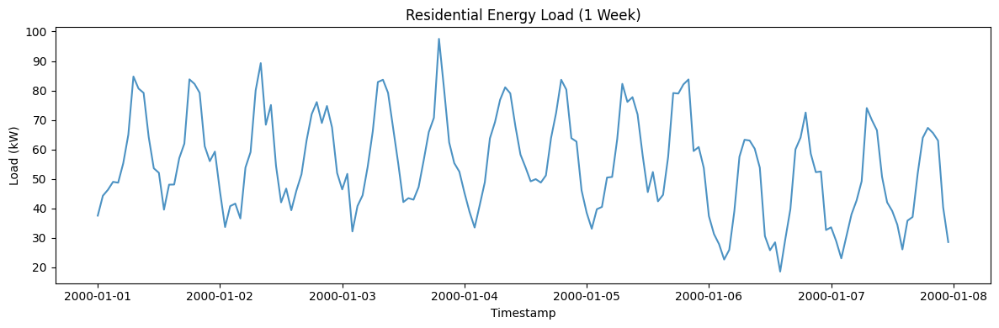
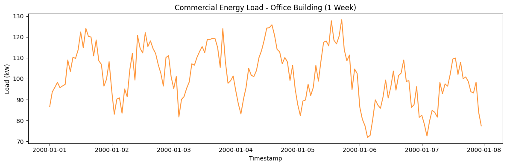
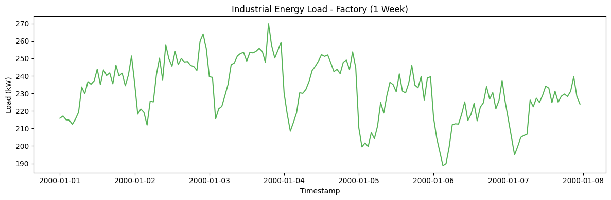
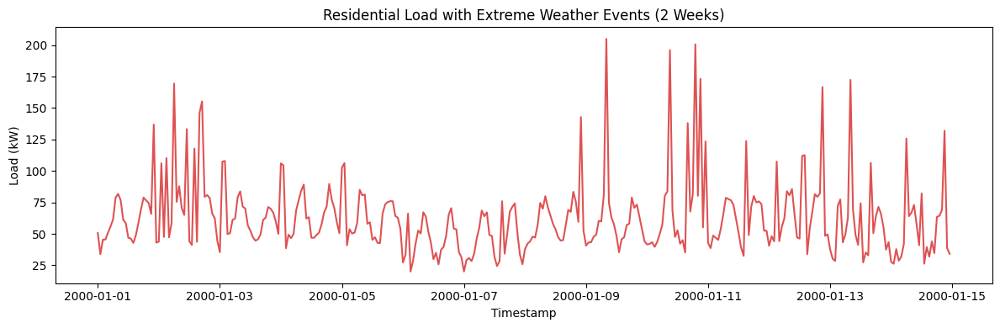
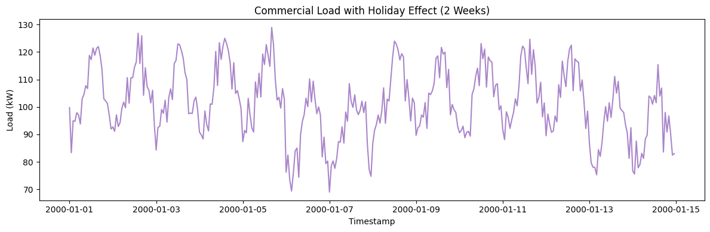
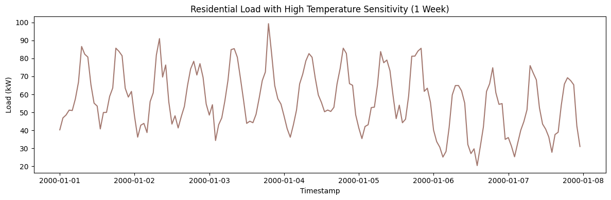
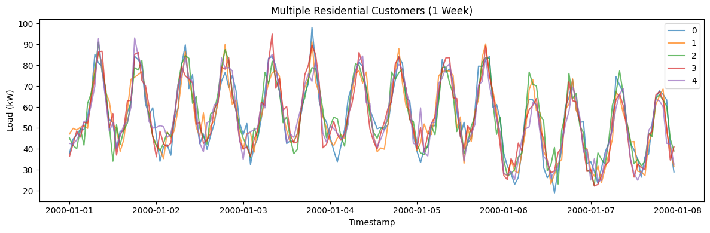

Simulate electricity demand patterns for different customer types
(residential, commercial, industrial). The generator incorporates
daily/weekly seasonality, temperature sensitivity, holiday effects, and
extreme weather events.

```python
import polars as pl
import matplotlib.pyplot as plt

from synforecast.generators import EnergyLoadGenerator
```

## 1. Residential Energy Load

Generate one week of hourly residential electricity demand with typical
morning/evening peaks.

```python
residential_params = {
    "min_length": 168,
    "max_length": 168,
    "freq": "h",
    "load_type": "residential",
    "base_load": 2.0,
    "temperature_sensitivity": 0.05,
    "seed": 42,
}
residential_gen = EnergyLoadGenerator(engine="polars", **residential_params)
residential_df = residential_gen.generate(n_series=1)
print(f"Generated {len(residential_df)} hourly observations")
print(
    f"Statistics: Mean={residential_df['y'].mean():.2f} kW, "
    f"Min={residential_df['y'].min():.2f} kW, Max={residential_df['y'].max():.2f} kW"
)
residential_df.head(24)
```

``` text
Generated 168 hourly observations
Statistics: Mean=54.94 kW, Min=18.48 kW, Max=97.52 kW
```

| unique_id | ds                  | y         |
|-----------|---------------------|-----------|
| cat       | datetime\[ns\]      | f64       |
| "0"       | 2000-01-01 00:00:00 | 37.475594 |
| "0"       | 2000-01-01 01:00:00 | 44.225126 |
| "0"       | 2000-01-01 02:00:00 | 46.264535 |
| "0"       | 2000-01-01 03:00:00 | 48.94903  |
| "0"       | 2000-01-01 04:00:00 | 48.662387 |
| …         | …                   | …         |
| "0"       | 2000-01-01 19:00:00 | 82.212299 |
| "0"       | 2000-01-01 20:00:00 | 79.205961 |
| "0"       | 2000-01-01 21:00:00 | 61.051004 |
| "0"       | 2000-01-01 22:00:00 | 55.973929 |
| "0"       | 2000-01-01 23:00:00 | 59.225813 |

```python
fig, ax = plt.subplots(figsize=(12, 4))
ax.plot(residential_df["ds"].to_list(), residential_df["y"].to_list(), alpha=0.8)
ax.set_xlabel("Timestamp")
ax.set_ylabel("Load (kW)")
ax.set_title("Residential Energy Load (1 Week)")
plt.tight_layout()
plt.show()
```



## 2. Commercial Energy Load (Office Building)

Office buildings show high demand during business hours and low demand
at night/weekends.

```python
commercial_params = {
    "min_length": 168,
    "max_length": 168,
    "freq": "h",
    "load_type": "commercial",
    "base_load": 50.0,
    "temperature_sensitivity": 0.08,
    "seed": 42,
}
commercial_gen = EnergyLoadGenerator(engine="polars", **commercial_params)
commercial_df = commercial_gen.generate(n_series=1)
print(f"Generated {len(commercial_df)} hourly observations")
print(
    f"Statistics: Mean={commercial_df['y'].mean():.2f} kW, "
    f"Min={commercial_df['y'].min():.2f} kW, Max={commercial_df['y'].max():.2f} kW"
)
commercial_df.head(24)
```

``` text
Generated 168 hourly observations
Statistics: Mean=101.82 kW, Min=71.94 kW, Max=128.25 kW
```

| unique_id | ds                  | y          |
|-----------|---------------------|------------|
| cat       | datetime\[ns\]      | f64        |
| "0"       | 2000-01-01 00:00:00 | 86.591504  |
| "0"       | 2000-01-01 01:00:00 | 93.658295  |
| "0"       | 2000-01-01 02:00:00 | 95.876818  |
| "0"       | 2000-01-01 03:00:00 | 98.244828  |
| "0"       | 2000-01-01 04:00:00 | 95.714007  |
| …         | …                   | …          |
| "0"       | 2000-01-01 19:00:00 | 108.620837 |
| "0"       | 2000-01-01 20:00:00 | 106.892316 |
| "0"       | 2000-01-01 21:00:00 | 96.47236   |
| "0"       | 2000-01-01 22:00:00 | 99.788689  |
| "0"       | 2000-01-01 23:00:00 | 108.175298 |

```python
fig, ax = plt.subplots(figsize=(12, 4))
ax.plot(commercial_df["ds"].to_list(), commercial_df["y"].to_list(), alpha=0.8, color="C1")
ax.set_xlabel("Timestamp")
ax.set_ylabel("Load (kW)")
ax.set_title("Commercial Energy Load - Office Building (1 Week)")
plt.tight_layout()
plt.show()
```



## 3. Industrial Energy Load (Factory)

Industrial loads are typically more constant with less temperature
sensitivity.

```python
industrial_params = {
    "min_length": 168,
    "max_length": 168,
    "freq": "h",
    "load_type": "industrial",
    "base_load": 200.0,
    "temperature_sensitivity": 0.02,
    "seed": 42,
}
industrial_gen = EnergyLoadGenerator(engine="polars", **industrial_params)
industrial_df = industrial_gen.generate(n_series=1)
print(f"Generated {len(industrial_df)} hourly observations")
print(
    f"Statistics: Mean={industrial_df['y'].mean():.2f} kW, "
    f"Min={industrial_df['y'].min():.2f} kW, Max={industrial_df['y'].max():.2f} kW"
)
industrial_df.head(24)
```

``` text
Generated 168 hourly observations
Statistics: Mean=231.73 kW, Min=188.72 kW, Max=269.90 kW
```

| unique_id | ds                  | y          |
|-----------|---------------------|------------|
| cat       | datetime\[ns\]      | f64        |
| "0"       | 2000-01-01 00:00:00 | 215.799236 |
| "0"       | 2000-01-01 01:00:00 | 217.076458 |
| "0"       | 2000-01-01 02:00:00 | 214.910692 |
| "0"       | 2000-01-01 03:00:00 | 214.805926 |
| "0"       | 2000-01-01 04:00:00 | 212.30712  |
| …         | …                   | …          |
| "0"       | 2000-01-01 19:00:00 | 239.999576 |
| "0"       | 2000-01-01 20:00:00 | 241.522404 |
| "0"       | 2000-01-01 21:00:00 | 234.366525 |
| "0"       | 2000-01-01 22:00:00 | 240.528091 |
| "0"       | 2000-01-01 23:00:00 | 251.386467 |

```python
fig, ax = plt.subplots(figsize=(12, 4))
ax.plot(industrial_df["ds"].to_list(), industrial_df["y"].to_list(), alpha=0.8, color="C2")
ax.set_xlabel("Timestamp")
ax.set_ylabel("Load (kW)")
ax.set_title("Industrial Energy Load - Factory (1 Week)")
plt.tight_layout()
plt.show()
```



## 4. Residential Load with Extreme Weather

Simulate load spikes during extreme weather events like heat waves or
cold snaps.

```python
extreme_weather_params = {
    "min_length": 336,
    "max_length": 336,
    "freq": "h",
    "load_type": "residential",
    "base_load": 2.0,
    "temperature_sensitivity": 0.05,
    "extreme_weather_prob": 0.1,
    "extreme_weather_impact": 2.5,
    "seed": 42,
}
extreme_gen = EnergyLoadGenerator(engine="polars", **extreme_weather_params)
extreme_df = extreme_gen.generate(n_series=1)
print(f"Generated {len(extreme_df)} hourly observations with extreme weather events")
print(
    f"Statistics: Mean={extreme_df['y'].mean():.2f} kW, "
    f"Min={extreme_df['y'].min():.2f} kW, Max={extreme_df['y'].max():.2f} kW"
)
extreme_df.head(24)
```

``` text
Generated 336 hourly observations with extreme weather events
Statistics: Mean=62.60 kW, Min=20.00 kW, Max=205.00 kW
```

| unique_id | ds                  | y          |
|-----------|---------------------|------------|
| cat       | datetime\[ns\]      | f64        |
| "0"       | 2000-01-01 00:00:00 | 50.647778  |
| "0"       | 2000-01-01 01:00:00 | 33.903193  |
| "0"       | 2000-01-01 02:00:00 | 45.368096  |
| "0"       | 2000-01-01 03:00:00 | 45.453387  |
| "0"       | 2000-01-01 04:00:00 | 50.819034  |
| …         | …                   | …          |
| "0"       | 2000-01-01 19:00:00 | 76.554611  |
| "0"       | 2000-01-01 20:00:00 | 74.492959  |
| "0"       | 2000-01-01 21:00:00 | 65.825395  |
| "0"       | 2000-01-01 22:00:00 | 136.884119 |
| "0"       | 2000-01-01 23:00:00 | 43.017805  |

```python
fig, ax = plt.subplots(figsize=(12, 4))
ax.plot(extreme_df["ds"].to_list(), extreme_df["y"].to_list(), alpha=0.8, color="C3")
ax.set_xlabel("Timestamp")
ax.set_ylabel("Load (kW)")
ax.set_title("Residential Load with Extreme Weather Events (2 Weeks)")
plt.tight_layout()
plt.show()
```



## 5. Commercial Load with Holiday Effect

Model reduced commercial demand during holidays and weekends.

```python
holiday_params = {
    "min_length": 336,
    "max_length": 336,
    "freq": "h",
    "load_type": "commercial",
    "base_load": 50.0,
    "temperature_sensitivity": 0.08,
    "holiday_effect": 0.3,
    "seed": 42,
}
holiday_gen = EnergyLoadGenerator(engine="polars", **holiday_params)
holiday_df = holiday_gen.generate(n_series=1)
print(f"Generated {len(holiday_df)} hourly observations with holiday/weekend effects")
print(
    f"Statistics: Mean={holiday_df['y'].mean():.2f} kW, "
    f"Min={holiday_df['y'].min():.2f} kW, Max={holiday_df['y'].max():.2f} kW"
)
holiday_df.head(24)
```

``` text
Generated 336 hourly observations with holiday/weekend effects
Statistics: Mean=101.44 kW, Min=69.02 kW, Max=128.92 kW
```

| unique_id | ds                  | y          |
|-----------|---------------------|------------|
| cat       | datetime\[ns\]      | f64        |
| "0"       | 2000-01-01 00:00:00 | 99.763688  |
| "0"       | 2000-01-01 01:00:00 | 83.336362  |
| "0"       | 2000-01-01 02:00:00 | 94.98038   |
| "0"       | 2000-01-01 03:00:00 | 94.749185  |
| "0"       | 2000-01-01 04:00:00 | 97.870654  |
| …         | …                   | …          |
| "0"       | 2000-01-01 19:00:00 | 102.963149 |
| "0"       | 2000-01-01 20:00:00 | 102.179314 |
| "0"       | 2000-01-01 21:00:00 | 101.246752 |
| "0"       | 2000-01-01 22:00:00 | 97.070383  |
| "0"       | 2000-01-01 23:00:00 | 91.96729   |

```python
fig, ax = plt.subplots(figsize=(12, 4))
ax.plot(holiday_df["ds"].to_list(), holiday_df["y"].to_list(), alpha=0.8, color="C4")
ax.set_xlabel("Timestamp")
ax.set_ylabel("Load (kW)")
ax.set_title("Commercial Load with Holiday Effect (2 Weeks)")
plt.tight_layout()
plt.show()
```



## 6. Residential Load with High Temperature Sensitivity

Simulate a household with heavy AC/heating usage that is very sensitive
to temperature changes.

```python
high_temp_params = {
    "min_length": 168,
    "max_length": 168,
    "freq": "h",
    "load_type": "residential",
    "base_load": 3.0,
    "temperature_sensitivity": 0.15,
    "seed": 42,
}
high_temp_gen = EnergyLoadGenerator(engine="polars", **high_temp_params)
high_temp_df = high_temp_gen.generate(n_series=1)
print(f"Generated {len(high_temp_df)} hourly observations with high temperature sensitivity")
print(
    f"Statistics: Mean={high_temp_df['y'].mean():.2f} kW, "
    f"Min={high_temp_df['y'].min():.2f} kW, Max={high_temp_df['y'].max():.2f} kW"
)
high_temp_df.head(24)
```

``` text
Generated 168 hourly observations with high temperature sensitivity
Statistics: Mean=56.94 kW, Min=20.36 kW, Max=99.35 kW
```

| unique_id | ds                  | y         |
|-----------|---------------------|-----------|
| cat       | datetime\[ns\]      | f64       |
| "0"       | 2000-01-01 00:00:00 | 40.255913 |
| "0"       | 2000-01-01 01:00:00 | 46.889278 |
| "0"       | 2000-01-01 02:00:00 | 48.506536 |
| "0"       | 2000-01-01 03:00:00 | 51.234452 |
| "0"       | 2000-01-01 04:00:00 | 51.012296 |
| …         | …                   | …         |
| "0"       | 2000-01-01 19:00:00 | 83.921064 |
| "0"       | 2000-01-01 20:00:00 | 81.484842 |
| "0"       | 2000-01-01 21:00:00 | 63.461836 |
| "0"       | 2000-01-01 22:00:00 | 58.506393 |
| "0"       | 2000-01-01 23:00:00 | 61.645597 |

```python
fig, ax = plt.subplots(figsize=(12, 4))
ax.plot(high_temp_df["ds"].to_list(), high_temp_df["y"].to_list(), alpha=0.8, color="C5")
ax.set_xlabel("Timestamp")
ax.set_ylabel("Load (kW)")
ax.set_title("Residential Load with High Temperature Sensitivity (1 Week)")
plt.tight_layout()
plt.show()
```



## 7. Multiple Residential Customers

Generate load profiles for 5 residential customers simultaneously.

```python
multi_params = {
    "min_length": 168,
    "max_length": 168,
    "freq": "h",
    "load_type": "residential",
    "base_load": 2.5,
    "temperature_sensitivity": 0.05,
    "seed": 42,
}
multi_gen = EnergyLoadGenerator(engine="polars", **multi_params)
multi_df = multi_gen.generate(n_series=5)
print(f"Generated 5 residential customers with {len(multi_df)} total observations")
print(
    f"Overall Statistics: Mean={multi_df['y'].mean():.2f} kW, "
    f"Total Load={multi_df.group_by('ds').agg(pl.col('y').sum()).select('y').mean().item():.2f} kW"
)

multi_df.filter(pl.col("unique_id") == "0").head(24)
```

``` text
Generated 5 residential customers with 840 total observations
Overall Statistics: Mean=55.30 kW, Total Load=276.52 kW
```

| unique_id | ds                  | y         |
|-----------|---------------------|-----------|
| cat       | datetime\[ns\]      | f64       |
| "0"       | 2000-01-01 00:00:00 | 37.975594 |
| "0"       | 2000-01-01 01:00:00 | 44.725126 |
| "0"       | 2000-01-01 02:00:00 | 46.764535 |
| "0"       | 2000-01-01 03:00:00 | 49.44903  |
| "0"       | 2000-01-01 04:00:00 | 49.162387 |
| …         | …                   | …         |
| "0"       | 2000-01-01 19:00:00 | 82.712299 |
| "0"       | 2000-01-01 20:00:00 | 79.705961 |
| "0"       | 2000-01-01 21:00:00 | 61.551004 |
| "0"       | 2000-01-01 22:00:00 | 56.473929 |
| "0"       | 2000-01-01 23:00:00 | 59.725813 |

```python
fig, ax = plt.subplots(figsize=(12, 4))
for uid in multi_df["unique_id"].unique().to_list():
    series = multi_df.filter(pl.col("unique_id") == uid)
    ax.plot(series["ds"].to_list(), series["y"].to_list(), label=uid, alpha=0.7)
ax.set_xlabel("Timestamp")
ax.set_ylabel("Load (kW)")
ax.set_title("Multiple Residential Customers (1 Week)")
ax.legend()
plt.tight_layout()
plt.show()
```



