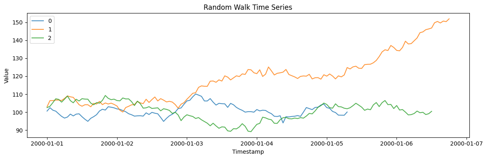

Generate random walk time series with configurable drift, volatility,
and start value.

```python
import polars as pl
import matplotlib.pyplot as plt

from synforecast.generators import RandomWalkGenerator
```

## Define Generator Parameters

Configure the random walk with drift (upward trend), volatility, hourly
frequency, and a fixed start value.

```python
params = {
    "min_length": 100,
    "max_length": 150,
    "freq": "h",
    "drift": 0.1,
    "volatility": 1.5,
    "start_value": 100.0,
    "seed": 42,
}

generator = RandomWalkGenerator(engine="polars", **params)
df = generator.generate(n_series=3)
```


```python
fig, ax = plt.subplots(figsize=(12, 4))
for uid in df["unique_id"].unique().to_list():
    series = df.filter(pl.col("unique_id") == uid)
    ax.plot(series["ds"].to_list(), series["y"].to_list(), label=uid, alpha=0.8)
ax.set_xlabel("Timestamp")
ax.set_ylabel("Value")
ax.set_title("Random Walk Time Series")
ax.legend()
plt.tight_layout()
plt.show()
```



## Inspect the Generated Data

The output is a Polars DataFrame with columns `unique_id`, `ds`
(timestamp), and `y` (value).

```python
print(f"Generated {df['unique_id'].n_unique()} time series")
print(f"Total observations: {len(df)}")
df.head(10)
```

``` text
Generated 3 time series
Total observations: 376
```

| unique_id | ds                  | y          |
|-----------|---------------------|------------|
| cat       | datetime\[ns\]      | f64        |
| "0"       | 2000-01-01 00:00:00 | 100.620958 |
| "0"       | 2000-01-01 01:00:00 | 102.500707 |
| "0"       | 2000-01-01 02:00:00 | 101.104897 |
| "0"       | 2000-01-01 03:00:00 | 100.564106 |
| "0"       | 2000-01-01 04:00:00 | 99.076724  |
| "0"       | 2000-01-01 05:00:00 | 97.674284  |
| "0"       | 2000-01-01 06:00:00 | 96.714608  |
| "0"       | 2000-01-01 07:00:00 | 97.294935  |
| "0"       | 2000-01-01 08:00:00 | 98.929896  |
| "0"       | 2000-01-01 09:00:00 | 97.918173  |

## Statistics by Series

Compute summary statistics for each generated series.

```python
df.group_by("unique_id").agg(
    [
        pl.col("y").count().alias("count"),
        pl.col("y").min().alias("min_value"),
        pl.col("y").max().alias("max_value"),
        pl.col("y").mean().alias("mean_value"),
        pl.col("y").std().alias("std_value"),
    ]
)
```

| unique_id | count | min_value  | max_value  | mean_value | std_value |
|-----------|-------|------------|------------|------------|-----------|
| cat       | u32   | f64        | f64        | f64        | f64       |
| "1"       | 139   | 100.090121 | 151.940789 | 118.881905 | 13.27846  |
| "0"       | 104   | 94.028521  | 110.129544 | 100.735208 | 3.266454  |
| "2"       | 133   | 89.176748  | 109.298167 | 100.537712 | 5.13869   |

