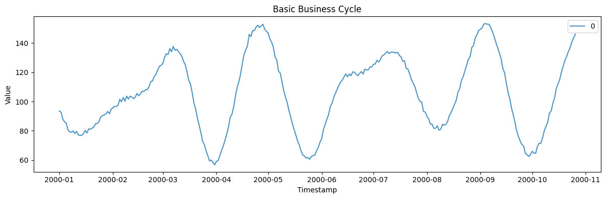
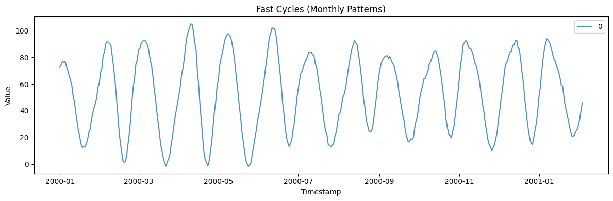
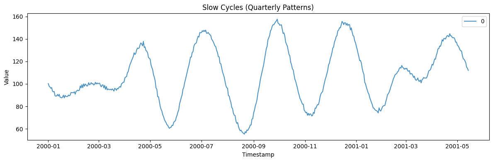
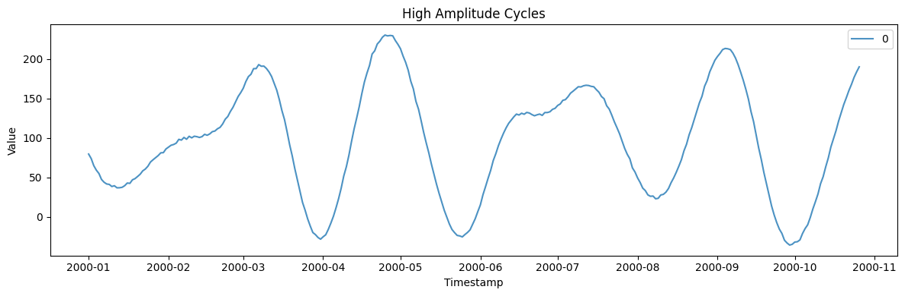
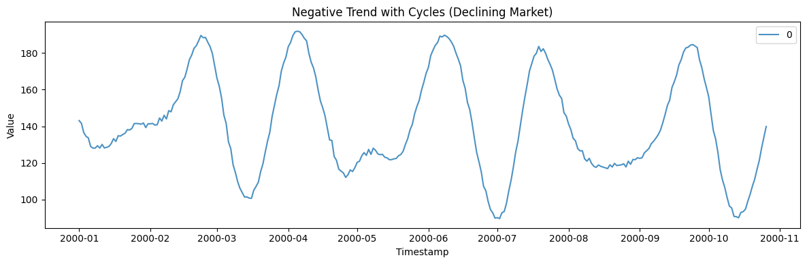
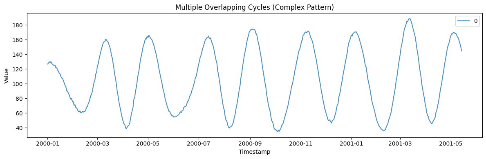
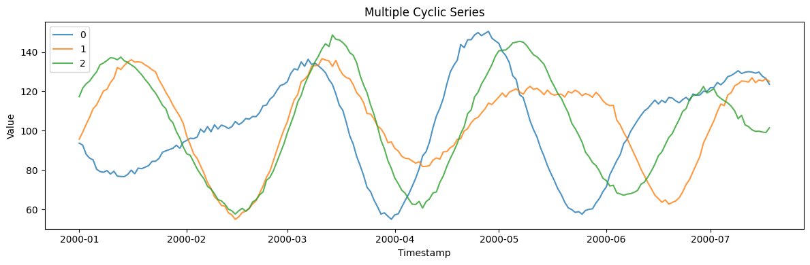

The Cyclic generator creates time series with irregular business cycles,
combining trend, multiple overlapping cycles with varying periods and
amplitudes, and random noise. Useful for economic indicators, commodity
prices, and business metrics.

```python
import polars as pl
import matplotlib.pyplot as plt

from synforecast.generators import CyclicGenerator
```

## 1. Basic Business Cycle

A simple model with ~60-day cycles, upward trend, and 3 overlapping
cycle components.

```python
basic_params = {
    "min_length": 300,
    "max_length": 300,
    "freq": "D",
    "base_level": 100.0,
    "trend": 0.05,
    "cycle_period_mean": 60.0,
    "cycle_amplitude_mean": 20.0,
    "num_cycles": 3,
    "seed": 42,
}

basic_gen = CyclicGenerator(engine="polars", **basic_params)
basic_df = basic_gen.generate(n_series=1)

print(f"Generated {len(basic_df)} observations with irregular cycles")
print(f"Statistics: Mean={basic_df['y'].mean():.4f}, Std={basic_df['y'].std():.4f}")
basic_df.head(10)
```

``` text
Generated 300 observations with irregular cycles
Statistics: Mean=105.2939, Std=25.9592
```

| unique_id | ds                  | y         |
|-----------|---------------------|-----------|
| cat       | datetime\[ns\]      | f64       |
| "0"       | 2000-01-01 00:00:00 | 93.663885 |
| "0"       | 2000-01-02 00:00:00 | 92.69384  |
| "0"       | 2000-01-03 00:00:00 | 88.046548 |
| "0"       | 2000-01-04 00:00:00 | 86.119544 |
| "0"       | 2000-01-05 00:00:00 | 85.275164 |
| "0"       | 2000-01-06 00:00:00 | 80.548824 |
| "0"       | 2000-01-07 00:00:00 | 79.348091 |
| "0"       | 2000-01-08 00:00:00 | 79.021414 |
| "0"       | 2000-01-09 00:00:00 | 79.888552 |
| "0"       | 2000-01-10 00:00:00 | 78.160928 |

```python
fig, ax = plt.subplots(figsize=(12, 4))
for uid in basic_df["unique_id"].unique().to_list():
    series = basic_df.filter(pl.col("unique_id") == uid)
    ax.plot(series["ds"].to_list(), series["y"].to_list(), label=uid, alpha=0.8)
ax.set_xlabel("Timestamp")
ax.set_ylabel("Value")
ax.set_title("Basic Business Cycle")
ax.legend()
plt.tight_layout()
plt.show()
```



## 2. Fast Cycles (Monthly Patterns)

Shorter ~30-day cycles with 5 overlapping components.

```python
fast_params = {
    "min_length": 400,
    "max_length": 400,
    "freq": "D",
    "base_level": 50.0,
    "trend": 0.02,
    "cycle_period_mean": 30.0,
    "cycle_amplitude_mean": 10.0,
    "num_cycles": 5,
    "seed": 42,
}

fast_gen = CyclicGenerator(engine="polars", **fast_params)
fast_df = fast_gen.generate(n_series=1)

print(f"Generated {len(fast_df)} observations with fast cycles")
print(f"Statistics: Mean={fast_df['y'].mean():.4f}, Std={fast_df['y'].std():.4f}")
fast_df.head(10)
```

``` text
Generated 400 observations with fast cycles
Statistics: Mean=53.2412, Std=28.5389
```

| unique_id | ds                  | y         |
|-----------|---------------------|-----------|
| cat       | datetime\[ns\]      | f64       |
| "0"       | 2000-01-01 00:00:00 | 72.909227 |
| "0"       | 2000-01-02 00:00:00 | 74.747078 |
| "0"       | 2000-01-03 00:00:00 | 77.028095 |
| "0"       | 2000-01-04 00:00:00 | 75.842216 |
| "0"       | 2000-01-05 00:00:00 | 76.859084 |
| "0"       | 2000-01-06 00:00:00 | 72.885358 |
| "0"       | 2000-01-07 00:00:00 | 70.139578 |
| "0"       | 2000-01-08 00:00:00 | 66.440151 |
| "0"       | 2000-01-09 00:00:00 | 62.914334 |
| "0"       | 2000-01-10 00:00:00 | 59.461281 |

```python
fig, ax = plt.subplots(figsize=(12, 4))
for uid in fast_df["unique_id"].unique().to_list():
    series = fast_df.filter(pl.col("unique_id") == uid)
    ax.plot(series["ds"].to_list(), series["y"].to_list(), label=uid, alpha=0.8)
ax.set_xlabel("Timestamp")
ax.set_ylabel("Value")
ax.set_title("Fast Cycles (Monthly Patterns)")
ax.legend()
plt.tight_layout()
plt.show()
```



## 3. Slow Cycles (Quarterly Patterns)

Longer ~90-day cycles with high amplitude, simulating quarterly business
cycles.

```python
slow_params = {
    "min_length": 500,
    "max_length": 500,
    "freq": "D",
    "base_level": 100.0,
    "trend": 0.03,
    "cycle_period_mean": 90.0,
    "cycle_amplitude_mean": 30.0,
    "num_cycles": 2,
    "seed": 42,
}

slow_gen = CyclicGenerator(engine="polars", **slow_params)
slow_df = slow_gen.generate(n_series=1)

print(f"Generated {len(slow_df)} observations with slow cycles")
print(f"Statistics: Mean={slow_df['y'].mean():.4f}, Std={slow_df['y'].std():.4f}")
slow_df.head(10)
```

``` text
Generated 500 observations with slow cycles
Statistics: Mean=107.5731, Std=25.5262
```

| unique_id | ds                  | y          |
|-----------|---------------------|------------|
| cat       | datetime\[ns\]      | f64        |
| "0"       | 2000-01-01 00:00:00 | 100.289452 |
| "0"       | 2000-01-02 00:00:00 | 98.00997   |
| "0"       | 2000-01-03 00:00:00 | 97.255182  |
| "0"       | 2000-01-04 00:00:00 | 96.080102  |
| "0"       | 2000-01-05 00:00:00 | 96.742441  |
| "0"       | 2000-01-06 00:00:00 | 93.572466  |
| "0"       | 2000-01-07 00:00:00 | 92.956132  |
| "0"       | 2000-01-08 00:00:00 | 93.248319  |
| "0"       | 2000-01-09 00:00:00 | 89.48066   |
| "0"       | 2000-01-10 00:00:00 | 89.060168  |

```python
fig, ax = plt.subplots(figsize=(12, 4))
for uid in slow_df["unique_id"].unique().to_list():
    series = slow_df.filter(pl.col("unique_id") == uid)
    ax.plot(series["ds"].to_list(), series["y"].to_list(), label=uid, alpha=0.8)
ax.set_xlabel("Timestamp")
ax.set_ylabel("Value")
ax.set_title("Slow Cycles (Quarterly Patterns)")
ax.legend()
plt.tight_layout()
plt.show()
```



## 4. High Amplitude Cycles (Large Fluctuations)

An amplitude of 50 produces large swings around the base level.

```python
high_amp_params = {
    "min_length": 300,
    "max_length": 300,
    "freq": "D",
    "base_level": 100.0,
    "trend": 0.01,
    "cycle_period_mean": 60.0,
    "cycle_amplitude_mean": 50.0,
    "num_cycles": 3,
    "seed": 42,
}

high_amp_gen = CyclicGenerator(engine="polars", **high_amp_params)
high_amp_df = high_amp_gen.generate(n_series=1)

print(f"Generated {len(high_amp_df)} observations with high amplitude cycles")
print(f"Statistics: Mean={high_amp_df['y'].mean():.4f}, Std={high_amp_df['y'].std():.4f}")
high_amp_df.head(10)
```

``` text
Generated 300 observations with high amplitude cycles
Statistics: Mean=95.7914, Std=69.8237
```

| unique_id | ds                  | y         |
|-----------|---------------------|-----------|
| cat       | datetime\[ns\]      | f64       |
| "0"       | 2000-01-01 00:00:00 | 79.572658 |
| "0"       | 2000-01-02 00:00:00 | 73.834076 |
| "0"       | 2000-01-03 00:00:00 | 64.882192 |
| "0"       | 2000-01-04 00:00:00 | 59.134291 |
| "0"       | 2000-01-05 00:00:00 | 54.963447 |
| "0"       | 2000-01-06 00:00:00 | 47.407805 |
| "0"       | 2000-01-07 00:00:00 | 43.870643 |
| "0"       | 2000-01-08 00:00:00 | 41.690049 |
| "0"       | 2000-01-09 00:00:00 | 41.170252 |
| "0"       | 2000-01-10 00:00:00 | 38.502783 |

```python
fig, ax = plt.subplots(figsize=(12, 4))
for uid in high_amp_df["unique_id"].unique().to_list():
    series = high_amp_df.filter(pl.col("unique_id") == uid)
    ax.plot(series["ds"].to_list(), series["y"].to_list(), label=uid, alpha=0.8)
ax.set_xlabel("Timestamp")
ax.set_ylabel("Value")
ax.set_title("High Amplitude Cycles")
ax.legend()
plt.tight_layout()
plt.show()
```



## 5. Negative Trend with Cycles (Declining Market)

A downward trend combined with cyclical fluctuations.

```python
declining_params = {
    "min_length": 300,
    "max_length": 300,
    "freq": "D",
    "base_level": 150.0,
    "trend": -0.05,
    "cycle_period_mean": 50.0,
    "cycle_amplitude_mean": 20.0,
    "num_cycles": 3,
    "seed": 42,
}

declining_gen = CyclicGenerator(engine="polars", **declining_params)
declining_df = declining_gen.generate(n_series=1)

print(f"Generated {len(declining_df)} observations with declining trend")
print(f"Statistics: Mean={declining_df['y'].mean():.4f}, Std={declining_df['y'].std():.4f}")
declining_df.head(10)
```

``` text
Generated 300 observations with declining trend
Statistics: Mean=140.8307, Std=27.3867
```

| unique_id | ds                  | y          |
|-----------|---------------------|------------|
| cat       | datetime\[ns\]      | f64        |
| "0"       | 2000-01-01 00:00:00 | 143.101924 |
| "0"       | 2000-01-02 00:00:00 | 141.627292 |
| "0"       | 2000-01-03 00:00:00 | 136.638082 |
| "0"       | 2000-01-04 00:00:00 | 134.529648 |
| "0"       | 2000-01-05 00:00:00 | 133.656044 |
| "0"       | 2000-01-06 00:00:00 | 129.039617 |
| "0"       | 2000-01-07 00:00:00 | 128.071289 |
| "0"       | 2000-01-08 00:00:00 | 128.080343 |
| "0"       | 2000-01-09 00:00:00 | 129.365766 |
| "0"       | 2000-01-10 00:00:00 | 128.117344 |

```python
fig, ax = plt.subplots(figsize=(12, 4))
for uid in declining_df["unique_id"].unique().to_list():
    series = declining_df.filter(pl.col("unique_id") == uid)
    ax.plot(series["ds"].to_list(), series["y"].to_list(), label=uid, alpha=0.8)
ax.set_xlabel("Timestamp")
ax.set_ylabel("Value")
ax.set_title("Negative Trend with Cycles (Declining Market)")
ax.legend()
plt.tight_layout()
plt.show()
```



## 6. Multiple Overlapping Cycles (Complex Pattern)

Five overlapping cycle components create a complex, realistic pattern.

```python
complex_params = {
    "min_length": 500,
    "max_length": 500,
    "freq": "D",
    "base_level": 100.0,
    "trend": 0.02,
    "cycle_period_mean": 60.0,
    "cycle_amplitude_mean": 15.0,
    "num_cycles": 5,
    "seed": 42,
}

complex_gen = CyclicGenerator(engine="polars", **complex_params)
complex_df = complex_gen.generate(n_series=1)

print(f"Generated {len(complex_df)} observations with multiple overlapping cycles")
print(f"Statistics: Mean={complex_df['y'].mean():.4f}, Std={complex_df['y'].std():.4f}")
complex_df.head(10)
```

``` text
Generated 500 observations with multiple overlapping cycles
Statistics: Mean=105.8392, Std=43.9463
```

| unique_id | ds                  | y          |
|-----------|---------------------|------------|
| cat       | datetime\[ns\]      | f64        |
| "0"       | 2000-01-01 00:00:00 | 126.751732 |
| "0"       | 2000-01-02 00:00:00 | 127.885824 |
| "0"       | 2000-01-03 00:00:00 | 129.749177 |
| "0"       | 2000-01-04 00:00:00 | 128.563635 |
| "0"       | 2000-01-05 00:00:00 | 130.119181 |
| "0"       | 2000-01-06 00:00:00 | 127.31363  |
| "0"       | 2000-01-07 00:00:00 | 126.418862 |
| "0"       | 2000-01-08 00:00:00 | 125.266044 |
| "0"       | 2000-01-09 00:00:00 | 124.954641 |
| "0"       | 2000-01-10 00:00:00 | 125.315938 |

```python
fig, ax = plt.subplots(figsize=(12, 4))
for uid in complex_df["unique_id"].unique().to_list():
    series = complex_df.filter(pl.col("unique_id") == uid)
    ax.plot(series["ds"].to_list(), series["y"].to_list(), label=uid, alpha=0.8)
ax.set_xlabel("Timestamp")
ax.set_ylabel("Value")
ax.set_title("Multiple Overlapping Cycles (Complex Pattern)")
ax.legend()
plt.tight_layout()
plt.show()
```



## 7. Multiple Cyclic Series

Generate multiple independent cyclic series in one call.

```python
multi_params = {
    "min_length": 200,
    "max_length": 200,
    "freq": "D",
    "base_level": 100.0,
    "trend": 0.03,
    "cycle_period_mean": 60.0,
    "cycle_amplitude_mean": 20.0,
    "num_cycles": 3,
    "seed": 42,
}

multi_gen = CyclicGenerator(engine="polars", **multi_params)
multi_df = multi_gen.generate(n_series=3)

print(f"Generated 3 series with {len(multi_df)} total observations")
print(f"Overall Statistics: Mean={multi_df['y'].mean():.4f}, Std={multi_df['y'].std():.4f}")
multi_df.filter(pl.col("unique_id") == "0").head(10)
```

``` text
Generated 3 series with 600 total observations
Overall Statistics: Mean=103.3095, Std=24.7829
```

| unique_id | ds                  | y         |
|-----------|---------------------|-----------|
| cat       | datetime\[ns\]      | f64       |
| "0"       | 2000-01-01 00:00:00 | 93.663885 |
| "0"       | 2000-01-02 00:00:00 | 92.67384  |
| "0"       | 2000-01-03 00:00:00 | 88.006548 |
| "0"       | 2000-01-04 00:00:00 | 86.059544 |
| "0"       | 2000-01-05 00:00:00 | 85.195164 |
| "0"       | 2000-01-06 00:00:00 | 80.448824 |
| "0"       | 2000-01-07 00:00:00 | 79.228091 |
| "0"       | 2000-01-08 00:00:00 | 78.881414 |
| "0"       | 2000-01-09 00:00:00 | 79.728552 |
| "0"       | 2000-01-10 00:00:00 | 77.980928 |

```python
fig, ax = plt.subplots(figsize=(12, 4))
for uid in multi_df["unique_id"].unique().to_list():
    series = multi_df.filter(pl.col("unique_id") == uid)
    ax.plot(series["ds"].to_list(), series["y"].to_list(), label=uid, alpha=0.8)
ax.set_xlabel("Timestamp")
ax.set_ylabel("Value")
ax.set_title("Multiple Cyclic Series")
ax.legend()
plt.tight_layout()
plt.show()
```



