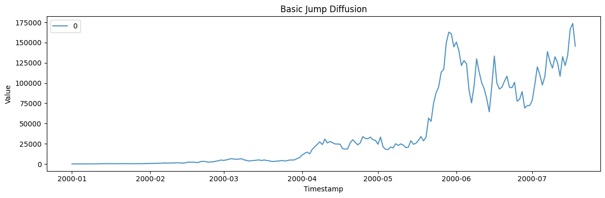
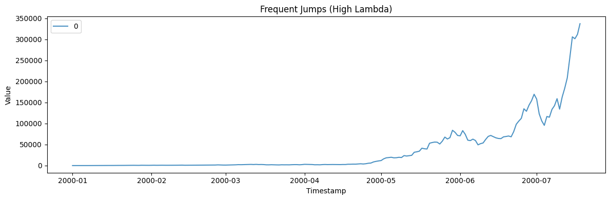
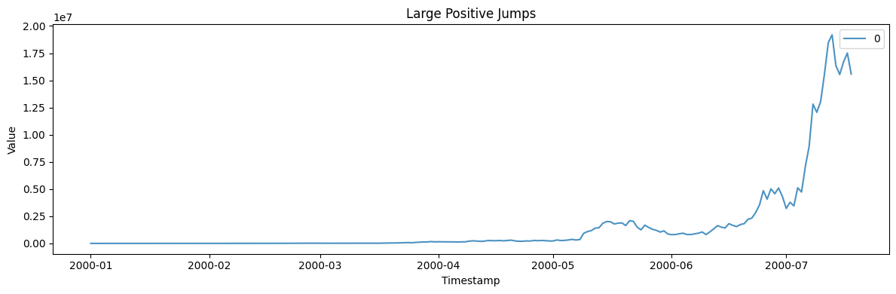
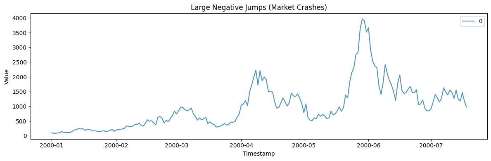
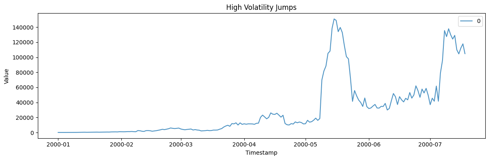
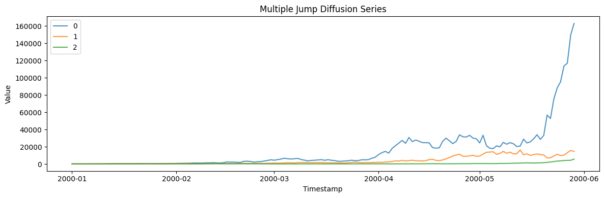

The Jump Diffusion (Merton) model extends Geometric Brownian Motion by
adding random jumps, making it suitable for modeling stock prices that
experience sudden, discontinuous changes (e.g., due to news events or
market shocks).

```python
import polars as pl
import matplotlib.pyplot as plt

from synforecast.generators import JumpDiffusionGenerator
```

## 1. Basic Jump Diffusion Model

A standard model with moderate jump frequency and symmetric jump sizes.

```python
basic_params = {
    "min_length": 200,
    "max_length": 200,
    "freq": "D",
    "mu": 0.05,
    "sigma": 0.15,
    "lambda_jump": 0.2,
    "jump_mean": 0.0,
    "jump_std": 0.1,
    "initial_value": 100.0,
    "seed": 42,
}

basic_gen = JumpDiffusionGenerator(engine="polars", **basic_params)
basic_df = basic_gen.generate(n_series=1)

print(f"Generated {len(basic_df)} observations with random jumps")
print(f"Statistics: Mean={basic_df['y'].mean():.4f}, Std={basic_df['y'].std():.4f}")
basic_df.head(10)
```

``` text
Generated 200 observations with random jumps
Statistics: Mean=39424.4683, Std=48687.0832
```

| unique_id | ds                  | y          |
|-----------|---------------------|------------|
| cat       | datetime\[ns\]      | f64        |
| "0"       | 2000-01-01 00:00:00 | 100.0      |
| "0"       | 2000-01-02 00:00:00 | 84.240947  |
| "0"       | 2000-01-03 00:00:00 | 94.557346  |
| "0"       | 2000-01-04 00:00:00 | 107.575297 |
| "0"       | 2000-01-05 00:00:00 | 114.688591 |
| "0"       | 2000-01-06 00:00:00 | 159.7268   |
| "0"       | 2000-01-07 00:00:00 | 146.174789 |
| "0"       | 2000-01-08 00:00:00 | 171.596255 |
| "0"       | 2000-01-09 00:00:00 | 174.553944 |
| "0"       | 2000-01-10 00:00:00 | 168.409026 |

```python
fig, ax = plt.subplots(figsize=(12, 4))
for uid in basic_df["unique_id"].unique().to_list():
    series = basic_df.filter(pl.col("unique_id") == uid)
    ax.plot(series["ds"].to_list(), series["y"].to_list(), label=uid, alpha=0.8)
ax.set_xlabel("Timestamp")
ax.set_ylabel("Value")
ax.set_title("Basic Jump Diffusion")
ax.legend()
plt.tight_layout()
plt.show()
```



## 2. Frequent Jumps (High Lambda)

Increase the jump intensity to produce more frequent discontinuities.

```python
frequent_params = {
    "min_length": 200,
    "max_length": 200,
    "freq": "D",
    "mu": 0.05,
    "sigma": 0.1,
    "lambda_jump": 1.0,
    "jump_mean": 0.0,
    "jump_std": 0.05,
    "initial_value": 100.0,
    "seed": 42,
}

frequent_gen = JumpDiffusionGenerator(engine="polars", **frequent_params)
frequent_df = frequent_gen.generate(n_series=1)

print(f"Generated {len(frequent_df)} observations with frequent jumps")
print(f"Statistics: Mean={frequent_df['y'].mean():.4f}, Std={frequent_df['y'].std():.4f}")
frequent_df.head(10)
```

``` text
Generated 200 observations with frequent jumps
Statistics: Mean=36601.3764, Std=62200.4044
```

| unique_id | ds                  | y          |
|-----------|---------------------|------------|
| cat       | datetime\[ns\]      | f64        |
| "0"       | 2000-01-01 00:00:00 | 100.0      |
| "0"       | 2000-01-02 00:00:00 | 90.922801  |
| "0"       | 2000-01-03 00:00:00 | 101.217826 |
| "0"       | 2000-01-04 00:00:00 | 113.461651 |
| "0"       | 2000-01-05 00:00:00 | 144.23748  |
| "0"       | 2000-01-06 00:00:00 | 142.016058 |
| "0"       | 2000-01-07 00:00:00 | 136.783393 |
| "0"       | 2000-01-08 00:00:00 | 174.353855 |
| "0"       | 2000-01-09 00:00:00 | 219.244362 |
| "0"       | 2000-01-10 00:00:00 | 207.142606 |

```python
fig, ax = plt.subplots(figsize=(12, 4))
for uid in frequent_df["unique_id"].unique().to_list():
    series = frequent_df.filter(pl.col("unique_id") == uid)
    ax.plot(series["ds"].to_list(), series["y"].to_list(), label=uid, alpha=0.8)
ax.set_xlabel("Timestamp")
ax.set_ylabel("Value")
ax.set_title("Frequent Jumps (High Lambda)")
ax.legend()
plt.tight_layout()
plt.show()
```



## 3. Large Positive Jumps (Positive News Shocks)

Set a positive jump mean to simulate upward shocks.

```python
positive_jump_params = {
    "min_length": 200,
    "max_length": 200,
    "freq": "D",
    "mu": 0.05,
    "sigma": 0.15,
    "lambda_jump": 0.3,
    "jump_mean": 0.1,
    "jump_std": 0.05,
    "initial_value": 100.0,
    "seed": 42,
}

positive_jump_gen = JumpDiffusionGenerator(engine="polars", **positive_jump_params)
positive_jump_df = positive_jump_gen.generate(n_series=1)

print(f"Generated {len(positive_jump_df)} observations with positive jumps")
print(f"Statistics: Mean={positive_jump_df['y'].mean():.4f}, Std={positive_jump_df['y'].std():.4f}")
positive_jump_df.head(10)
```

``` text
Generated 200 observations with positive jumps
Statistics: Mean=1587269.2450, Std=3704480.0099
```

| unique_id | ds                  | y          |
|-----------|---------------------|------------|
| cat       | datetime\[ns\]      | f64        |
| "0"       | 2000-01-01 00:00:00 | 100.0      |
| "0"       | 2000-01-02 00:00:00 | 84.240947  |
| "0"       | 2000-01-03 00:00:00 | 108.034216 |
| "0"       | 2000-01-04 00:00:00 | 122.907561 |
| "0"       | 2000-01-05 00:00:00 | 131.034684 |
| "0"       | 2000-01-06 00:00:00 | 182.492003 |
| "0"       | 2000-01-07 00:00:00 | 198.60247  |
| "0"       | 2000-01-08 00:00:00 | 231.941512 |
| "0"       | 2000-01-09 00:00:00 | 235.939332 |
| "0"       | 2000-01-10 00:00:00 | 227.63343  |

```python
fig, ax = plt.subplots(figsize=(12, 4))
for uid in positive_jump_df["unique_id"].unique().to_list():
    series = positive_jump_df.filter(pl.col("unique_id") == uid)
    ax.plot(series["ds"].to_list(), series["y"].to_list(), label=uid, alpha=0.8)
ax.set_xlabel("Timestamp")
ax.set_ylabel("Value")
ax.set_title("Large Positive Jumps")
ax.legend()
plt.tight_layout()
plt.show()
```



## 4. Large Negative Jumps (Market Crashes)

A negative jump mean simulates crash-like events.

```python
negative_jump_params = {
    "min_length": 200,
    "max_length": 200,
    "freq": "D",
    "mu": 0.05,
    "sigma": 0.15,
    "lambda_jump": 0.2,
    "jump_mean": -0.15,
    "jump_std": 0.08,
    "initial_value": 100.0,
    "seed": 42,
}

negative_jump_gen = JumpDiffusionGenerator(engine="polars", **negative_jump_params)
negative_jump_df = negative_jump_gen.generate(n_series=1)

print(f"Generated {len(negative_jump_df)} observations with crash-like jumps")
print(f"Statistics: Mean={negative_jump_df['y'].mean():.4f}, Std={negative_jump_df['y'].std():.4f}")
negative_jump_df.head(10)
```

``` text
Generated 200 observations with crash-like jumps
Statistics: Mean=986.9243, Std=778.0857
```

| unique_id | ds                  | y          |
|-----------|---------------------|------------|
| cat       | datetime\[ns\]      | f64        |
| "0"       | 2000-01-01 00:00:00 | 100.0      |
| "0"       | 2000-01-02 00:00:00 | 84.240947  |
| "0"       | 2000-01-03 00:00:00 | 82.475649  |
| "0"       | 2000-01-04 00:00:00 | 93.830282  |
| "0"       | 2000-01-05 00:00:00 | 100.034703 |
| "0"       | 2000-01-06 00:00:00 | 139.31833  |
| "0"       | 2000-01-07 00:00:00 | 113.001821 |
| "0"       | 2000-01-08 00:00:00 | 109.473303 |
| "0"       | 2000-01-09 00:00:00 | 111.360221 |
| "0"       | 2000-01-10 00:00:00 | 107.439946 |

```python
fig, ax = plt.subplots(figsize=(12, 4))
for uid in negative_jump_df["unique_id"].unique().to_list():
    series = negative_jump_df.filter(pl.col("unique_id") == uid)
    ax.plot(series["ds"].to_list(), series["y"].to_list(), label=uid, alpha=0.8)
ax.set_xlabel("Timestamp")
ax.set_ylabel("Value")
ax.set_title("Large Negative Jumps (Market Crashes)")
ax.legend()
plt.tight_layout()
plt.show()
```



## 5. High Volatility Jumps (Uncertain Jump Sizes)

High jump_std produces widely varying jump magnitudes.

```python
high_vol_jump_params = {
    "min_length": 200,
    "max_length": 200,
    "freq": "D",
    "mu": 0.05,
    "sigma": 0.15,
    "lambda_jump": 0.3,
    "jump_mean": 0.0,
    "jump_std": 0.2,
    "initial_value": 100.0,
    "seed": 42,
}

high_vol_jump_gen = JumpDiffusionGenerator(engine="polars", **high_vol_jump_params)
high_vol_jump_df = high_vol_jump_gen.generate(n_series=1)

print(f"Generated {len(high_vol_jump_df)} observations with high jump volatility")
print(f"Statistics: Mean={high_vol_jump_df['y'].mean():.4f}, Std={high_vol_jump_df['y'].std():.4f}")
high_vol_jump_df.head(10)
```

``` text
Generated 200 observations with high jump volatility
Statistics: Mean=29758.1542, Std=38723.7798
```

| unique_id | ds                  | y          |
|-----------|---------------------|------------|
| cat       | datetime\[ns\]      | f64        |
| "0"       | 2000-01-01 00:00:00 | 100.0      |
| "0"       | 2000-01-02 00:00:00 | 84.240947  |
| "0"       | 2000-01-03 00:00:00 | 88.475307  |
| "0"       | 2000-01-04 00:00:00 | 100.655928 |
| "0"       | 2000-01-05 00:00:00 | 107.311687 |
| "0"       | 2000-01-06 00:00:00 | 149.452985 |
| "0"       | 2000-01-07 00:00:00 | 118.131558 |
| "0"       | 2000-01-08 00:00:00 | 171.136693 |
| "0"       | 2000-01-09 00:00:00 | 174.086461 |
| "0"       | 2000-01-10 00:00:00 | 167.958    |

```python
fig, ax = plt.subplots(figsize=(12, 4))
for uid in high_vol_jump_df["unique_id"].unique().to_list():
    series = high_vol_jump_df.filter(pl.col("unique_id") == uid)
    ax.plot(series["ds"].to_list(), series["y"].to_list(), label=uid, alpha=0.8)
ax.set_xlabel("Timestamp")
ax.set_ylabel("Value")
ax.set_title("High Volatility Jumps")
ax.legend()
plt.tight_layout()
plt.show()
```



## 6. Multiple Jump Diffusion Series

Generate multiple independent jump diffusion paths.

```python
multi_params = {
    "min_length": 150,
    "max_length": 150,
    "freq": "D",
    "mu": 0.05,
    "sigma": 0.15,
    "lambda_jump": 0.2,
    "jump_mean": 0.0,
    "jump_std": 0.1,
    "initial_value": 100.0,
    "seed": 42,
}

multi_gen = JumpDiffusionGenerator(engine="polars", **multi_params)
multi_df = multi_gen.generate(n_series=3)

print(f"Generated 3 series with {len(multi_df)} total observations")
print(f"Overall Statistics: Mean={multi_df['y'].mean():.4f}, Std={multi_df['y'].std():.4f}")
multi_df.filter(pl.col("unique_id") == "0").head(10)
```

``` text
Generated 3 series with 450 total observations
Overall Statistics: Mean=6662.1054, Std=16489.8470
```

| unique_id | ds                  | y          |
|-----------|---------------------|------------|
| cat       | datetime\[ns\]      | f64        |
| "0"       | 2000-01-01 00:00:00 | 100.0      |
| "0"       | 2000-01-02 00:00:00 | 84.240947  |
| "0"       | 2000-01-03 00:00:00 | 94.557346  |
| "0"       | 2000-01-04 00:00:00 | 107.575297 |
| "0"       | 2000-01-05 00:00:00 | 114.688591 |
| "0"       | 2000-01-06 00:00:00 | 159.7268   |
| "0"       | 2000-01-07 00:00:00 | 146.174789 |
| "0"       | 2000-01-08 00:00:00 | 171.596255 |
| "0"       | 2000-01-09 00:00:00 | 174.553944 |
| "0"       | 2000-01-10 00:00:00 | 168.409026 |

```python
fig, ax = plt.subplots(figsize=(12, 4))
for uid in multi_df["unique_id"].unique().to_list():
    series = multi_df.filter(pl.col("unique_id") == uid)
    ax.plot(series["ds"].to_list(), series["y"].to_list(), label=uid, alpha=0.8)
ax.set_xlabel("Timestamp")
ax.set_ylabel("Value")
ax.set_title("Multiple Jump Diffusion Series")
ax.legend()
plt.tight_layout()
plt.show()
```



