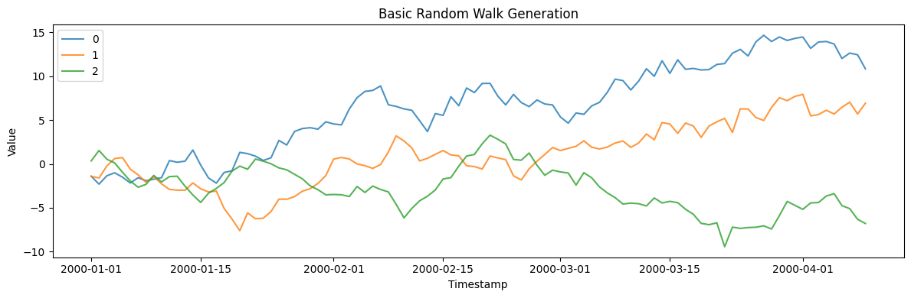
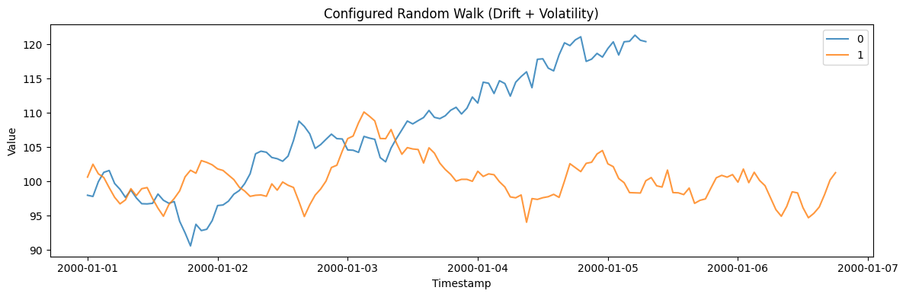
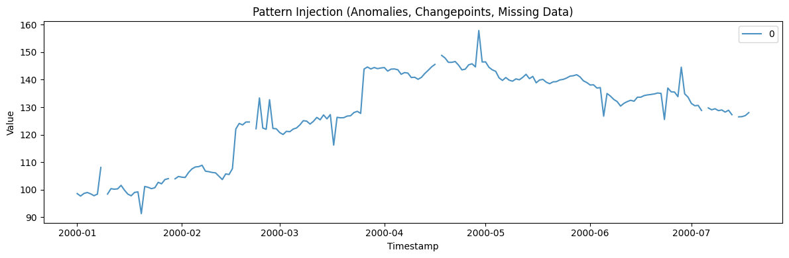
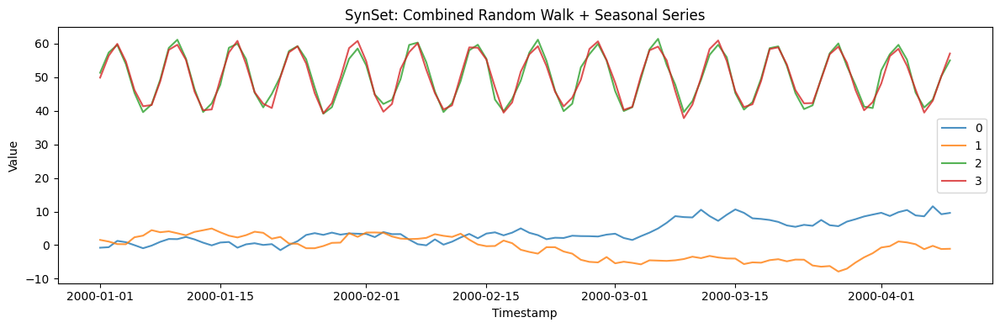

This tutorial covers the basics of generating synthetic time series data
with SynForecast. You will learn how to create generators, configure
parameters, inject patterns, and combine multiple generators into
datasets.

```python
import polars as pl
import matplotlib.pyplot as plt

from synforecast import SynSet
from synforecast.generators import RandomWalkGenerator, SeasonalGenerator
```

## Create a Simple Generator

Every generator takes a dictionary of parameters. At minimum, you
specify the series length and frequency.

```python
generator = RandomWalkGenerator(engine="polars", **{
    "min_length": 100,
    "max_length": 100,
    "freq": "D",
    "seed": 42,
})

df = generator.generate(n_series=3)
df.head(10)
```

| unique_id | ds                  | y         |
|-----------|---------------------|-----------|
| cat       | datetime\[ns\]      | f64       |
| "0"       | 2000-01-01 00:00:00 | -1.401594 |
| "0"       | 2000-01-02 00:00:00 | -2.307539 |
| "0"       | 2000-01-03 00:00:00 | -1.352484 |
| "0"       | 2000-01-04 00:00:00 | -1.011828 |
| "0"       | 2000-01-05 00:00:00 | -1.511372 |
| "0"       | 2000-01-06 00:00:00 | -2.176202 |
| "0"       | 2000-01-07 00:00:00 | -1.574639 |
| "0"       | 2000-01-08 00:00:00 | -1.915517 |
| "0"       | 2000-01-09 00:00:00 | -1.746987 |
| "0"       | 2000-01-10 00:00:00 | -1.566314 |

```python
fig, ax = plt.subplots(figsize=(12, 4))
for uid in df["unique_id"].unique().to_list():
    series = df.filter(pl.col("unique_id") == uid)
    ax.plot(series["ds"].to_list(), series["y"].to_list(), label=uid, alpha=0.8)
ax.set_xlabel("Timestamp")
ax.set_ylabel("Value")
ax.set_title("Basic Random Walk Generation")
ax.legend()
plt.tight_layout()
plt.show()
```



## Configure Generator Parameters

Each generator has specific parameters that control the shape of the
output. For `RandomWalkGenerator`, you can set drift, volatility, and
start value.

```python
generator = RandomWalkGenerator(engine="polars", **{
    "min_length": 100,
    "max_length": 150,
    "freq": "h",
    "drift": 0.1,
    "volatility": 1.5,
    "start_value": 100.0,
    "seed": 42,
})

df = generator.generate(n_series=2)
print(f"Generated {df['unique_id'].n_unique()} series, {len(df)} total rows")
df.head(10)
```

``` text
Generated 2 series, 243 total rows
```

| unique_id | ds                  | y          |
|-----------|---------------------|------------|
| cat       | datetime\[ns\]      | f64        |
| "0"       | 2000-01-01 00:00:00 | 97.970343  |
| "0"       | 2000-01-01 01:00:00 | 97.797686  |
| "0"       | 2000-01-01 02:00:00 | 99.952696  |
| "0"       | 2000-01-01 03:00:00 | 101.316565 |
| "0"       | 2000-01-01 04:00:00 | 101.585458 |
| "0"       | 2000-01-01 05:00:00 | 99.693524  |
| "0"       | 2000-01-01 06:00:00 | 98.830769  |
| "0"       | 2000-01-01 07:00:00 | 97.657048  |
| "0"       | 2000-01-01 08:00:00 | 98.728945  |
| "0"       | 2000-01-01 09:00:00 | 97.588927  |

```python
fig, ax = plt.subplots(figsize=(12, 4))
for uid in df["unique_id"].unique().to_list():
    series = df.filter(pl.col("unique_id") == uid)
    ax.plot(series["ds"].to_list(), series["y"].to_list(), label=uid, alpha=0.8)
ax.set_xlabel("Timestamp")
ax.set_ylabel("Value")
ax.set_title("Configured Random Walk (Drift + Volatility)")
ax.legend()
plt.tight_layout()
plt.show()
```



## Pattern Injection

SynForecast can inject realistic patterns into generated data:
anomalies, changepoints, and missing values. These are configured
through the generator parameters.

```python
generator = RandomWalkGenerator(engine="polars", **{
    "min_length": 200,
    "max_length": 200,
    "freq": "D",
    "start_value": 100.0,
    "seed": 42,
    # Enable anomalies
    "anomalies": True,
    "anomaly_fraction": 0.05,
    "anomaly_types": ["spike", "dip"],
    # Enable changepoints
    "changepoints": True,
    "num_changepoints": 2,
    "changepoint_type": "level",
    # Enable missing data
    "missing_data": True,
    "missing_rate": 0.03,
})

df = generator.generate(n_series=1)
print(f"Null values: {df['y'].null_count()}")
df.head(10)
```

``` text
Null values: 0
```

| unique_id | ds                  | y          |
|-----------|---------------------|------------|
| cat       | datetime\[ns\]      | f64        |
| "0"       | 2000-01-01 00:00:00 | 98.598406  |
| "0"       | 2000-01-02 00:00:00 | 97.692461  |
| "0"       | 2000-01-03 00:00:00 | 98.647516  |
| "0"       | 2000-01-04 00:00:00 | 98.988172  |
| "0"       | 2000-01-05 00:00:00 | 98.488628  |
| "0"       | 2000-01-06 00:00:00 | 97.823798  |
| "0"       | 2000-01-07 00:00:00 | 98.425361  |
| "0"       | 2000-01-08 00:00:00 | 108.084483 |
| "0"       | 2000-01-09 00:00:00 | NaN        |
| "0"       | 2000-01-10 00:00:00 | 98.433686  |

```python
fig, ax = plt.subplots(figsize=(12, 4))
for uid in df["unique_id"].unique().to_list():
    series = df.filter(pl.col("unique_id") == uid)
    ax.plot(series["ds"].to_list(), series["y"].to_list(), label=uid, alpha=0.8)
ax.set_xlabel("Timestamp")
ax.set_ylabel("Value")
ax.set_title("Pattern Injection (Anomalies, Changepoints, Missing Data)")
ax.legend()
plt.tight_layout()
plt.show()
```



## Combining Generators with SynSet

`SynSet` lets you combine multiple generators into a single unified
dataset. Each generator contributes a batch of series.

```python
generators = [
    RandomWalkGenerator(engine="polars", **{
        "min_length": 100,
        "max_length": 100,
        "freq": "D",
        "seed": 1,
    }),
    SeasonalGenerator(engine="polars", **{
        "min_length": 100,
        "max_length": 100,
        "freq": "D",
        "seasonality_period": 7,
        "seed": 2,
    }),
]

synset = SynSet(generators)
df = synset.generate(n_series_per_generator=2)
print(f"Total unique series: {df['unique_id'].n_unique()}")
df.head(10)
```

``` text
Total unique series: 4
```

| unique_id | ds                  | y         |
|-----------|---------------------|-----------|
| cat       | datetime\[ns\]      | f64       |
| "0"       | 2000-01-01 00:00:00 | -0.75549  |
| "0"       | 2000-01-02 00:00:00 | -0.60759  |
| "0"       | 2000-01-03 00:00:00 | 1.274036  |
| "0"       | 2000-01-04 00:00:00 | 0.87971   |
| "0"       | 2000-01-05 00:00:00 | -0.002609 |
| "0"       | 2000-01-06 00:00:00 | -0.914103 |
| "0"       | 2000-01-07 00:00:00 | -0.132172 |
| "0"       | 2000-01-08 00:00:00 | 0.986832  |
| "0"       | 2000-01-09 00:00:00 | 1.833801  |
| "0"       | 2000-01-10 00:00:00 | 1.793422  |

```python
fig, ax = plt.subplots(figsize=(12, 4))
for uid in df["unique_id"].unique().to_list():
    series = df.filter(pl.col("unique_id") == uid)
    ax.plot(series["ds"].to_list(), series["y"].to_list(), label=uid, alpha=0.8)
ax.set_xlabel("Timestamp")
ax.set_ylabel("Value")
ax.set_title("SynSet: Combined Random Walk + Seasonal Series")
ax.legend()
plt.tight_layout()
plt.show()
```



## Next Steps

SynForecast includes 17+ generators covering statistical models (SARIMA,
ETS), stochastic processes (GARCH, Ornstein-Uhlenbeck, GBM), and
domain-specific patterns (IoT, energy, demand). Explore the other
example notebooks to learn more about each generator.

