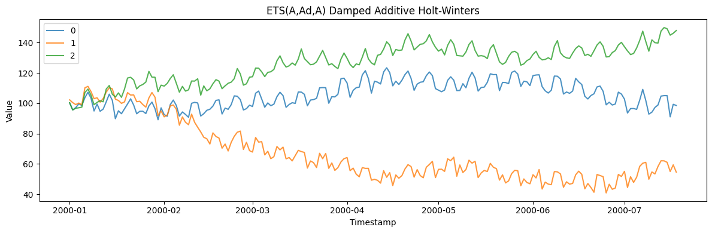
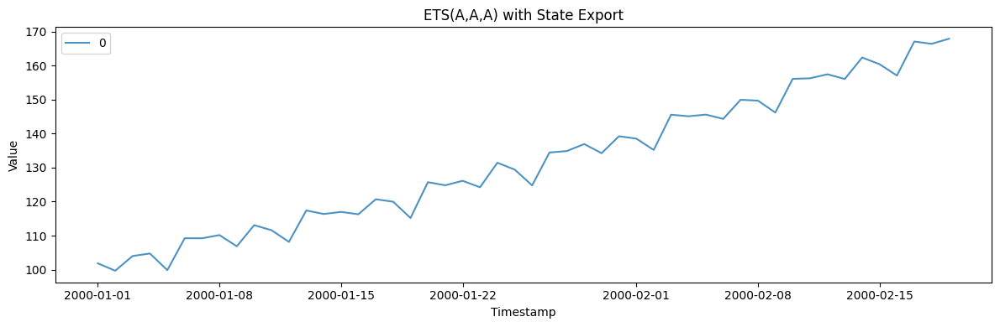
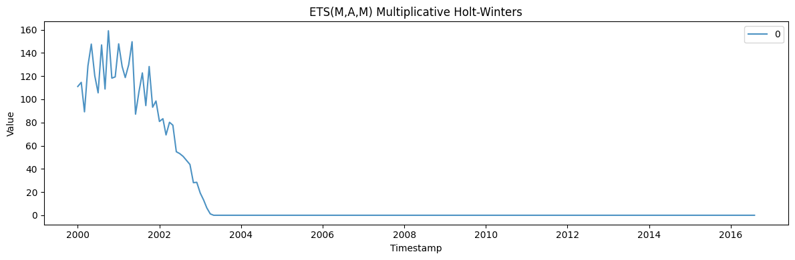
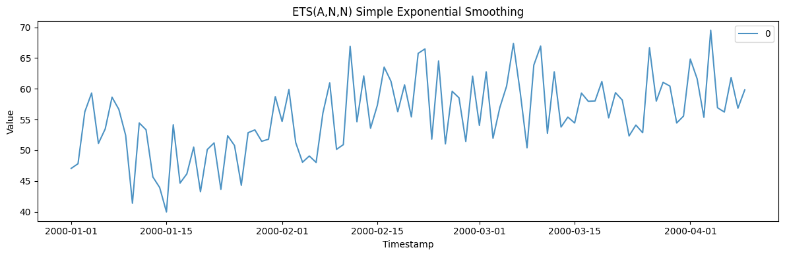
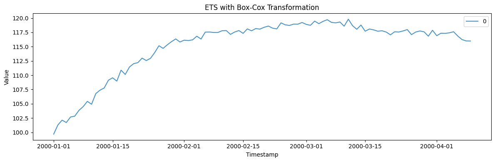

ETS models describe a series through slowly evolving *states* — level,
optional trend, optional seasonality — updated by exponential smoothing.
The error/trend/season taxonomy spans 30 variants (additive or
multiplicative, damped or not), so a single generator covers a broad
family of realistic trend-plus-seasonality shapes.

> **The model**
>
> Each series is built from a level state plus optional trend and
> seasonal states, combined additively or multiplicatively via
> `error_type`, `trend_type`, `seasonal_type`, and `damped`. This is the
> state-space form behind Holt and Holt-Winters smoothing.

```python
import polars as pl
import matplotlib.pyplot as plt

from synforecast.generators import ETSGenerator
```

## 1. Damped additive Holt-Winters ETS(A,Ad,A)

An additive model with weekly seasonality and a damped trend.

```python
params = {
    "min_length": 200,
    "max_length": 200,
    "freq": "D",
    "error_type": "add",
    "trend_type": "add",
    "seasonal_type": "add",
    "seasonal_period": 7,
    "level": 100.0,
    "trend": 0.5,
    "alpha": 0.3,
    "beta": 0.1,
    "gamma": 0.1,
    "damped": True,
    "phi": 0.95,
    "noise_std": 2.0,
    "seed": 123,
}

generator = ETSGenerator(engine="polars", **params)
```

### Model information

```python
model_info = generator.get_model_info()
print(f"Model: {model_info['model']}")
print(f"Initial level: {model_info['level']}")
print(f"Initial trend: {model_info['trend']}")
print(f"Smoothing parameters: alpha={model_info['alpha']}, beta={model_info['beta']}, gamma={model_info['gamma']}")
print(f"Damping parameter: phi={model_info['phi']}")
```

``` text
Model: ETS(A,Ad,A)
Initial level: 100.0
Initial trend: 0.5
Smoothing parameters: alpha=0.3, beta=0.1, gamma=0.1
Damping parameter: phi=0.95
```

### Generate and inspect data

```python
df = generator.generate(n_series=3)
print(f"Generated {df['unique_id'].n_unique()} time series")
print(f"Total observations: {len(df)}")
df.head(10)
```

``` text
Generated 3 time series
Total observations: 600
```

| unique_id | ds                  | y          |
|-----------|---------------------|------------|
| cat       | datetime\[ns\]      | f64        |
| "0"       | 2000-01-01 00:00:00 | 100.240791 |
| "0"       | 2000-01-02 00:00:00 | 95.591069  |
| "0"       | 2000-01-03 00:00:00 | 97.083479  |
| "0"       | 2000-01-04 00:00:00 | 99.609554  |
| "0"       | 2000-01-05 00:00:00 | 98.526403  |
| "0"       | 2000-01-06 00:00:00 | 103.635379 |
| "0"       | 2000-01-07 00:00:00 | 107.23276  |
| "0"       | 2000-01-08 00:00:00 | 103.376507 |
| "0"       | 2000-01-09 00:00:00 | 94.880221  |
| "0"       | 2000-01-10 00:00:00 | 99.409027  |

```python
fig, ax = plt.subplots(figsize=(12, 4))
for uid in df["unique_id"].unique().to_list():
    series = df.filter(pl.col("unique_id") == uid)
    ax.plot(series["ds"].to_list(), series["y"].to_list(), label=uid, alpha=0.8)
ax.set_xlabel("Timestamp")
ax.set_ylabel("Value")
ax.set_title("ETS(A,Ad,A) Damped Additive Holt-Winters")
ax.legend()
plt.tight_layout()
plt.show()
```



### Statistics by series

```python
df.group_by("unique_id").agg(
    [
        pl.col("y").count().alias("count"),
        pl.col("y").min().alias("min_value"),
        pl.col("y").max().alias("max_value"),
        pl.col("y").mean().alias("mean_value"),
        pl.col("y").std().alias("std_value"),
    ]
).sort("unique_id")
```

| unique_id | count | min_value | max_value  | mean_value | std_value |
|-----------|-------|-----------|------------|------------|-----------|
| cat       | u32   | f64       | f64        | f64        | f64       |
| "0"       | 200   | 89.114448 | 123.364807 | 105.517095 | 8.448336  |
| "1"       | 200   | 40.87026  | 111.131822 | 66.927617  | 19.298572 |
| "2"       | 200   | 95.571068 | 149.87852  | 126.124841 | 12.339277 |

## 2. ETS(A,A,A) with state export

Generate data and extract the underlying level, trend, and seasonal
state components.

```python
params_states = {
    "min_length": 50,
    "max_length": 50,
    "freq": "D",
    "error_type": "add",
    "trend_type": "add",
    "seasonal_type": "add",
    "seasonal_period": 7,
    "level": 100.0,
    "trend": 1.0,
    "alpha": 0.3,
    "beta": 0.1,
    "gamma": 0.1,
    "noise_std": 1.0,
    "seed": 42,
}

generator_states = ETSGenerator(engine="polars", **params_states)
obs_df, states_df = generator_states.generate_with_states(n_series=1)
```


```python
fig, ax = plt.subplots(figsize=(12, 4))
for uid in obs_df["unique_id"].unique().to_list():
    series = obs_df.filter(pl.col("unique_id") == uid)
    ax.plot(series["ds"].to_list(), series["y"].to_list(), label=uid, alpha=0.8)
ax.set_xlabel("Timestamp")
ax.set_ylabel("Value")
ax.set_title("ETS(A,A,A) with State Export")
ax.legend()
plt.tight_layout()
plt.show()
```



```python
print("Observations DataFrame:")
obs_df.head(10)
```

``` text
Observations DataFrame:
```

| unique_id | ds                  | y          |
|-----------|---------------------|------------|
| cat       | datetime\[ns\]      | f64        |
| "0"       | 2000-01-01 00:00:00 | 101.852261 |
| "0"       | 2000-01-02 00:00:00 | 99.674429  |
| "0"       | 2000-01-03 00:00:00 | 103.997037 |
| "0"       | 2000-01-04 00:00:00 | 104.742658 |
| "0"       | 2000-01-05 00:00:00 | 99.842295  |
| "0"       | 2000-01-06 00:00:00 | 109.225432 |
| "0"       | 2000-01-07 00:00:00 | 109.215338 |
| "0"       | 2000-01-08 00:00:00 | 110.156755 |
| "0"       | 2000-01-09 00:00:00 | 106.862563 |
| "0"       | 2000-01-10 00:00:00 | 113.073648 |

```python
print("States DataFrame (level, trend, seasonal components):")
states_df.head(10)
```

``` text
States DataFrame (level, trend, seasonal components):
```

| unique_id | ds                  | level      | trend    | seasonal_0 | seasonal_1 | seasonal_2 | seasonal_3 | seasonal_4 | seasonal_5 | seasonal_6 |
|-----------|---------------------|------------|----------|------------|------------|------------|------------|------------|------------|------------|
| cat       | datetime\[ns\]      | f64        | f64      | f64        | f64        | f64        | f64        | f64        | f64        | f64        |
| "0"       | 2000-01-01 00:00:00 | 100.0      | 1.0      | 1.168504   | -2.182273  | 2.014922   | 0.402623   | -5.629283  | 3.185167   | 1.04034    |
| "0"       | 2000-01-02 00:00:00 | 100.905127 | 0.968376 | 1.136879   | -2.182273  | 2.014922   | 0.402623   | -5.629283  | 3.185167   | 1.04034    |
| "0"       | 2000-01-03 00:00:00 | 101.868463 | 0.966696 | 1.136879   | -2.183953  | 2.014922   | 0.402623   | -5.629283  | 3.185167   | 1.04034    |
| "0"       | 2000-01-04 00:00:00 | 102.579245 | 0.881391 | 1.136879   | -2.183953  | 1.929618   | 0.402623   | -5.629283  | 3.185167   | 1.04034    |
| "0"       | 2000-01-05 00:00:00 | 103.724456 | 0.969331 | 1.136879   | -2.183953  | 1.929618   | 0.490563   | -5.629283  | 3.185167   | 1.04034    |
| "0"       | 2000-01-06 00:00:00 | 104.927124 | 1.04711  | 1.136879   | -2.183953  | 1.929618   | 0.490563   | -5.551504  | 3.185167   | 1.04034    |
| "0"       | 2000-01-07 00:00:00 | 105.994044 | 1.053713 | 1.136879   | -2.183953  | 1.929618   | 0.490563   | -5.551504  | 3.19177    | 1.04034    |
| "0"       | 2000-01-08 00:00:00 | 107.385929 | 1.166437 | 1.136879   | -2.183953  | 1.929618   | 0.490563   | -5.551504  | 3.19177    | 1.153064   |
| "0"       | 2000-01-09 00:00:00 | 108.69262  | 1.213188 | 1.18363    | -2.183953  | 1.929618   | 0.490563   | -5.551504  | 3.19177    | 1.153064   |
| "0"       | 2000-01-10 00:00:00 | 109.64802  | 1.127259 | 1.18363    | -2.269882  | 1.929618   | 0.490563   | -5.551504  | 3.19177    | 1.153064   |

## 3. Multiplicative Holt-Winters ETS(M,A,M)

A multiplicative error and seasonal model with monthly frequency. All
values remain positive.

```python
params_mul = {
    "min_length": 200,
    "max_length": 200,
    "freq": "MS",
    "error_type": "mul",
    "trend_type": "add",
    "seasonal_type": "mul",
    "seasonal_period": 12,
    "level": 100.0,
    "trend": 1.0,
    "alpha": 0.3,
    "beta": 0.1,
    "gamma": 0.1,
    "noise_std": 0.1,
    "seed": 456,
}

generator_mul = ETSGenerator(engine="polars", **params_mul)
df_mul = generator_mul.generate(n_series=1)

print(f"Model: {generator_mul.get_model_info()['model']}")
print(f"All values positive: {(df_mul['y'] > 0).all()}")
df_mul.head(12)
```

``` text
Model: ETS(M,A,M)
All values positive: True
```

| unique_id | ds                  | y          |
|-----------|---------------------|------------|
| cat       | datetime\[ns\]      | f64        |
| "0"       | 2000-01-01 00:00:00 | 111.065496 |
| "0"       | 2000-02-01 00:00:00 | 114.629555 |
| "0"       | 2000-03-01 00:00:00 | 89.217158  |
| "0"       | 2000-04-01 00:00:00 | 128.916366 |
| "0"       | 2000-05-01 00:00:00 | 147.608714 |
| …         | …                   | …          |
| "0"       | 2000-08-01 00:00:00 | 146.908144 |
| "0"       | 2000-09-01 00:00:00 | 108.879508 |
| "0"       | 2000-10-01 00:00:00 | 159.118308 |
| "0"       | 2000-11-01 00:00:00 | 118.266366 |
| "0"       | 2000-12-01 00:00:00 | 119.364213 |

```python
fig, ax = plt.subplots(figsize=(12, 4))
for uid in df_mul["unique_id"].unique().to_list():
    series = df_mul.filter(pl.col("unique_id") == uid)
    ax.plot(series["ds"].to_list(), series["y"].to_list(), label=uid, alpha=0.8)
ax.set_xlabel("Timestamp")
ax.set_ylabel("Value")
ax.set_title("ETS(M,A,M) Multiplicative Holt-Winters")
ax.legend()
plt.tight_layout()
plt.show()
```



## 4. Simple exponential smoothing ETS(A,N,N)

A model with no trend and no seasonality — just level smoothing with
additive errors.

```python
params_ses = {
    "min_length": 100,
    "max_length": 100,
    "freq": "D",
    "error_type": "add",
    "trend_type": None,
    "seasonal_type": None,
    "level": 50.0,
    "alpha": 0.2,
    "noise_std": 5.0,
    "seed": 789,
}

generator_ses = ETSGenerator(engine="polars", **params_ses)
df_ses = generator_ses.generate(n_series=1)

print(f"Model: {generator_ses.get_model_info()['model']}")
print(f"Mean: {df_ses['y'].mean():.2f}")
print(f"Std: {df_ses['y'].std():.2f}")
print(f"Min: {df_ses['y'].min():.2f}")
print(f"Max: {df_ses['y'].max():.2f}")
```

``` text
Model: ETS(A,N,N)
Mean: 55.54
Std: 6.25
Min: 39.97
Max: 69.52
```

```python
fig, ax = plt.subplots(figsize=(12, 4))
for uid in df_ses["unique_id"].unique().to_list():
    series = df_ses.filter(pl.col("unique_id") == uid)
    ax.plot(series["ds"].to_list(), series["y"].to_list(), label=uid, alpha=0.8)
ax.set_xlabel("Timestamp")
ax.set_ylabel("Value")
ax.set_title("ETS(A,N,N) Simple Exponential Smoothing")
ax.legend()
plt.tight_layout()
plt.show()
```



## 5. ETS with Box-Cox transformation

Apply a Box-Cox transformation (lambda=0.5, square root) to the
generated series.

```python
params_boxcox = {
    "min_length": 100,
    "max_length": 100,
    "freq": "D",
    "error_type": "add",
    "trend_type": "add",
    "seasonal_type": None,
    "level": 100.0,
    "trend": 0.5,
    "alpha": 0.3,
    "beta": 0.1,
    "noise_std": 0.5,
    "box_cox_lambda": 0.5,
    "seed": 111,
}

generator_boxcox = ETSGenerator(engine="polars", **params_boxcox)
df_boxcox = generator_boxcox.generate(n_series=1)

print(f"Model: {generator_boxcox.get_model_info()['model']}")
print(f"Box-Cox lambda: {generator_boxcox.get_model_info()['box_cox_lambda']}")
print(f"Mean: {df_boxcox['y'].mean():.2f}")
print(f"Std: {df_boxcox['y'].std():.2f}")
```

``` text
Model: ETS(A,A,N)
Box-Cox lambda: 0.5
Mean: 115.15
Std: 5.02
```

```python
fig, ax = plt.subplots(figsize=(12, 4))
for uid in df_boxcox["unique_id"].unique().to_list():
    series = df_boxcox.filter(pl.col("unique_id") == uid)
    ax.plot(series["ds"].to_list(), series["y"].to_list(), label=uid, alpha=0.8)
ax.set_xlabel("Timestamp")
ax.set_ylabel("Value")
ax.set_title("ETS with Box-Cox Transformation")
ax.legend()
plt.tight_layout()
plt.show()
```



> **Related generators**
>
> -   [SARIMA](sarima) — the ARIMA view of the same trend/seasonal
>     structure.
> -   [Seasonal](seasonal) — a fixed seasonal wave when you don’t need
>     evolving states.
>
> The full error/trend/season taxonomy is in the [generator
> reference](https://github.com/Nixtla/synforecast/blob/main/GENERATORS.md).

