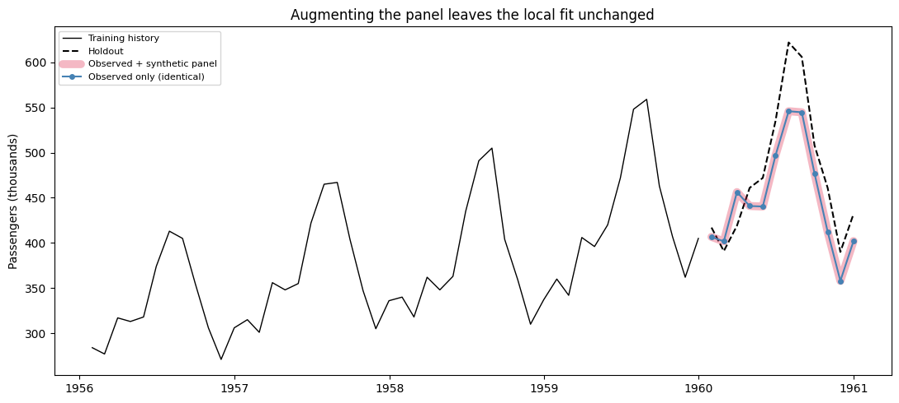
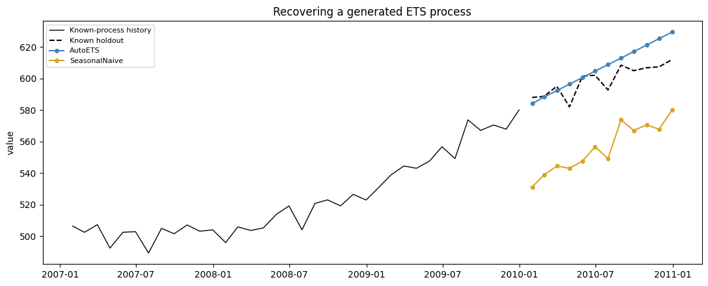

`AutoETS` and the other StatsForecast models are fitted independently
per series, so the two workflows that matter for synthetic data are
different from the global-model case. This guide shows that augmenting a
panel cannot change a local fit, and uses synthetic series with a known
data-generating process to check that the forecasting pipeline recovers
what was put into it.

StatsForecast models are fitted independently to each series and share
no transferable weights. Two consequences follow, and they set up the
rest of this guide.

Adding synthetic series to the panel leaves the model fitted to the
observed series bit-for-bit identical — there is no pooled parameter for
the extra series to influence. And because nothing is shared, fitting
local models to synthetic histories transfers nothing to the observed
series: there is no local-model analogue of synthetic pretraining. The
section below measures both claims.

> **Where synthetic data does help here**
>
> Generating from a process you configured yourself gives a holdout
> whose truth you know, including the irreducible noise floor. That
> turns a forecast comparison into a pipeline check: if `AutoETS` cannot
> recover a clean seasonal process, the problem is the setup rather than
> the data.

We use the classic [Box–Jenkins airline passenger
series](https://search.r-project.org/R/refmans/datasets/html/AirPassengers.html).
Its final 12 months are held out before `SynAugment` analyzes the
training history.

```python
from pathlib import Path

import matplotlib.pyplot as plt
import numpy as np
import pandas as pd
from statsforecast import StatsForecast
from statsforecast.models import AutoETS, SeasonalNaive

from synforecast import SynAugment
from synforecast.generators import ETSGenerator

```


```python
HORIZON = 12
TARGET_ID = "AirPassengers"
data_path = Path("nbs/data/air_passengers.csv")
if not data_path.exists():
    data_path = Path("../../data/air_passengers.csv")

observed_df = pd.read_csv(data_path, parse_dates=["ds"])
train_df = observed_df.iloc[:-HORIZON].copy()
test_df = observed_df.iloc[-HORIZON:].copy()
train_df.tail()
```

|     | unique_id     | ds         | y     |
|-----|---------------|------------|-------|
| 127 | AirPassengers | 1959-08-31 | 559.0 |
| 128 | AirPassengers | 1959-09-30 | 463.0 |
| 129 | AirPassengers | 1959-10-31 | 407.0 |
| 130 | AirPassengers | 1959-11-30 | 362.0 |
| 131 | AirPassengers | 1959-12-31 | 405.0 |

```python
augmented_train_df = SynAugment(seed=42).augment(
    train_df,
    n_augment=16,
    generator_override={TARGET_ID: "SARIMAGenerator"},
)
synthetic_history_df = augmented_train_df.loc[
    augmented_train_df["unique_id"].astype(str) != TARGET_ID
].copy()

pd.DataFrame(
    {
        "training set": ["observed only", "observed + augmented", "matched synthetic only"],
        "series": [1, augmented_train_df["unique_id"].nunique(), synthetic_history_df["unique_id"].nunique()],
    }
)
```

|     | training set           | series |
|-----|------------------------|--------|
| 0   | observed only          | 1      |
| 1   | observed + augmented   | 17     |
| 2   | matched synthetic only | 16     |

```python
def make_forecaster() -> StatsForecast:
    return StatsForecast(
        models=[AutoETS(season_length=12)],
        freq="ME",
        n_jobs=1,
    )


def target_forecast(forecast_df: pd.DataFrame) -> pd.DataFrame:
    return forecast_df.loc[
        forecast_df["unique_id"].astype(str) == TARGET_ID,
        ["unique_id", "ds", "AutoETS"],
    ].copy()
```


```python
real_only = make_forecaster()
real_only.fit(train_df)
real_only_forecast = target_forecast(real_only.predict(h=HORIZON))
```


```python
with_augmentation = make_forecaster()
with_augmentation.fit(augmented_train_df)
augmented_forecast = target_forecast(with_augmentation.predict(h=HORIZON))

np.allclose(real_only_forecast["AutoETS"], augmented_forecast["AutoETS"])
```

``` text
True
```

Averaging forecasts from those synthetic histories would not give a
usable forecast, and the reason is worth measuring rather than
asserting. `SynAugment` matches each synthetic series to the **mean of
the training window**, not to its final level. On a strongly trending
series those are far apart, so the synthetic histories end at levels
scattered around the observed endpoint.

```python
levels = synthetic_history_df.groupby("unique_id", observed=True)["y"].agg(
    window_mean="mean",
    final_year_mean=lambda values: values.tail(12).mean(),
)

pd.DataFrame(
    {
        "series": ["observed", "synthetic (16 draws)"],
        "window mean": [
            round(train_df["y"].mean(), 1),
            f"{levels['window_mean'].min():.0f} - {levels['window_mean'].max():.0f}",
        ],
        "final-year mean": [
            round(train_df["y"].tail(12).mean(), 1),
            f"{levels['final_year_mean'].min():.0f} - {levels['final_year_mean'].max():.0f}",
        ],
    }
)

```

|     | series               | window mean | final-year mean |
|-----|----------------------|-------------|-----------------|
| 0   | observed             | 262.5       | 428.3           |
| 1   | synthetic (16 draws) | 262 - 263   | 191 - 506       |

```python
forecast_sets = {
    "Observed only": real_only_forecast,
    "Observed + synthetic panel": augmented_forecast,
}
comparison = test_df[["unique_id", "ds", "y"]].copy()
for label, forecast_df in forecast_sets.items():
    comparison = comparison.merge(
        forecast_df.rename(columns={"AutoETS": label}),
        on=["unique_id", "ds"],
        how="left",
    )

pd.DataFrame(
    {
        "workflow": list(forecast_sets),
        "MAE": [
            (comparison[label] - comparison["y"]).abs().mean()
            for label in forecast_sets
        ],
    }
)

```

|     | workflow                   | MAE       |
|-----|----------------------------|-----------|
| 0   | Observed only              | 35.612471 |
| 1   | Observed + synthetic panel | 35.612471 |

```python
fig, ax = plt.subplots(figsize=(11, 5))
history = train_df.tail(48)
ax.plot(history["ds"], history["y"], color="black", linewidth=1, label="Training history")
ax.plot(test_df["ds"], test_df["y"], color="black", linestyle="--", label="Holdout")
# The two forecasts are identical, so the augmented one is drawn wide and
# translucent with the observed-only line on top of it.
ax.plot(comparison["ds"], comparison["Observed + synthetic panel"],
        color="crimson", linewidth=7, alpha=0.3, solid_capstyle="round",
        label="Observed + synthetic panel")
ax.plot(comparison["ds"], comparison["Observed only"],
        color="steelblue", linewidth=1.5, marker="o", markersize=4,
        label="Observed only (identical)")
ax.set(title="Augmenting the panel leaves the local fit unchanged",
       ylabel="Passengers (thousands)")
ax.legend(fontsize=8)
fig.tight_layout()

```



## Validate the pipeline on a known process

The airline series has no ground truth beyond its holdout. A generated
series does: the process, its seasonal period, and its noise scale are
all inputs. Below, twelve series come from an additive ETS process with
a 12-period season and a fixed noise standard deviation, the last 12
points of each are held out, and `AutoETS` is scored against
`SeasonalNaive` and against the generator’s noise floor.

```python
NOISE_STD = 6.0
known_process = ETSGenerator(
    min_length=132,
    max_length=132,
    freq="ME",
    engine="polars",
    seasonal_period=12,
    error_type="add",
    trend_type="add",
    seasonal_type="add",
    level=300.0,
    trend=1.5,
    noise_std=NOISE_STD,
    seed=7,
)
known_panel = known_process.generate(n_series=12).to_pandas()

is_holdout = (
    known_panel.groupby("unique_id", observed=True).cumcount() >= 132 - HORIZON
)
known_train_df = known_panel.loc[~is_holdout]
known_test_df = known_panel.loc[is_holdout]

known_models = StatsForecast(
    models=[AutoETS(season_length=12), SeasonalNaive(season_length=12)],
    freq="ME",
    n_jobs=1,
)
known_models.fit(known_train_df)
known_forecast = known_models.predict(h=HORIZON).merge(
    known_test_df[["unique_id", "ds", "y"]], on=["unique_id", "ds"]
)

pd.DataFrame(
    {
        "model": ["AutoETS", "SeasonalNaive", "noise floor (generator)"],
        "MAE": [
            (known_forecast["AutoETS"] - known_forecast["y"]).abs().mean(),
            (known_forecast["SeasonalNaive"] - known_forecast["y"]).abs().mean(),
            NOISE_STD,
        ],
    }
).round(2)

```

|     | model                   | MAE   |
|-----|-------------------------|-------|
| 0   | AutoETS                 | 11.52 |
| 1   | SeasonalNaive           | 49.54 |
| 2   | noise floor (generator) | 6.00  |

```python
example_id = known_panel["unique_id"].iloc[0]
example_history = known_train_df.loc[known_train_df["unique_id"] == example_id].tail(36)
example_holdout = known_test_df.loc[known_test_df["unique_id"] == example_id]
example_forecast = known_forecast.loc[known_forecast["unique_id"] == example_id]

fig, ax = plt.subplots(figsize=(11, 4.5))
ax.plot(example_history["ds"], example_history["y"], color="black", linewidth=1,
        label="Known-process history")
ax.plot(example_holdout["ds"], example_holdout["y"], color="black", linestyle="--",
        label="Known holdout")
ax.plot(example_forecast["ds"], example_forecast["AutoETS"], color="steelblue",
        marker="o", markersize=4, label="AutoETS")
ax.plot(example_forecast["ds"], example_forecast["SeasonalNaive"], color="goldenrod",
        marker="o", markersize=4, label="SeasonalNaive")
ax.set(title="Recovering a generated ETS process", ylabel="value")
ax.legend(fontsize=8)
fig.tight_layout()

```



For local models, synthetic data is a test instrument rather than extra
training signal.

-   **Augmentation is inert.** The observed-only and augmented forecasts
    agree to floating-point precision, because `AutoETS` fits each
    series on its own. Panel augmentation only helps model families that
    pool parameters across series — see the [MLForecast](mlforecast) and
    [NeuralForecast](neuralforecast) guides for that case.
-   **There is no local-model pretraining.** Fitting `AutoETS` to
    synthetic histories produces forecasts for those histories, not for
    the observed series. The level table above shows why aggregating
    them is not a shortcut: matching the window mean leaves the
    final-year level free, so the draws end far from the observed
    endpoint.
-   **A known process validates the pipeline.** On data generated from a
    configured `ETSGenerator`, `AutoETS` lands within about twice the
    generator’s own noise floor and well ahead of `SeasonalNaive`.
    Running that check before pointing a pipeline at real data separates
    model problems from data problems.

Synthetic panels are also useful here for simulation and stress testing:
inject [anomalies](../capabilities/anomalies) or
[changepoints](../capabilities/changepoints) with known positions and
measure how far the fitted model moves.

